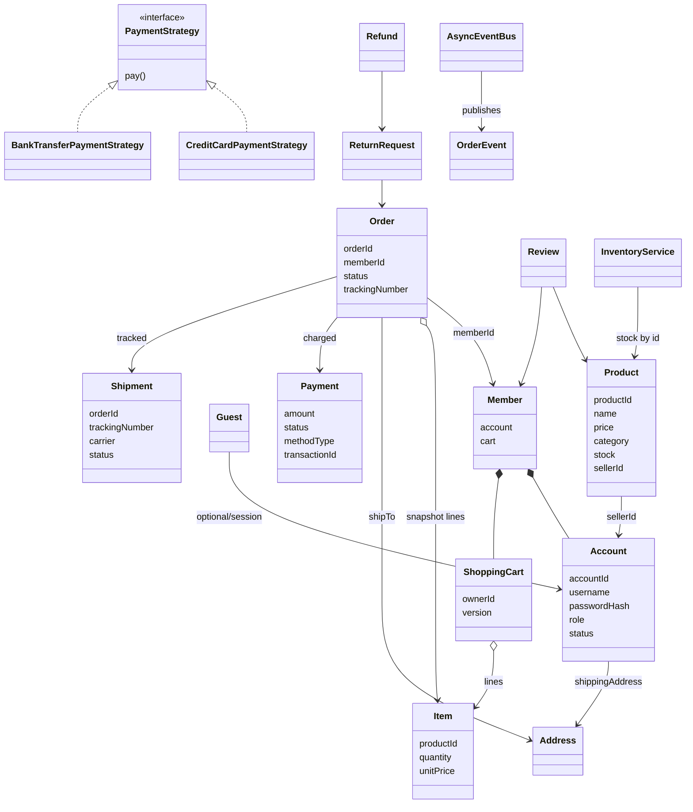
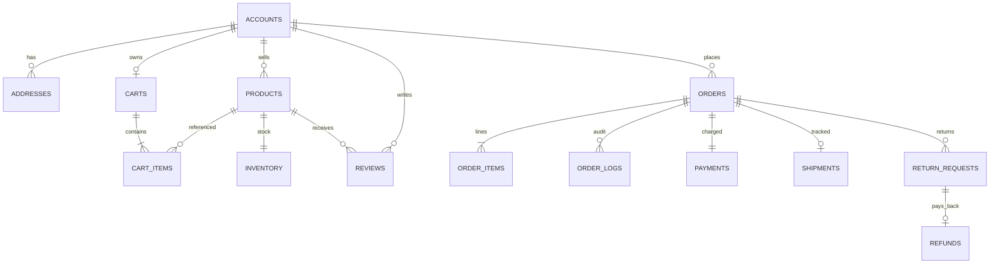

# Amazon Ecommerce LLD — Classes, Relationships & Data Model

Maps **OOP classes** in this codebase to **relationships** and a production-style **relational schema**.  
LLD code is in-memory; tables show how the same domain would persist.

Companions: [`README.md`](./README.md) · [`INTERVIEW_PREP_GUIDE.md`](./INTERVIEW_PREP_GUIDE.md)

---

## Why learn this?

**Yes — strongly recommended for 5+ YOE interviews.**

Marketplace designs are almost always followed by: *“How do you model orders in the DB?”* or *“Where does cart version live?”*

| Skill | Why it matters |
|-------|----------------|
| Class diagram | Ownership: Member owns Cart; Order snapshots Items |
| Class → table | Checkout, inventory, payments are schema-heavy domains |
| Runtime vs durable | Strategies, Command, EventBus ≠ tables |
| Cardinality & constraints | Order lines, returns, optimistic `version` column |

Knowing **both** class design and table design is more knowledge than LLD-only prep — and it matches real senior work.

---

## 1. Class Catalog (by package)

| Package | Class | Role | Persist? |
|---------|-------|------|----------|
| account | `Account` | Identity, salt+hash, role, address | **Yes** → `accounts` |
| account | `Member` / `Guest` | Purchase vs browse-only | Member → account row; Guest often session-only |
| account | `Address` | Shipping address value | **Yes** → columns or `addresses` |
| account | `AccessControl` | Role gates | No (policy) |
| account | `*Factory` | Create Member/Guest | No |
| catalog | `Product` | Sellable SKU | **Yes** → `products` |
| catalog | `ProductCatalog` / search Trie | Catalog + index | Tables + **ES** |
| catalog | `Review` | Rating + text | **Yes** → `reviews` |
| cart | `ShoppingCart` | Versioned cart | **Yes** → `carts` |
| cart | `Item` | Line (product, qty, price) | **Yes** → `cart_items` / `order_items` |
| order | `Order` | Checkout snapshot | **Yes** → `orders` |
| order | `OrderLog` | Status audit | **Yes** → `order_logs` |
| order | `CheckoutService` / `OrderService` | Workflows | No (services) |
| payment | `Payment` | Amount/status/method/txn | **Yes** → `payments` |
| payment | `PaymentStrategy*` / Factory | Behavior selection | No (code) |
| shipping | `Shipment` | Tracking + carrier status | **Yes** → `shipments` |
| shipping | `ShipmentTracker*` / `ShipmentPoller` | Carrier adapter + poll | No / job |
| returns | `ReturnRequest` | Return workflow | **Yes** → `return_requests` |
| returns | `Refund` | Money back | **Yes** → `refunds` |
| inventory | `InventoryService` | Stock reserve | **Yes** → `inventory` |
| events | `AsyncEventBus`, `OrderEvent` | Notifications | Kafka in prod |
| command | `Command`, `AddItemToCartCommand`, … | Action objects | No |

---

## 2. Class Relationships



### Relationship notes

| Relation | Type | Meaning |
|----------|------|---------|
| `Member` → `ShoppingCart` | Composition | One active cart per member (simplify) |
| `ShoppingCart` → `Item` | 1:N | Versioned line items |
| `Order` → `Item` | 1:N snapshot | Frozen at checkout (not live cart FK) |
| `Order` → `Payment` | 1:1 | Capture for this order |
| `Order` → `Shipment` | 1:1 (or 1:N partial ship) | Tracking |
| `Product` → `Account` | N:1 | Seller |
| `ReturnRequest` → `Order` | N:1 | One order, many return attempts possible |
| `PaymentStrategy` | Strategy | Runtime behavior — **not** a table |

---

## 3. How Tables Look (Relational Sketch)

### Accounts & addresses

```sql
accounts (
  account_id     UUID PK,
  username       VARCHAR UNIQUE NOT NULL,
  password_hash  VARCHAR NOT NULL,
  salt           VARCHAR NOT NULL,
  role           VARCHAR NOT NULL,   -- GUEST|MEMBER|SELLER|ADMIN
  status         VARCHAR NOT NULL,   -- ACTIVE|BLOCKED|CLOSED
  name           VARCHAR,
  email          VARCHAR,
  phone          VARCHAR,
  created_at     TIMESTAMPTZ
);

addresses (
  address_id   UUID PK,
  account_id   UUID FK → accounts,
  line1        VARCHAR,
  line2        VARCHAR,
  city         VARCHAR,
  state        VARCHAR,
  postal_code  VARCHAR,
  country      CHAR(2),
  is_default   BOOLEAN
);
```

### Catalog, inventory, reviews

```sql
products (
  product_id    UUID PK,
  seller_id     UUID FK → accounts,
  name          VARCHAR NOT NULL,
  description   TEXT,
  price         NUMERIC(12,2) NOT NULL,
  category      VARCHAR NOT NULL,
  created_at    TIMESTAMPTZ
);

inventory (
  product_id     UUID PK FK → products,
  stock_count    INT NOT NULL CHECK (stock_count >= 0),
  reserved_count INT NOT NULL DEFAULT 0,
  version        INT NOT NULL DEFAULT 0   -- optimistic stock updates
);

reviews (
  review_id   UUID PK,
  product_id  UUID FK → products,
  member_id   UUID FK → accounts,
  rating      SMALLINT CHECK (rating BETWEEN 1 AND 5),
  body        TEXT,
  created_at  TIMESTAMPTZ
);
-- Search: Elasticsearch index on products.name / category (Trie is LLD only)
```

### Cart (optimistic locking)

```sql
carts (
  cart_id    UUID PK,
  member_id  UUID UNIQUE FK → accounts,
  version    INT NOT NULL DEFAULT 0,   -- maps ShoppingCart.version
  updated_at TIMESTAMPTZ
);

cart_items (
  cart_id     UUID FK → carts,
  product_id  UUID FK → products,
  quantity    INT NOT NULL CHECK (quantity > 0),
  unit_price  NUMERIC(12,2) NOT NULL,  -- price at add-time (optional)
  PRIMARY KEY (cart_id, product_id)
);
-- UPDATE carts SET version = version + 1 WHERE cart_id = ? AND version = ?
-- If 0 rows updated → CartVersionException equivalent
```

### Orders, payments, shipments

```sql
orders (
  order_id           UUID PK,
  member_id          UUID FK → accounts,
  status             VARCHAR NOT NULL,
  shipping_address_id UUID FK → addresses,
  tracking_number    VARCHAR NULL,
  shipment_status    VARCHAR NULL,
  created_at         TIMESTAMPTZ
);

order_items (
  order_id    UUID FK → orders,
  product_id  UUID FK → products,
  quantity    INT NOT NULL,
  unit_price  NUMERIC(12,2) NOT NULL,  -- snapshot
  PRIMARY KEY (order_id, product_id)
);

order_logs (
  log_id     BIGSERIAL PK,
  order_id   UUID FK → orders,
  status     VARCHAR,
  message    VARCHAR,
  created_at TIMESTAMPTZ
);

payments (
  payment_id      UUID PK,
  order_id        UUID UNIQUE FK → orders,
  amount          NUMERIC(12,2) NOT NULL,
  method_type     VARCHAR NOT NULL,  -- CREDIT_CARD | BANK_TRANSFER
  status          VARCHAR NOT NULL,
  transaction_id  VARCHAR UNIQUE,
  created_at      TIMESTAMPTZ
);

shipments (
  shipment_id      UUID PK,
  order_id         UUID FK → orders,
  carrier          VARCHAR NOT NULL,  -- UPS | FEDEX
  tracking_number  VARCHAR UNIQUE NOT NULL,
  status           VARCHAR NOT NULL,
  updated_at       TIMESTAMPTZ
);
```

### Returns & refunds

```sql
return_requests (
  return_id      UUID PK,
  order_id       UUID FK → orders,
  reason         VARCHAR NOT NULL,
  status         VARCHAR NOT NULL,  -- REQUESTED|APPROVED|…|REFUNDED
  refund_amount  NUMERIC(12,2),
  created_at     TIMESTAMPTZ
);

refunds (
  refund_id          UUID PK,
  return_request_id  UUID FK → return_requests,
  amount             NUMERIC(12,2) NOT NULL,
  status             VARCHAR NOT NULL,  -- REFUND_INITIATED|REFUNDED|FAILED
  provider_ref       VARCHAR,
  created_at         TIMESTAMPTZ
);
```

### ER overview



---

## 4. Class → Table Cheatsheet

| Java class | Table(s) |
|------------|----------|
| `Account` / `Member` | `accounts` (+ role) |
| `Address` | `addresses` |
| `Product` | `products` |
| stock on Product / `InventoryService` | `inventory` |
| `ShoppingCart` | `carts.version` |
| `Item` (in cart) | `cart_items` |
| `Item` (in order) | `order_items` (snapshot) |
| `Order` | `orders` |
| `OrderLog` | `order_logs` |
| `Payment` | `payments` |
| `Shipment` | `shipments` |
| `ReturnRequest` | `return_requests` |
| `Refund` | `refunds` |
| `Review` | `reviews` |
| `PaymentStrategy` / Factory / Command | **Code only** |
| `AsyncEventBus` | **Kafka** |
| `ProductSearchIndex` | **Elasticsearch** |
| `ShipmentPoller` | **Worker / cron** |

---

## 5. Critical path: checkout as SQL story

```
1. SELECT version FROM carts WHERE member_id = ?          -- optimistic read
2. UPDATE inventory SET stock = stock - qty
     WHERE product_id = ? AND stock >= qty                -- reserve / prevent oversell
3. INSERT payments … ; charge via PSP
4. INSERT orders + order_items (price snapshot)
5. DELETE cart_items; bump carts.version OR delete cart
6. Publish ORDER_PLACED (outbox → Kafka)
```

Say this in interviews to connect LLD services to durable consistency.

---

## 6. Whiteboard tip

1. Classes first: Member → Cart(version) → Checkout → Order → Payment/Shipment.  
2. Tables second: show `carts.version` and `order_items` as **snapshot**.  
3. Call out non-tables: Strategy, Command, EventBus, Trie.
