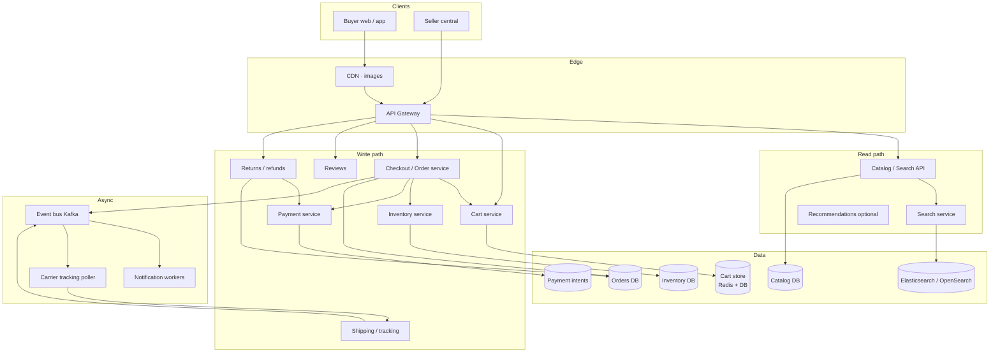

# Amazon Ecommerce — HLD

High-level design for an Amazon-like marketplace (interview whiteboard).  
Companions: [`README.md`](./README.md) (LLD) · [`API_REFERENCE.md`](./API_REFERENCE.md)

---

## 1. Final architecture diagram



**Checkout path:** Authz (member only) → validate cart version → reserve inventory → charge payment → create order UNSHIPPED → clear cart → async notify → ship + poll carriers → optional return/refund.

---

## 2. Why these technologies (and why not the alternatives)

| Concern | Choose | Why | Not / when to reconsider |
|---------|--------|-----|---------------------------|
| Product catalog | **Postgres / MySQL** + denormalized read models | Sellers, SKUs, categories; transactional updates | Single Mongo blob for everything — painful joins for orders/returns |
| Product search | **Elasticsearch / OpenSearch** | Relevance, facets, typo tolerance at catalog scale | SQL `LIKE %x%` — can’t rank or scale browse UX |
| Cart | **Redis** (hot) + DB backup *or* versioned DB row | Low latency; **optimistic version** stops lost updates | Session-only cart — lost on device switch; no version → oversell races |
| Inventory | Dedicated **Inventory service + DB** | Reserve/commit/release around checkout | Decrement in catalog table only — couples browse to checkout locks |
| Orders | **Relational Order DB** | State machine, audit log, financial trail | Event-only store without projections — hard customer support queries |
| Payments | **Strategy + PSP adapters** (card, bank) | PCI outsourced; swap providers | Hardcoded `if (visa)` in checkout — untestable, inflexible |
| Messaging | **Kafka / SNS+SQS** | Order/shipping events fan-out | Sync Observer in-process only — doesn’t survive multi-instance deploy |
| Tracking | **Carrier APIs + poller/webhooks** | Real shipment state machine | Fake `Thread.sleep` status — interview red flag |
| Images | **Object storage + CDN** | Cheap, cacheable | DB BLOBs — expensive and slow |

---

## 3. Components

| Component | Responsibility | Interview note |
|-----------|----------------|----------------|
| **Account / AccessControl** | Guest vs Member | Guests browse; only members buy |
| **Catalog + Search Index** | Products, categories, indexed search | Trie/ES — never linear scan |
| **Reviews** | Ratings + text after purchase (policy) | Moderation / abuse is a follow-up |
| **Shopping Cart** | Add/update/remove with version | Optimistic concurrency |
| **Inventory** | Reserve on checkout, release on cancel/fail | Prevents oversell |
| **Checkout / Order** | Create order, cancel if not shipped | Explicit state machine + OrderLog |
| **Payment** | Strategy + Factory + Processor | Idempotent charge |
| **Shipping** | Shipment + UPS/FedEx trackers + poller | External truth for status |
| **Returns / Refunds** | RMA → refund path | Partial refunds discussion |
| **Notification** | Async on order/ship events | Email/push via workers |
| **Command layer (LLD)** | Cart/order actions as commands | Optional CQRS-lite clarity |

---

## 4. Checkout consistency (say this clearly)

```
1. read cart + version
2. reserve inventory (atomic per SKU)
3. payment.authorize/capture (idempotency key = checkoutAttemptId)
4. persist order UNSHIPPED
5. compare-and-set cart version / clear items
6. publish OrderPlaced
```

On payment failure → release inventory. On crash between 3 and 4 → reconcile via payment intent idempotency + outbox.

---

## 5. Other important interview discussion points

**Clarify:** marketplace (3P sellers) vs single retailer, traffic (Prime Day), guest checkout?, inventory ownership, international shipping.

**Hot topics**
- Cart race (two tabs) → version check  
- Oversell prevention (reserve vs soft available count)  
- Exactly-once payment vs at-least-once webhooks  
- Cancel window (only pre-ship)  
- Search indexing lag after seller edits  
- Returns vs chargebacks  
- Why Observer must be async / durable  

**Scale sketch**
- Browse 100:1 vs checkout writes  
- CQRS: catalog/search scaled independently from order DB  
- Flash sale: rate limit + inventory shard by `productId`  

**Follow-ups**
- “Two warehouses?” → inventory by Fulfillment Center; allocation service  
- “Fraud?” → risk score before capture  

**Link to LLD:** `com.amazon.lld.*` — versioned cart, strategy payments, shipment poller, async events, returns.
