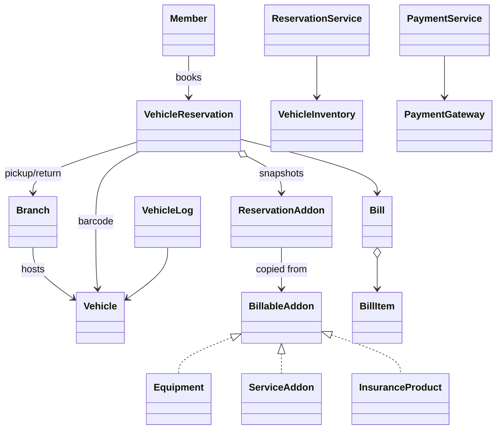
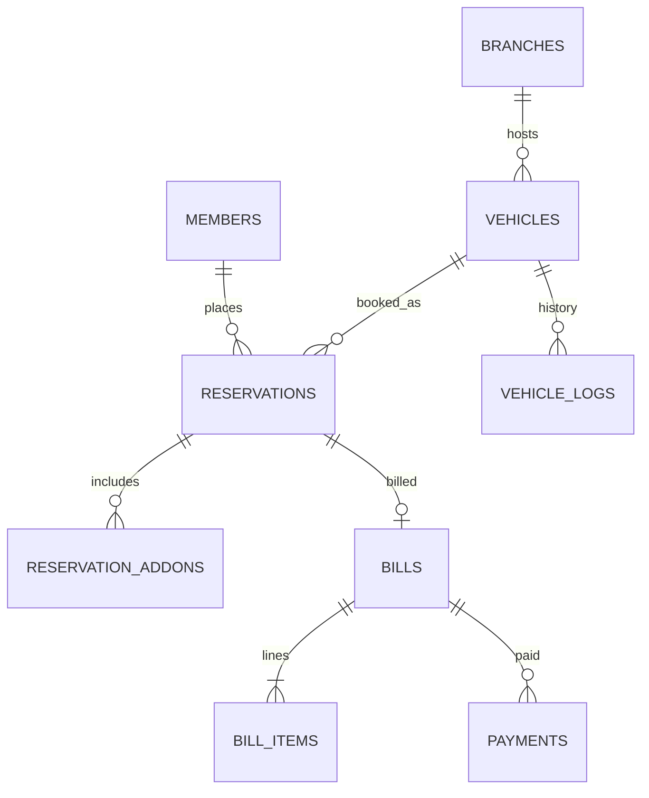

# Car Rental LLD — Classes, Relationships & Data Model

Maps OOP classes → relationships → relational tables.

Companions: [`README.md`](./README.md) · [`API_REFERENCE.md`](./API_REFERENCE.md)

---

## Why learn this?

Rental interviews almost always ask: *“How do you prevent double-booking in the DB?”* and *“How do you store add-on prices?”*  
Class design + table design together is **high-value 5+ YOE knowledge**.

---

## 1. Class catalog

| Package | Class | Persist? |
|---------|-------|----------|
| account | `Member` | **Yes** → `members` |
| branch | `Branch` | **Yes** → `branches` |
| vehicle | `Vehicle` | **Yes** → `vehicles` |
| vehicle | `VehicleInventory` | No (service) |
| reservation | `VehicleReservation` | **Yes** → `reservations` |
| reservation | `ReservationService` | No |
| addon | `Equipment` / `ServiceAddon` / `InsuranceProduct` | **Yes** → catalog tables |
| addon | `ReservationAddon` | **Yes** → `reservation_addons` |
| addon | `*Catalog` | No / cache over tables |
| billing | `Bill`, `BillItem` | **Yes** → `bills`, `bill_items` |
| payment | `PaymentGateway*`, `PaymentService` | Payment intents → `payments` |
| log | `VehicleLog` | **Yes** → `vehicle_logs` |
| events | `AsyncEventBus` | Kafka in prod |

---

## 2. Relationships



| Relation | Type |
|----------|------|
| Reservation → Vehicle | N:1 by barcode |
| Reservation → ReservationAddon | 1:N snapshots |
| Catalog addon → many reservations | via snapshots (not live FK price) |
| Vehicle → Branch | N:1 current location |
| Vehicle → VehicleLog | 1:N |

---

## 3. Tables

```sql
members (
  member_id UUID PK,
  username VARCHAR UNIQUE,
  password_hash VARCHAR,
  salt VARCHAR,
  name VARCHAR,
  email VARCHAR,
  license_number VARCHAR
);

branches (
  branch_id UUID PK,
  name VARCHAR,
  city VARCHAR,
  address VARCHAR
);

vehicles (
  barcode VARCHAR PK,
  type VARCHAR,          -- CAR|TRUCK|SUV|VAN|MOTORCYCLE
  make VARCHAR,
  model VARCHAR,
  parking_stall VARCHAR,
  branch_id UUID FK → branches,
  daily_rate NUMERIC(10,2),
  late_fee_per_hour NUMERIC(10,2),
  status VARCHAR,        -- AVAILABLE|RESERVED|RENTED|MAINTENANCE
  version INT DEFAULT 0
);

reservations (
  reservation_number VARCHAR PK,
  member_id UUID FK → members,
  vehicle_barcode VARCHAR FK → vehicles,
  start_at TIMESTAMPTZ,
  end_at TIMESTAMPTZ,
  pickup_branch_id UUID FK → branches,
  return_branch_id UUID FK → branches,
  status VARCHAR,        -- CONFIRMED|ACTIVE|COMPLETED|CANCELLED
  pickup_at TIMESTAMPTZ NULL,
  return_at TIMESTAMPTZ NULL,
  total_cost NUMERIC(12,2)
  -- Ideal: EXCLUDE constraint / GiST on (vehicle_barcode, tstzrange(start_at,end_at))
);

equipment_catalog (
  equipment_id VARCHAR PK,
  name VARCHAR,
  base_price_per_day NUMERIC(10,2)
);
-- similar: service_catalog, insurance_catalog

reservation_addons (
  id UUID PK,
  reservation_number VARCHAR FK → reservations,
  addon_id VARCHAR,
  category VARCHAR,      -- EQUIPMENT|SERVICE|INSURANCE
  name_snapshot VARCHAR,
  price_per_day_snapshot NUMERIC(10,2),
  quantity INT,
  per_reservation BOOLEAN
);

bills (
  bill_id VARCHAR PK,
  reservation_number VARCHAR FK → reservations,
  total_amount NUMERIC(12,2),
  payment_status VARCHAR
);

bill_items (
  id UUID PK,
  bill_id VARCHAR FK → bills,
  item_type VARCHAR,
  description VARCHAR,
  amount NUMERIC(12,2)
);

payments (
  payment_id UUID PK,
  bill_id VARCHAR FK → bills,
  method VARCHAR,
  amount NUMERIC(12,2),
  status VARCHAR,
  transaction_id VARCHAR,
  attempts INT
);

vehicle_logs (
  log_id UUID PK,
  vehicle_barcode VARCHAR FK → vehicles,
  log_type VARCHAR,
  description TEXT,
  performed_by VARCHAR,
  created_at TIMESTAMPTZ
);
```

### ER



---

## 4. Class → table

| Class | Table |
|-------|-------|
| `Member` | `members` |
| `Branch` | `branches` |
| `Vehicle` | `vehicles` |
| `VehicleReservation` | `reservations` |
| `ReservationAddon` | `reservation_addons` |
| `Equipment` etc. | `*_catalog` |
| `Bill` / `BillItem` | `bills` / `bill_items` |
| `VehicleLog` | `vehicle_logs` |
| Locks / EventBus / Gateways | runtime / Redis / Kafka / PSP |

---

## 5. Double-booking in SQL (interview gold)

```sql
-- Under transaction:
SELECT * FROM vehicles WHERE barcode = ? FOR UPDATE;
SELECT 1 FROM reservations
 WHERE vehicle_barcode = ?
   AND status IN ('CONFIRMED','ACTIVE')
   AND start_at < :end AND end_at > :start;
-- if none: INSERT reservation; UPDATE vehicles SET status='RESERVED';
```

Or PostgreSQL range exclusion constraint on `(vehicle_barcode, tstzrange)`.
