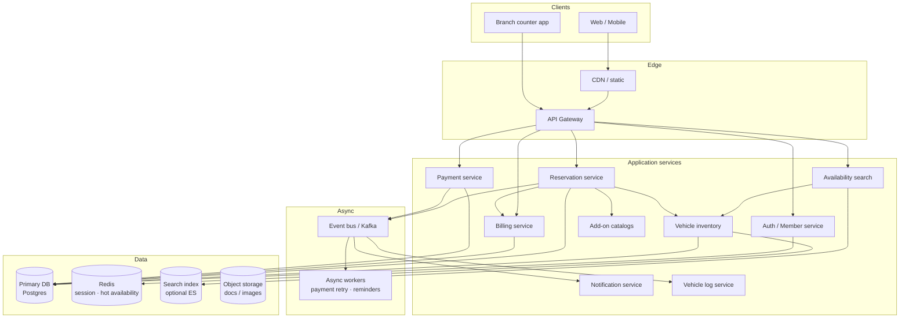

# Car Rental — HLD

High-level design for a multi-branch car rental platform (interview whiteboard).  
Companions: [`README.md`](./README.md) (LLD) · [`API_REFERENCE.md`](./API_REFERENCE.md)

---

## 1. Final architecture diagram



**Core booking path:** Search available vehicle → reserve under per-vehicle lock / DB transaction → snapshot add-ons into bill → async payment + notifications → pickup/return updates inventory + vehicle log (one-way return changes branch).

---

## 2. Why these technologies (and why not the alternatives)

| Concern | Choose | Why | Not / when to reconsider |
|---------|--------|-----|---------------------------|
| System of record | **Postgres** | Strong transactions for overlap + payment intent; relational fit for reservations, bills, branches | Cassandra — weak for multi-row booking invariants; Mongo OK for catalog docs, not for double-booking core |
| Concurrency on a car | **Row lock / `SELECT FOR UPDATE`** or app **per-vehicle lock** | Prevents overlapping CONFIRMED/ACTIVE rentals | Optimistic-only without conflict check — double-booking under race |
| Availability cache | **Redis** | Fast “cars free this weekend at SFO” reads | Cache-as-truth — must invalidate on reserve/cancel/return |
| Search | Postgres filters early; **Elasticsearch** if geo + fuzzy grow | Branch + type + date range is mostly structured | ES as sole source of truth — consistency lag → oversell |
| Payments | **Stripe/Adyen-style gateway** + idempotent PaymentService | PCI offload; retries with idempotency keys | Homegrown card vault — compliance nightmare |
| Notifications | **Kafka / SQS** + worker → email/SMS/push | Reservation confirm / due / overdue must not block booking API | Sync SMTP in request thread — latency + failure couples UX |
| Add-on pricing | **Catalog + reservation snapshot** | Price-at-booking stays stable if catalog changes later | Live FK to catalog price — bills rewrite history |
| Vehicle history | **Separate VehicleLog service/table** | Audit without bloating `Vehicle` aggregate | Logs inside Vehicle entity — God object, hard to query |

---

## 3. Components

| Component | Responsibility | Interview note |
|-----------|----------------|----------------|
| **Member / Auth** | Register, login, profile | Who rented what; authz on cancel |
| **Branch** | Airport/city locations | One-way = pickup branch ≠ return branch |
| **Vehicle Inventory** | Fleet by type/status/stall/branch | Status: AVAILABLE → RESERVED → RENTED → MAINTENANCE |
| **Reservation Service** | Search → reserve → cancel → pickup → return | **Critical section** per vehicle; overlap rules |
| **Cancellation Policy** | Fee strategy by timing | Strategy pattern — corporate vs consumer rules |
| **Add-on Catalogs** | Insurance, equipment, services | Billable interface + catalogs |
| **Billing** | Itemized bill (base, add-ons, late fee) | Snapshot lines, not recalculated whimsically |
| **Payment Service** | Async charge/refund + retry | Never block reserve forever on PSP timeout |
| **Notification Service** | Event-driven messages | Due approaching / overdue |
| **Vehicle Log** | Lifecycle audit trail | Pickup, return, damage, branch moves |
| **Event Bus** | Decouple side effects | At-least-once consumers; idempotent handlers |

---

## 4. Consistency model for bookings

```
reserve(vehicle, window):
  lock(vehicle) or FOR UPDATE
  assert no overlap on CONFIRMED/ACTIVE
  write reservation + set RESERVED
  create bill from base + addon snapshots
  publish ReservationCreated
  unlock
```

**Return path:** compute late fee → COMPLETED → AVAILABLE (at return branch) → log → notify.

---

## 5. Other important interview discussion points

**Clarify:** number of branches/vehicles, one-way allowed?, concurrent booking rate, payment authorization vs capture, damage deposits.

**Hot topics**
- Double-booking under concurrency (lock vs DB constraint on exclusion calendar)  
- Soft hold / payment timeout releasing RESERVED cars  
- One-way imbalance (too many cars at one airport) — ops rebalancing jobs  
- Late fees + timezone of “due”  
- Idempotent payments on retry  
- Why notifications must be async  
- Add-on snapshot vs live price  

**Scale sketch (say something concrete)**
- 200 branches × 500 cars ≈ 100K vehicles  
- Peak Friday search heavy; write path is per-car — shard by `vehicle_id` / branch  

**Follow-ups**
- “Can two members reserve overlapping windows if first never pays?” → TTL on unpaid hold  
- “Dynamic pricing?” → pricing service; still snapshot into bill at confirm  

**Link to LLD:** `com.carrental.lld.*` — per-vehicle `ReentrantLock`, async event bus, payment retry, addon snapshots.
