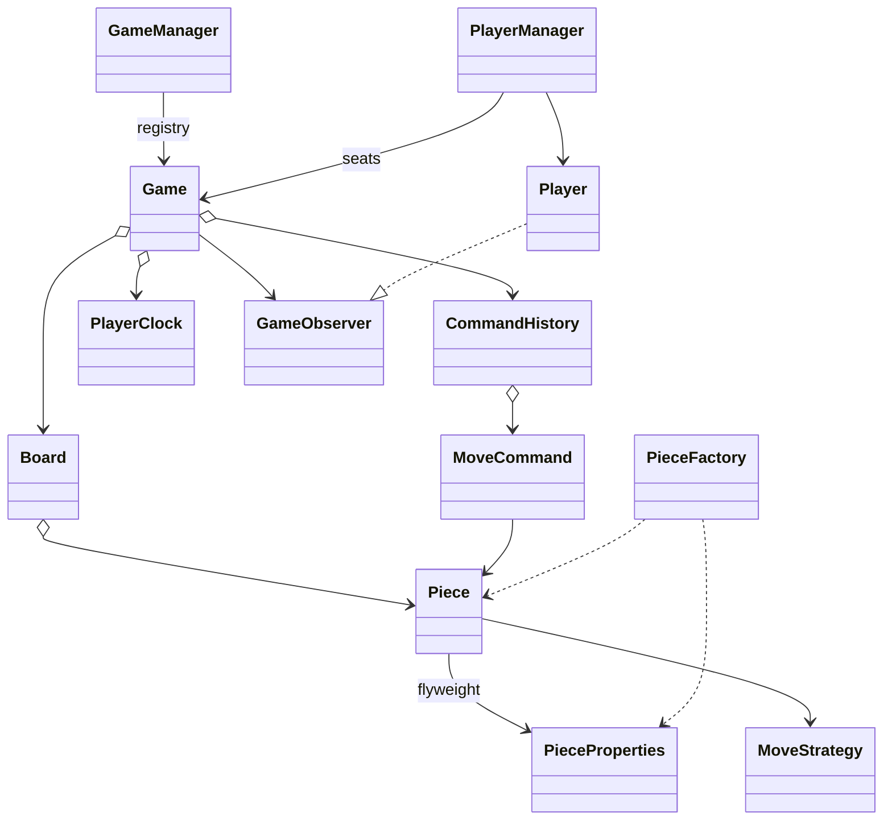

# Chess Game LLD — Classes, Relationships & Data Model

Companions: [`README.md`](./README.md) · [`API_REFERENCE.md`](./API_REFERENCE.md)

---

## 1. Class catalog

| Package | Class | Persist? |
|---------|-------|----------|
| manager | `GameManager` | No (process registry) |
| manager | `PlayerManager` | Session → Redis in prod |
| game | `Game` | Live in Redis; completed → `games` |
| game | `PlayerClock` | With game row |
| board | `Board` | Snapshot / FEN |
| piece | `Piece` / `PieceProperties` | Flyweight not persisted |
| move | `MoveCommand` | `moves` table |
| persist | `GameSnapshot` | Blob or move list |
| player | `Player` | `users` |

---

## 2. Relationships



| Relation | Type |
|----------|------|
| Game → Board | 1:1 |
| Game → MoveCommand | 1:N history |
| Piece → PieceProperties | N:1 flyweight |
| Player → Game | N:1 seated |

---

## 3. Tables (prod sketch)

```sql
games(id, status, turn, board_hash, fifty, white_ms, black_ms, winner)
moves(game_id, ply, start_x, start_y, end_x, end_y, captured, castle, ep)
game_seats(game_id, player_id, color)
position_counts(game_id, zobrist, n)  -- or keep in Redis hashmap
```

Live attack sets stay in memory; they are derived, not stored.
