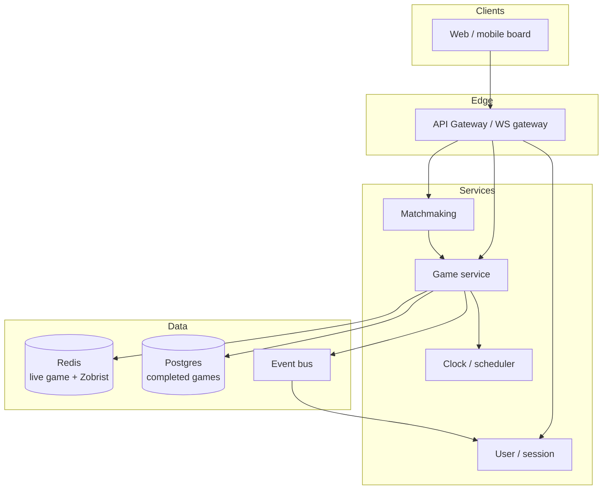

# Chess Game — HLD

High-level design for an online multiplayer chess platform (interview whiteboard).  
Companions: [`README.md`](./README.md) · [`API_REFERENCE.md`](./API_REFERENCE.md)

---

## 1. Final architecture diagram

## 2. Tech choices vs alternatives

| Concern | This design | Alternative | Why this |
|---------|-------------|-------------|----------|
| Concurrency | Per-game lock / actor | Global `synchronized` | Horizontal scale; one writer per match |
| Live state | In-memory + Redis snapshot | Only DB row per move | Sub-ms makeMove; DB for durability |
| Repetition | Zobrist | Store full boards | O(1) vs O(N) compare |
| Notifications | Observer / WS fan-out | Sync in makeMove | Don't block the writer thread |
| Clocks | Server `ScheduledExecutor` | Client timer | “Timeouts are game rules, not UI” |

## 3. Components

- **Matchmaking** — pair two players, `GameManager.createGame`, seat White/Black.
- **Game service** — validate + apply ply, publish events, persist snapshot.
- **Clock** — arm on turn start, cancel on move, auto-lose on expiry.
- **User** — sessions; observers for push.

## 4. Scaling

Chess games **scale horizontally by isolating state per game**. Shard by `gameId`. Never put all matches on one monitor.

## 5. Interview talking points

- Single writer principle vs synchronize-everything.
- Incremental attack maps: never recompute what you can update.
- Logs for humans, hashes for engines.
- Server-side clocks.
