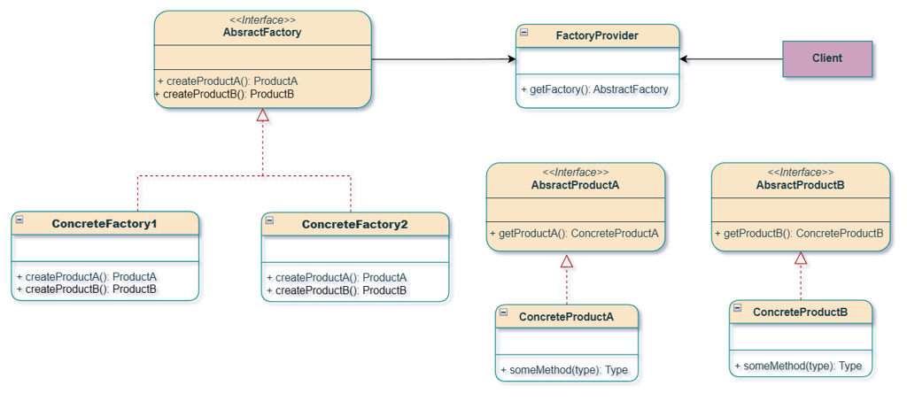
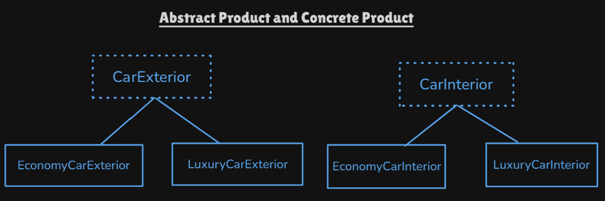
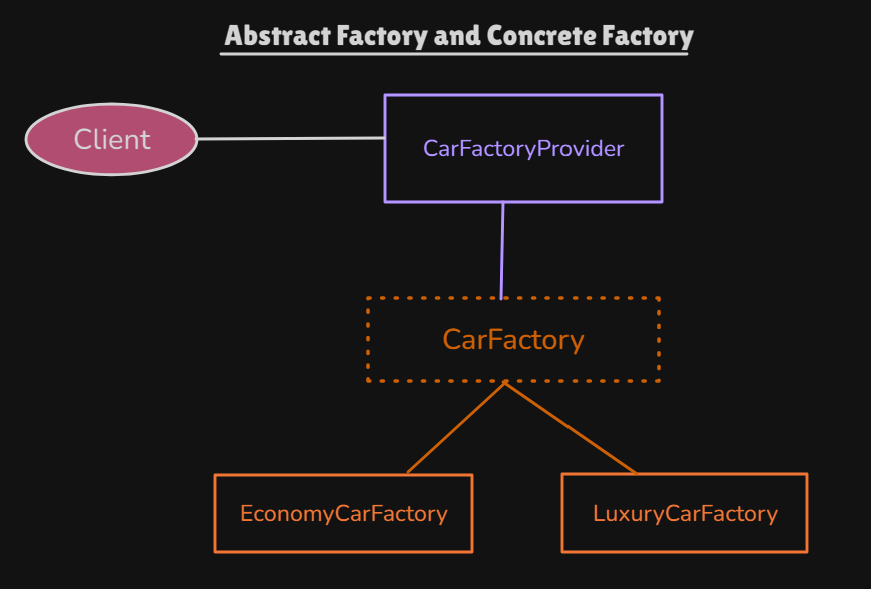

# Abstract Factory Pattern

Creational pattern: **an interface for creating a family of related products** without naming the concretes. Each concrete factory builds one consistent theme (economy interior **and** economy exterior). Nicknames: **factory of factories**, **super factory**.

This package follows the Concept & Coding LLD note: car manufacturing. UI kits (Light vs Dark: Button + Checkbox) are the same idea.

**Code:** `com.lld.patterns.abstractfactory.car`, `.demo`

## Why this pattern is required

Without Abstract Factory the client mixes families:

```text
new EconomyCarInterior();
new LuxuryCarExterior();   // mismatch: cheap cabin, chrome body
```

Or it `new`s every part itself:

```text
if (luxury) { new LuxuryCarInterior(); new LuxuryCarExterior(); }
```

That produces:

1. **Incompatible combinations** — products that were never designed to ship together.
2. **Client knows every concrete** — Honda economy vs Mercedes luxury leaks into the app.
3. **Switch explosion** — two product types × two families = four `if`s, worse with wheels/engine.
4. **Factory Method is not enough** — Factory Method builds **one** product (`Shape`). Here you need **interior + exterior** from the **same** family.

Abstract Factory is required when **many product types** must stay in **one family** (theme, platform, brand tier).

## Structure

**Class diagram** (from the LLD note):



**Product families:**



**Factories and provider:**



| Role | In this codebase | Job |
|------|------------------|-----|
| **Abstract products** | `CarInterior`, `CarExterior` | Family members |
| **Concrete products** | `Economy*` / `Luxury*` | Matching pair |
| **Abstract factory** | `CarFactory` | `createInterior()`, `createExterior()` |
| **Concrete factories** | `EconomyCarFactory`, `LuxuryCarFactory` | One family each |
| **Provider** | `CarFactoryProvider` | `getFactory(CarType, brand)` — Simple Factory of factories |
| **Client** | `AbstractFactoryPatternDemo` | Only `CarFactory.produceCompleteVehicle()` |

```
Provider.getFactory(ECONOMY, "Honda")
        → EconomyCarFactory
             createInterior() → EconomyCarInterior  (basic)
             createExterior() → EconomyCarExterior  (basic)

LUXURY / PREMIUM → LuxuryCarFactory  (luxurious interior + exterior)
```

`produceCompleteVehicle()` is a **template method** on the factory: it calls the two factory methods then assembles. Factory Method inside Abstract Factory.

## Where to use it (and why there)

| Domain | Family | Products |
|--------|--------|----------|
| **This package** | Economy vs luxury | Interior + exterior |
| **UI toolkit** | Light vs dark / Mac vs Windows | Button, checkbox, scrollbar |
| **DB** | Postgres vs MySQL | Connection, command, transaction |
| **Cloud** | AWS vs GCP | Compute + storage + queue |

**Do not use it** for a **single** product with variants (that is **Factory Method** / Simple Factory). Do not add a new product type (`Engine`) without changing `CarFactory` — that is the usual OCP tax.

## Factory Method vs Abstract Factory (from the note)

| | **Factory Method** | **Abstract Factory** |
|--|--------------------|----------------------|
| **When** | **One** product, many variants | **Many** products, grouped by family |
| **This repo** | `Shape` / `SquareCreator` | Interior + exterior / `EconomyCarFactory` |
| **How many factory methods?** | Usually one (`createShape`) | Several (`createInterior`, `createExterior`) |
| **Nickname** | Creator per product | Factory of factories |

One-liner from the note: **one product, many variants → Factory Method. Many products, grouped by family → Abstract Factory.**

## Pros and cons

**Pros**

- Economy never mixes with luxury chrome in this factory.
- Client swaps family at runtime via the provider (`ECONOMY` vs `LUXURY`).
- New family (`ElectricCarFactory`) without editing existing factories (OCP on families).
- Products stay behind `CarInterior` / `CarExterior` (DIP).

**Cons**

- New product type (`Engine`) changes the abstract factory **and every** concrete factory.
- Many classes (2 products × 2 families + 2 factories + provider).
- `CarFactoryProvider` is still a Simple Factory `switch` (OCP-weak for **new `CarType`**).
- Unused `brand` in the note’s factories — stored, not printed in `produceCompleteVehicle`.

## How it follows SOLID

| Principle | How Abstract Factory satisfies it | How the mixed `new` design breaks it |
|-----------|-----------------------------------|--------------------------------------|
| **S** | `LuxuryCarFactory` only builds luxury parts. Assembly is the template. | Client creates and assembles every part. |
| **O** | New family = new factory class. New `CarType` still edits the provider. | New luxury part = more `if`s in the client. |
| **L** | Any `CarFactory` must return a matching interior/exterior pair. | Factory that returns economy interior + luxury exterior. |
| **I** | Two small product interfaces. | One fat `CarParts` with unused luxury-only methods. |
| **D** | Client depends on `CarFactory`, not `LuxuryCarInterior`. | Client `new LuxuryCarInterior()`. |

## How it differs from Factory Method, Simple Factory, and Builder

| | **Abstract Factory** | **Factory Method** | **Simple Factory** | **Builder** |
|--|----------------------|--------------------|--------------------|-------------|
| **Creates** | A **set** of related objects | One object | One object from a `switch` | One complex object step by step |
| **Consistency** | Family stays together | N/A | N/A | Same object, many steps |
| **This repo** | Cars | Shapes | `simple.ShapeFactory` | Not yet |

## Run

```bash
cd DesignPatterns
javac -d out $(find src -name '*.java')
java -cp out com.lld.patterns.abstractfactory.demo.AbstractFactoryPatternDemo
```

Three runs: Honda economy (basic), Mercedes luxury, Rolls Royce premium (same luxury family as the note).

## Interview questions and answers

**1. What is Abstract Factory?**  
A creational pattern that creates families of related products without specifying concrete classes.

**2. Why “factory of factories”?**  
`CarFactoryProvider` returns a `CarFactory`; that factory then creates interior and exterior.

**3. When Factory Method vs this?**  
One product → Factory Method. Several products that must match → Abstract Factory.

**4. Products in this demo?**  
`CarInterior` and `CarExterior`. Economy pair vs luxury pair.

**5. What if the client mixes families?**  
That is the bug Abstract Factory prevents: you never `new` a luxury exterior from an economy factory.

**6. `produceCompleteVehicle`?**  
Default method: template that calls `createInterior`/`createExterior` then `add*Components`. Factory Method + Template Method.

**7. PREMIUM vs LUXURY?**  
Both map to `LuxuryCarFactory` in the note.

**8. Provider vs abstract factory?**  
Provider is Simple Factory of factories. The GoF pattern is `CarFactory` + concretes. The provider is convenience.

**9. How does it follow OCP?**  
New family: new factory + products. New product *kind*: must change `CarFactory` (harder).

**10. vs Builder?**  
Builder: one object, many steps. Abstract Factory: several objects, one theme.

**11. UI example?**  
`GUIFactory.createButton()` + `createCheckbox()` for Windows vs Mac so you never mix widgets.

**12. DIP?**  
Client talks to `CarFactory`, `CarInterior`, `CarExterior`.

**13. `brand` field?**  
Passed into the factory; the note does not use it in `produceCompleteVehicle`. Available via `getBrand()`.

**14. Adding `SportCarFactory`?**  
New factory + sport interior/exterior. Add `CarType.SPORT` in the provider `switch`.

**15. Adding `Engine`?**  
Add `createEngine()` to `CarFactory` and every concrete factory. That is the painful axis.

**16. vs Singleton?**  
A factory instance is not “the one DB.” You can have many factory objects; each produces a family.

**17. Thread safety?**  
Stateless factories are shareable. Don’t put a mutable VIN counter on the factory without care.

**18. Testing?**  
Inject a fake `CarFactory` that returns test doubles for interior/exterior.

**19. Java examples?**  
`DocumentBuilderFactory`, `TransformerFactory` — factory of factories for XML.

**20. Why not one Factory Method per part?**  
You could, but nothing stops mixing. Abstract Factory **binds the family** in one object.
