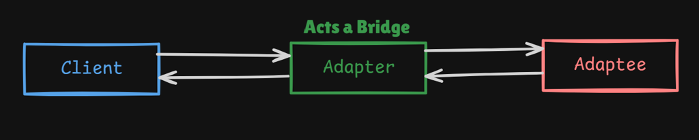
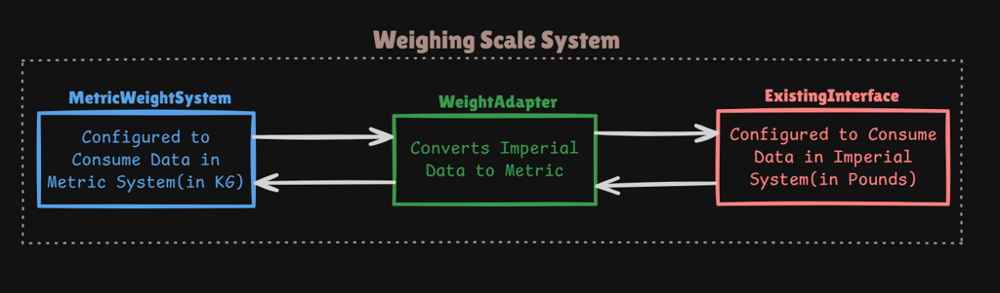
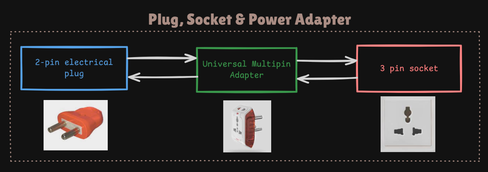
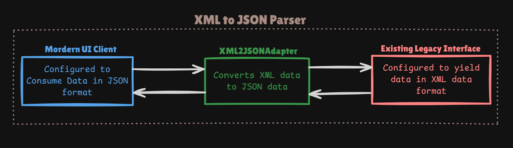
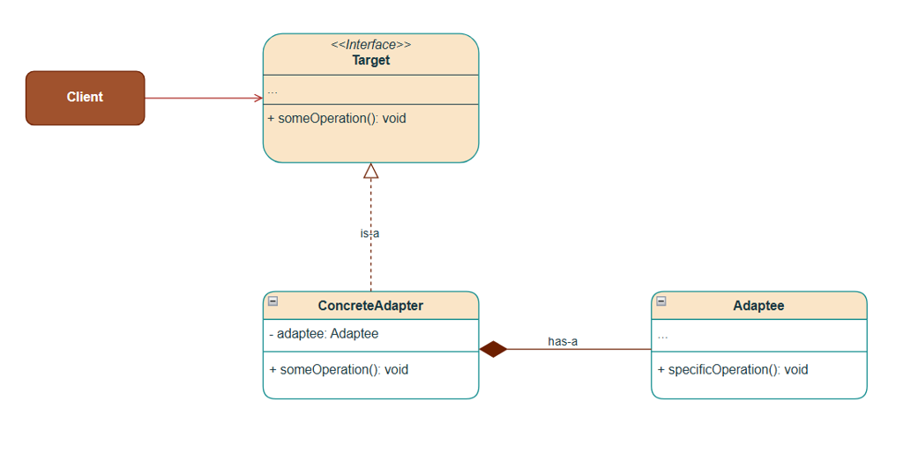
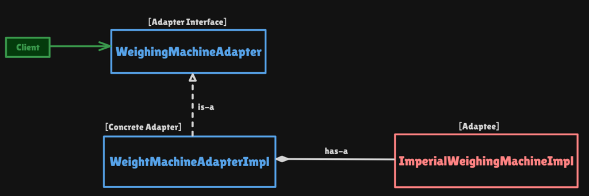

# Adapter Pattern

Structural pattern: **a bridge between two incompatible interfaces**. The client keeps the API it already expects; the adapter **translates** calls and data so an existing class can be used without rewriting it.

This package follows the Concept & Coding LLD note: weighing scale (pounds → kg). Plug/socket and XML→JSON are the same idea, not coded.

**Code:** `com.lld.patterns.adapter.weighing`, `.demo`

## Why this pattern is required

Without Adapter the metric client must speak pounds (or you fork the US scale):

```text
double lb = imperialScale.getWeightInPounds();
double kg = lb * 0.45;   // conversion copied in every screen
```

That produces:

1. **Scattered conversion** — every caller knows pounds and the formula. Miss one and you mix units.
2. **You cannot change the adaptee** — third-party / legacy `getWeightInPounds()` stays. Forking it is not an option.
3. **Wrong pattern if you “just wrap”** — Proxy would still expose pounds. Facade would not exist to *translate* one method; it would hide many services.
4. **Client should stay metric** — hospital UI is `getWeightInKg()`. The US hardware should not leak into that UI.

Adapter is required when **an existing object’s interface does not match** what the client already uses, and you **must not modify** that object.

## Structure

**Adapter as a bridge:**



**Weighing scale (this codebase):**



**Plug, socket, and travel adapter:**



**XML → JSON (same shape, not coded):**



**Class diagram** (from the LLD note):



**Structure** (weighing machine):



| Role | In this codebase | Job |
|------|------------------|-----|
| **Target** | `WeighingMachineAdapter` | `getWeightInKg()` — what the client expects |
| **Adaptee** | `ImperialWeighingMachine` / `ImperialWeighingMachineImpl` | `getWeightInPounds()` — existing US scale |
| **Concrete adapter** | `WeightMachineAdapterImpl` | IS-A target, HAS-A adaptee; `lb * 0.45` |
| **Client** | `AdapterPatternDemo` | Prints kg; does not convert |

```
Client
  getWeightInKg()
        │
        ▼
WeightMachineAdapterImpl
  lb = imperial.getWeightInPounds()
  return lb * 0.45
        │
        ▼
ImperialWeighingMachineImpl   (25.0 lb → 11.25 kg)
```

**IS-A:** `WeightMachineAdapterImpl` is-a `WeighingMachineAdapter`.

**HAS-A:** adapter has-a `ImperialWeighingMachine` (object adapter / composition). The note does not use class-adapter inheritance.

## Where to use it (and why there)

Use Adapter when **you already have a client API** and **an incompatible library/legacy object**.

| Domain | Why Adapter | Translation |
|--------|-------------|-------------|
| **Weighing scale** | Metric UI vs US hardware | pounds → kg |
| **Plug / socket** | 2-pin plug vs 3-pin wall | travel adapter |
| **XML / JSON** | Modern UI wants JSON; legacy yields XML | `XML2JSONAdapter` |
| **Payment / SDKs** | App uses `pay(amount)`; Stripe/Razorpay differ | wrap each SDK |
| **Java I/O** | `Reader` vs `InputStream` | `InputStreamReader` |
| **Arrays ↔ lists** | `Arrays.asList`, `Collections.list` | view adapters |

**Do not use it** to hide a *checkout workflow of many services* (Facade), to *control access* to one object with the **same** API (Proxy), or to *add toppings* (Decorator).

## Pros and cons

**Pros**

- Adaptee stays closed; no fork of the US scale.
- Client stays on `getWeightInKg()`; conversion lives in one class.
- Open for a second adaptee (e.g. stone/ounce scale) via another adapter, same target.
- Object adapter (composition) works even if adaptee is `final`.

**Cons**

- Extra type and hop; stack traces go Client → Adapter → Adaptee.
- A fat adapter that maps a huge API is noisy (split by use case).
- Two-way adapters (metric *and* imperial both wrap each other) get confusing.
- Class adapter (multiple inheritance) is unavailable in Java — composition only.

## How it follows SOLID

| Principle | How Adapter satisfies it | How the bad design breaks it |
|-----------|--------------------------|------------------------------|
| **S — Single Responsibility** | Impl reports pounds. Adapter converts. Client displays kg. | Metric UI also knows the pounds formula. |
| **O — Open/Closed** | New `StoneWeighingAdapter` for a UK scale; client unchanged. | Edit every screen when a new unit appears. |
| **L — Liskov Substitution** | Any `WeighingMachineAdapter` must return kg, not pounds. | Adapter that returns pounds from `getWeightInKg()`. |
| **I — Interface Segregation** | Tiny `getWeightInKg()`. | Forcing the client to depend on calibration/tare APIs. |
| **D — Dependency Inversion** | Client depends on `WeighingMachineAdapter`, not `ImperialWeighingMachineImpl`. | Client `new`s the US impl and converts inline. |

## How it differs from Facade, Proxy, and Decorator

| | **Adapter** | **Facade** | **Proxy** | **Decorator** |
|--|-------------|------------|-----------|---------------|
| **Intent** | Make **incompatible** APIs work | **Simplify** many objects / one workflow | **Control access** to **one** object | **Add** behavior, same API |
| **Interface** | **Different** (target ≠ adaptee) | Usually **narrower** than the subsystem | **Same** as the real object | **Same** as the component |
| **How many objects** | One adaptee | Many subsystems | One real subject | One wrappee (+ stack) |
| **This repo / note** | pounds → kg | `OrderFacade` | `EmployeeDaoProxy` | Pizza toppings |

**Adapter vs Facade:** Facade **simplifies** a subsystem the client *could* call directly. Adapter **translates** an API the client *cannot* call as-is. You do not write an Adapter to hide checkout; you write a Facade.

**Adapter vs Proxy:** Proxy keeps the **same** interface (`EmployeeDao`). Adapter **changes** the interface (`getWeightInPounds` → `getWeightInKg`).

**Adapter vs Decorator:** Decorator wraps to **enrich** (`getCost` still means cost). Adapter wraps to **rename/convert**.

**Adapter vs Bridge:** Bridge is designed up front so abstraction and implementation vary independently. Adapter is a **retrofit** after two APIs already exist.

## Run

```bash
cd DesignPatterns
javac -d out $(find src -name '*.java')
java -cp out com.lld.patterns.adapter.demo.AdapterPatternDemo
```

## Interview questions and answers

**1. What is Adapter?**  
A structural pattern that converts one interface into another the client already expects so incompatible classes can work together.

**2. When do you use it?**  
Legacy or third-party API you cannot change; units, XML vs JSON, SDK shapes, plugs vs sockets.

**3. Target vs adaptee vs adapter?**  
Target = `WeighingMachineAdapter.getWeightInKg()`. Adaptee = imperial scale. Adapter holds the scale and converts.

**4. IS-A and HAS-A?**  
Concrete adapter **is-a** target and **has-a** adaptee (object adapter).

**5. Object adapter vs class adapter?**  
Object: composition (this code; Java). Class: inherit adaptee + implement target (C++ multiple inheritance).

**6. What is the conversion here?**  
25 lb × 0.45 = 11.25 kg (note’s simplified factor; real is ≈ 0.453592).

**7. Adapter vs Facade?**  
Translate vs simplify. See table.

**8. Adapter vs Proxy?**  
Different interface vs same interface + access control.

**9. Adapter vs Decorator?**  
Convert/rename vs add behavior.

**10. Adapter vs Bridge?**  
Retrofit mismatch vs two hierarchies designed to vary.

**11. Two-way adapter?**  
One class that looks like A to B and B to A (rare; keep one direction unless you must).

**12. How does it follow SOLID?**  
Conversion in the adapter (SRP), new scales as new adapters (OCP). See table.

**13. Java examples?**  
`InputStreamReader`, `Arrays.asList`, `java.util.Collections.enumeration`, JDBC drivers as adapters over vendor APIs.

**14. Can you adapt many adaptees to one target?**  
Yes: `StripePaymentAdapter`, `RazorpayPaymentAdapter` both implement `PaymentGateway`.

**15. Why not change `ImperialWeighingMachineImpl`?**  
Vendor/legacy; other callers still want pounds; closed for modification.

**16. Downsides?**  
Extra types; huge adapters; easy to hide a god-conversion class.

**17. XML to JSON?**  
Same pattern: client wants JSON; legacy returns XML; `XML2JSONAdapter` is the target impl.

**18. Plug analogy?**  
2-pin plug (client shape) + 3-pin wall (adaptee) + travel adapter (this class).

**19. Thread safety?**  
Stateless conversion is fine to share. If the scale object is mutable, do not share the adapter across threads without care.

**20. How would you add stones?**  
`StoneWeighingMachine` adaptee + `StoneToKgAdapter` implementing `WeighingMachineAdapter`. Demo still only calls `getWeightInKg()`.
