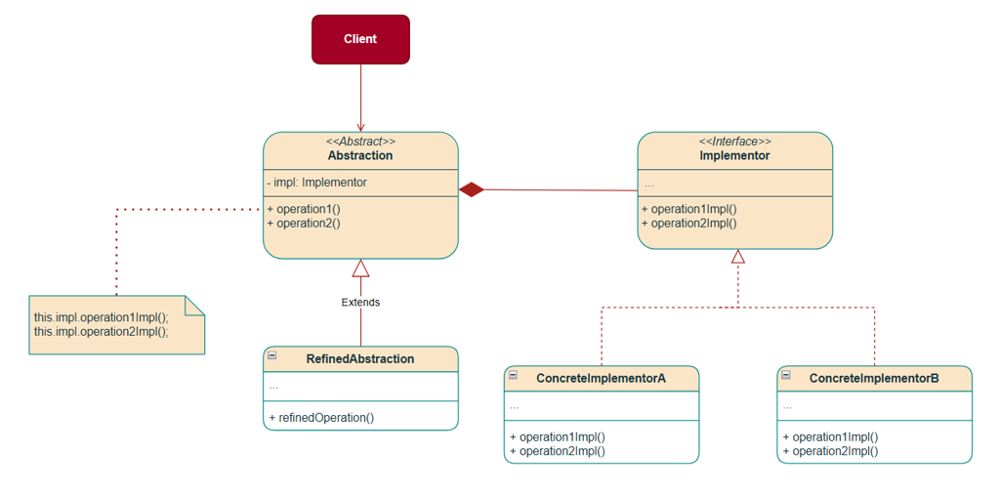
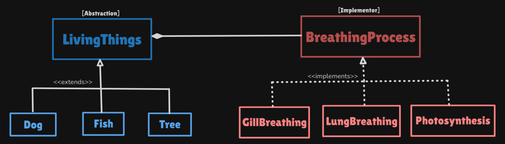

# Bridge Pattern

Structural pattern: **decouple abstraction (the “what”) from implementation (the “how”)** so each hierarchy can grow without a class for every combination.

This package follows the Concept & Coding LLD note: living things × breathing process. Dog/Whale share lungs; Fish uses gills; Tree uses photosynthesis. Shape×renderer and remote×device are the same idea.

**Code:** `com.lld.patterns.bridge.living`, `.breathing`, `.demo`

## Why this pattern is required

Without Bridge, each animal **hardcodes** how it breathes:

```text
class Dog extends LivingThings {
  void breathe() { /* lungs, land, inhale O2 ... */ }
}
class Whale extends LivingThings {
  void breathe() { /* lungs again, copy-paste */ }
}
```

That produces:

1. **Duplication** — Dog and Whale both have lung logic.
2. **Tight coupling** — you cannot reuse gill breathing on a new animal without copying.
3. **Class explosion** — `DogWithLungs`, `WhaleWithLungs`, `FishWithGills`, `FrogWithSkin`, …
4. **Cannot extend one axis** — a new `SkinBreathing` mechanism forces new subclasses on every animal that might use it.

Bridge is required when **two dimensions vary independently** (kind of living thing × kind of respiration) and you must **compose** them instead of subclassing the Cartesian product.

## Structure

**Class diagram** (from the LLD note):



**Structure** (living things × breathing):



| Role | In this codebase | Job |
|------|------------------|-----|
| **Abstraction** | `LivingThings` | High-level `breathe()`; **has-a** `BreathingProcess` |
| **Refined abstraction** | `Dog`, `Fish`, `Tree`, `Whale`, `Frog` | The “what” (prints the species, then delegates) |
| **Implementor** | `BreathingProcess` | The “how”: `breathe()` |
| **Concrete implementor** | `LungBreathing`, `GillBreathing`, `Photosynthesis`, `SkinBreathing` | Reusable mechanisms |
| **Client** | `BridgePatternDemo` | Mixes: `new Whale(new LungBreathing())` |

```
Client
  new Dog(new LungBreathing())
  new Fish(new GillBreathing())
  new Whale(new LungBreathing())   // same how, different what
  new Frog(new SkinBreathing())    // new what + new how, no matrix class
        │
        ▼
LivingThings.breathe()  →  breathingProcess.breathe()
```

The **bridge** is the field `LivingThings.breathingProcess`. Abstraction and implementor are linked by **composition**, not inheritance.

## Where to use it (and why there)

Use Bridge when you would otherwise multiply **N kinds × M implementations**.

| Domain | Abstraction (what) | Implementor (how) |
|--------|--------------------|-------------------|
| **This package** | Living thing | Breathing process |
| **Shapes / drawing** | Circle, square | Vector vs raster renderer |
| **Remote / device** | TV remote UI | IR vs Bluetooth vs Wi-Fi |
| **Notifications** | Alert, reminder | Email vs SMS vs push |
| **Persistence** | Repository API | SQL vs document vs memory |
| **This repo (Strategy)** | Vehicle is *not* Bridge | Drive is **one** family of algorithms |

**Do not use it** when only **one** dimension varies (that is **Strategy**), or when you are **translating** an existing API (**Adapter**), or **wrapping to add** toppings (**Decorator**).

## Pros and cons

**Pros**

- Add `Frog` without editing `LungBreathing`. Add `SkinBreathing` without editing `Dog`.
- Lung logic lives once; Dog and Whale share it.
- Mix at construction (or later, if you add a setter): whale + lungs, fish + gills.
- Avoids `DogWithLungs` / `FishWithGills` explosion.

**Cons**

- Two hierarchies to learn; overkill if there is only one breathing type forever.
- Indirection: `Dog.breathe()` → `LungBreathing.breathe()`.
- Easy to confuse with Strategy in interviews (same composition shape).
- Refined abstractions in this demo are thin (just a label). Real Bridge abstractions often have more “what” logic (move, feed) that still delegates “how.”

## How it follows SOLID

| Principle | How Bridge satisfies it | How the bad design breaks it |
|-----------|-------------------------|------------------------------|
| **S — Single Responsibility** | `Dog` is a dog. `LungBreathing` is lungs. | `Dog.breathe()` owns species **and** respiratory chemistry. |
| **O — Open/Closed** | New animal class or new process class; the other tree stays closed. | New combo = new subclass or copy-paste `breathe()`. |
| **L — Liskov Substitution** | Any `BreathingProcess` can sit in `LivingThings`. `Frog` is still a `LivingThings`. | `Whale.breathe()` that secretly uses a different undocumented mechanism. |
| **I — Interface Segregation** | Tiny `breathe()` on the implementor. | One fat `LivingThings` with gill, lung, and leaf methods. |
| **D — Dependency Inversion** | `LivingThings` depends on `BreathingProcess`, not `LungBreathing`. | `Dog` constructs lung details inline. |

## How it differs from Strategy, Adapter, and Decorator

| | **Bridge** | **Strategy** | **Adapter** | **Decorator** |
|--|------------|--------------|-------------|---------------|
| **Intent** | Two hierarchies evolve **independently** | Swap **one** algorithm | Make **incompatible** APIs match | **Add** behavior, same API |
| **When you pick it** | Design-time split to kill a subclass matrix | Runtime choice of *how* for one job | Retrofit after two APIs exist | Stack features on one object |
| **This repo** | Living thing × breathing | Drive / pay | pounds → kg | Pizza toppings |
| **Who grows** | **Both** trees | Mostly the strategy list | One adaptee wrapper | The decorator list |

**Bridge vs Strategy (from the note):** Same “has-a behavior object” shape. **Intent** differs.

- Bridge: *two* hierarchies — living things **and** respiratory mechanisms — must both extend. Binding is structural (Dog is not “choosing a route”).
- Strategy: *one* behavior family, swapped dynamically — Google Maps fastest vs shortest vs avoid tolls; this repo’s `PaymentStrategy`.

You can use both: a `Remote` (Bridge abstraction over IR/BT) might use a Strategy for volume curves.

**Bridge vs Adapter:** Adapter is a **retrofit** (`getWeightInPounds` → `getWeightInKg`). Bridge is designed so abstraction and implementation start separate.

**Bridge vs Decorator:** Decorator stacks add-ons on **one** object. Bridge is **two dimensions** (species × lungs), not Extra Cheese wrapping Farmhouse.

## Run

```bash
cd DesignPatterns
javac -d out $(find src -name '*.java')
java -cp out com.lld.patterns.bridge.demo.BridgePatternDemo
```

## Interview questions and answers

**1. What is Bridge?**  
A structural pattern that decouples abstraction from implementation so both can vary independently, linked by composition.

**2. What problem does it solve?**  
Cartesian subclass explosion and duplicated “how” logic (Dog and Whale both inlining lungs).

**3. Abstraction vs implementor here?**  
`LivingThings` = what. `BreathingProcess` = how. The field on `LivingThings` is the bridge.

**4. Why not put `breathe()` only on `LivingThings` as a switch?**  
`switch (species)` or `switch (organ)` grows every time you add a type. Two trees + composition stay closed.

**5. Mix and match in the demo?**  
`Dog` + lungs, `Fish` + gills, `Tree` + photosynthesis, `Whale` + lungs, `Frog` + skin.

**6. Add Frog / SkinBreathing?**  
New refined abstraction and/or new implementor. No `FrogWithSkin` class and no edits to `Dog`.

**7. Bridge vs Strategy?**  
Strategy: one algorithm family, often chosen at runtime. Bridge: two hierarchies. See table. The note: Maps routes = Strategy; living things × respiration = Bridge.

**8. Why do they look the same in code?**  
Both are composition + interface. Interviews grade **intent** and **how many axes grow**.

**9. Adapter vs Bridge?**  
Adapter translates an existing mismatch. Bridge is an up-front split.

**10. How does it follow SOLID?**  
New animal or new process without editing the other (OCP). Depend on `BreathingProcess` (DIP).

**11. Could `LivingThings.breathe()` be concrete?**  
Yes: `public void breathe() { breathingProcess.breathe(); }` and refined classes only add extra “what.” This note keeps `breathe()` abstract so each species prints its name first.

**12. Shape and renderer?**  
`Shape` abstraction, `Renderer` implementor. `Circle`/`Square` × `Vector`/`Raster` — classic Bridge, same as this package.

**13. Java examples?**  
JDBC (`Connection` vs vendor driver), AWT peers (historically), lists vs list UI delegates.

**14. Downsides?**  
Two packages of types; overkill for one implementation; easy Strategy mix-up.

**15. Runtime swap?**  
Add `setBreathingProcess`. A tadpole might start with gills and later use lungs. Still Bridge (two trees), with Strategy-like swapping of the implementor.

**16. Class explosion numbers?**  
4 animals × 4 processes = 16 subclasses without Bridge; 4 + 4 = 8 types with Bridge (plus the two roots).

**17. vs Facade?**  
Facade hides **many** services behind one API. Bridge splits **two** trees. Not a front door to lungs+gills+leaves.

**18. Thread safety?**  
If you never swap the process after construct (`final` here), sharing a `Dog` is fine. A setter needs the same care as Strategy.

**19. Why Whale if Dog already has lungs?**  
To show the **same implementor** on a **different abstraction** — the duplication the naive design copies.

**20. How would you add `Bird`?**  
`class Bird extends LivingThings` + `new Bird(new LungBreathing())`. No change to existing breathing classes.
