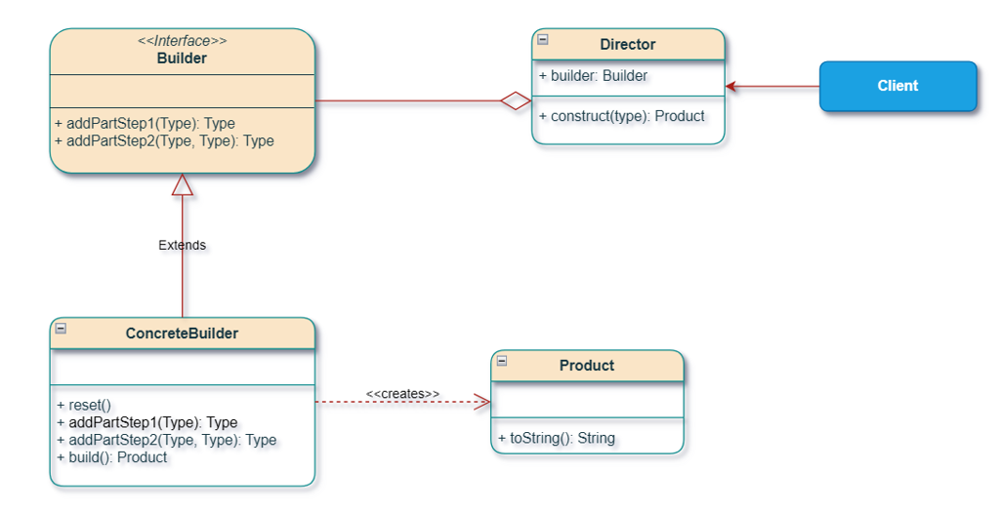

# Builder Pattern

Creational pattern: **construct a complex object step by step**. Useful when many fields are **optional**, when you want **different representations** of the same product (engineering vs MBA student), or when a telescoping constructor list has become unreadable.

This package follows the Concept & Coding LLD note: **student registration**. Not the Prototype `Student` in `com.lld.patterns.prototype`.

**Code:** `com.lld.patterns.builder.student`, `.demo`

## Why this pattern is required

Without Builder you overload constructors (telescoping):

```text
Student(roll, age, name, branch)
Student(..., fatherName)
Student(..., fatherName, motherName)
Student(..., emailId)     // same signature as mobileNo — will not compile
Student(all nine args)    // callers pass null for unused optionals
```

That produces:

1. **Constructor explosion** — one extra optional ≈ one extra ctor.
2. **Same-type collisions** — `String emailId` vs `String mobileNo` cannot both be “the 7th String.”
3. **Unreadable calls** — `new Student(1, 22, "John", "CSE", null, null, list, null, null)`.
4. **Wrong assignment** — mix up two `String`s; the compiler cannot help.
5. **No immutability** — without Builder, people add setters. Final fields need all values in one ctor.
6. **SRP** — `Student` stores data **and** every construction recipe.

Builder is required when **construction is a process** (fluent steps + `build()`), not a single `new`.

## Structure

**Class diagram** (from the LLD note):



| Role | In this codebase | Job |
|------|------------------|-----|
| **Product** | `Student` | Complex object; ctor takes the builder |
| **Builder** | `StudentBuilder` | Fluent setters; abstract `setSubjects()` |
| **Concrete builders** | `EngineeringStudentBuilder`, `MBAStudentBuilder` | Different subject lists |
| **Director** (optional) | `StudentRegistrationDirector` | Recipes: John/CSE vs Sarah/MBA |
| **Client** | `BuilderPatternDemo` | Wires director + builder |

```
Director(EngineeringStudentBuilder)
  setRollNumber(1).setAge(22).setName("John")...setSubjects().build()
        → Student  OS, CA, DS, DBMS

Director(MBAStudentBuilder)
  ...setSubjects().setMobileNo(...).setEmailId(...).build()
        → Student  Micro Econ, Business Studies, ...
```

Fluent interface: each setter **returns `this`** so you can chain.

## Where to use it (and why there)

| Domain | Why Builder |
|--------|-------------|
| **Student / user / order** | Many optional fields |
| **SQL / HTTP** | `QueryBuilder`, `Request.Builder` |
| **String** | `StringBuilder` (same idea, not GoF Director) |
| **Lombok / records** | Generated builders |

**Do not use it** for 2 required fields. Do not confuse with **Decorator** (that **wraps behavior** after the object exists).

## Builder vs Decorator (from the note)

| | **Builder** | **Decorator** |
|--|-------------|---------------|
| **When** | **Building** a complex object | **Extending** behavior at runtime |
| **This repo** | Student registration | Pizza toppings |
| **Result** | One product from steps | Wrapper stack around a component |

**Conclusion from the note:** complex construction → Builder. Layering enhancements → Decorator.

## Pros and cons

**Pros**

- Named steps: `setEmailId` vs a 9-arg ctor.
- Skip optionals (MBA has phone/email; engineer in the director does not).
- Different representations: engineering vs MBA subjects.
- Product ctor can stay package-private; fields can be `final` in a stricter design.

**Cons**

- Extra types (builder + director).
- Director `instanceof` is OCP-weak (this note). Prefer `builder.buildStandard()` per subtype.
- Note’s `toString` used `subjects.get(0..2)` — 4 subjects, and NPE if list is null. This code prints the whole list.
- Mutable builder reused without reset can leak previous `setMobileNo`.

## How it follows SOLID

| Principle | How Builder satisfies it | How telescoping ctors break it |
|-----------|--------------------------|--------------------------------|
| **S** | `Student` holds data. Builder/director own recipes. | One class is data + every ctor variant. |
| **O** | New `LawStudentBuilder` with `setSubjects()`. Director still may need a branch. | New optional = new ctor on `Student`. |
| **L** | Any `StudentBuilder` must `build()` a valid `Student`. | Ctor that leaves mandatory `name` null. |
| **I** | Client can use director or chain setters itself. | Forced to pass all nine args. |
| **D** | Director depends on `StudentBuilder`, not only `EngineeringStudentBuilder` (except the `instanceof`). | Client `new Student(....)`. |

## How it differs from Factory, Prototype, and Abstract Factory

| | **Builder** | **Factory Method** | **Abstract Factory** | **Prototype** |
|--|-------------|--------------------|----------------------|---------------|
| **Creates** | One object, **many steps** | One object, one `new` | A **family** of objects | A **clone** |
| **Optional params** | First-class | Awkward | N/A | Copy then tweak |
| **This repo** | Student | `Shape` | Car interior+exterior | Prototype `Student.clone()` |

## Run

```bash
cd DesignPatterns
javac -d out $(find src -name '*.java')
java -cp out com.lld.patterns.builder.demo.BuilderPatternDemo
```

## Interview questions and answers

**1. What is Builder?**  
A creational pattern that builds a complex object step by step, often with a fluent API and `build()`.

**2. Telescoping constructor?**  
A chain of overloaded ctors adding one optional at a time. Unreadable and can be illegal (two `String` tails).

**3. Why not setters on Student?**  
Breaks immutability; half-built objects can escape. Builder gathers state, then one ctor.

**4. Fluent interface?**  
`setX` returns the builder so you can chain.

**5. Director?**  
Optional class that encodes a **standard sequence**. Client can skip it and call the builder directly.

**6. Two concrete builders?**  
Engineering vs MBA **subject lists** — same product type, different representation.

**7. Builder vs Decorator?**  
Build vs wrap. See table.

**8. vs Factory Method?**  
Factory: which class. Builder: how to fill a complex instance.

**9. vs Abstract Factory?**  
Abstract Factory: several related objects. Builder: one object, many parts.

**10. Effective Java builder?**  
Static inner `Student.Builder` — same idea, often no Director. This note uses an abstract builder + director (GoF).

**11. How does it follow SOLID?**  
Construction moved off `Student` (SRP). See table.

**12. Mandatory vs optional?**  
Note: roll, age, name, branch vs father/mother/subjects/phone/email. Validate in `build()`.

**13. `instanceof` in the director?**  
Matches the note; adding `PhDStudentBuilder` requires a new `if`. Polymorphic `assemble()` on the builder is cleaner.

**14. Thread safety?**  
Don’t share a builder across threads. `build()` should copy lists (this `Student` ctor does).

**15. `StringBuilder`?**  
Related: append steps, then `toString()`. No Director.

**16. Lombok `@Builder`?**  
Generates this pattern. Know the design, don’t only cite the annotation.

**17. Wrong parameter order?**  
Builder names the field. Ctor `String, String` does not.

**18. Can the client skip the director?**  
Yes: `new MBAStudentBuilder().setName("Sarah").setSubjects().build()`.

**19. Package-private Student ctor?**  
Only builders in the same package can `new Student(this)`. Demo goes through the director.

**20. How would you add Law school?**  
`LawStudentBuilder.setSubjects()` with law courses. Director: new recipe or polymorphic assemble.
