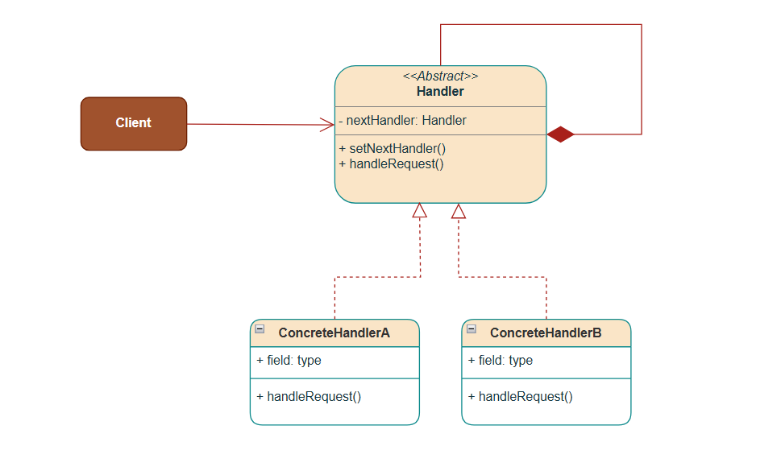
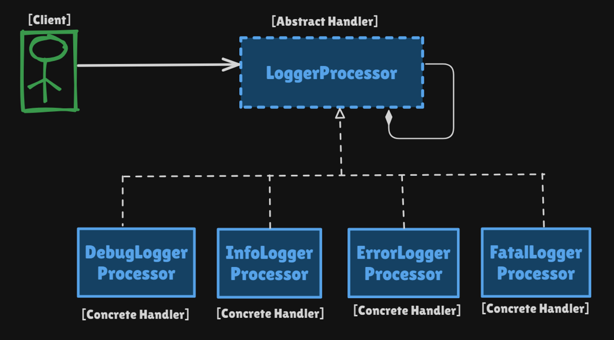

# Chain of Responsibility Pattern

Behavioral pattern: **pass a request along a chain of handlers.** Each handler either processes the request, forwards it, or both.

This package follows the Concept & Coding LLD note (logging system) plus the note’s other real-life example (ATM cash dispense).

**Code:** `com.lld.patterns.chainofresponsibility.logging`, `.atm`, `.demo`

## Why this pattern is required

Without CoR you encode “who handles this?” as a central `if` / `switch` or one god logger:

```text
if (level >= DEBUG) debug.write
if (level >= INFO)  info.write
if (level >= ERROR) error.write
if (level >= FATAL) fatal.write
```

or

```text
if (amount >= 2000) … else if (amount >= 500) … else if …
```

That produces:

1. **A bloated dispatcher** that knows every handler and every rule.
2. **Open/Closed violation** — a new log level or ₹200 note means editing the dispatcher.
3. **Tight coupling** — client or ATM core depends on every concrete processor.
4. **Hard to reorder** — production often wants DEBUG→INFO→ERROR vs ERROR-only; that should be **composition**, not a rewrite.
5. **No runtime chain** — servlet filters, auth middleware, and support-ticket escalation are chains assembled from config.

CoR is required when **several objects may handle a request**, the exact handler is not known to the sender, and you want to **add / reorder handlers without touching the client**.

## Structure

**Class diagram** (from the LLD note):



**Structure** using the logging example:



| Role | Logging (this note) | ATM |
|------|---------------------|-----|
| **Handler** | `LogProcessor` | `DispenseHandler` |
| **Concrete handlers** | `DebugLogProcessor`, `Info`, `Error`, `Fatal` | ₹2000, ₹500, ₹100 |
| **Successor** | `nextLoggerProcessor` | `next` |
| **Client** | builds DEBUG → INFO → ERROR → FATAL, then `logMessage` | builds 2000 → 500 → 100, then `dispense` |

```
Client
  │  logMessage(ERROR, "...")
  ▼
DebugLogProcessor  --if level ok, write-->  still forwards
  │
  ▼
InfoLogProcessor
  │
  ▼
ErrorLogProcessor
  │
  ▼
FatalLogProcessor  (next == null, stop)
```

Two chain **policies** (interview-critical):

| Policy | Logging demo | ATM demo |
|--------|----------------|----------|
| **Propagating** | Handler writes if `handler.level <= message.level`, then **always** calls next | — |
| **Exclusive / remainder** | — | Handler takes what it can (₹2000 notes), **passes the leftover** |

A DEBUG log only prints `DEBUG:` (INFO handler’s level `2 <= 1` is false). A FATAL log prints DEBUG, INFO, ERROR, and FATAL — every handler whose level is at or below FATAL. That matches the note’s `if (this.level <= level)` then forward.

## Where to use it (and why there)

Use CoR when the sender should say **“handle this”** without naming the handler, and handlers form a **pipeline** you can reorder.

| Domain | Why CoR | Handlers |
|--------|---------|----------|
| **Application logging** | Severity is a chain; add FATAL without editing DEBUG | Debug → Info → Error → Fatal |
| **ATM / cash recycle** | Greedy notes, remainder to smaller denomination | 2000 → 500 → 100 |
| **Servlet / middleware** | Auth, then rate-limit, then audit; skip or stop | Filter chain |
| **Support / approval** | L1 then L2 then manager if not resolved | Escalation |
| **Validation** | Each rule can reject or pass the request | Not-empty → format → business |
| **Exception handling** | Catch in the layer that knows how | UI → service → global |
| **Recommendation filters** | This monorepo: `FilterChain` eligibility → seed → blocked → purchased | Pipeline of filters |
| **GUI bubbling** | Click not consumed → parent widget | Event chain |

**Do not use it** when there is exactly one handler, or when the client **must** call a specific class (then just call it). A chain that always runs every handler and only “adds wrapping” is often **Decorator**, not CoR.

## Pros and cons

**Pros**

- Sender is decoupled from receivers (client holds the **head** of the chain only).
- Add/reorder handlers at runtime (`setNextLogger`).
- Open for new processors (`WarnLogProcessor`, ₹200 dispenser).
- Each handler has one rule (DEBUG write, ₹500 notes).
- Natural fit for pipelines (HTTP filters, logging, ATM).

**Cons**

- Request can fall off the end with **no handler** (ATM remainder with no next).
- Debugging: you must walk the chain to see who ran.
- Performance: long chains on a hot path.
- Recursion / stack if implemented as nested `next.handle` with huge chains (usually fine).
- Easy to confuse with Decorator if you always forward.
- Ordering bugs: DEBUG after FATAL would change which lines print.

## How it follows SOLID

| Principle | How CoR satisfies it | How the bad design breaks it |
|-----------|----------------------|------------------------------|
| **S — Single Responsibility** | `ErrorLogProcessor` only knows how to print ERROR. `LogProcessor` owns “forward if next exists.” | One `Logger` class with four `if`s and four print formats. |
| **O — Open/Closed** | New `WarnLogProcessor` + `setNext`; client still calls `logMessage`. | Edit the central `switch (level)`. |
| **L — Liskov Substitution** | Any `LogProcessor` can sit in the chain; client talks to the abstract type. | `if (logger instanceof Fatal)` in the client. |
| **I — Interface Segregation** | Handlers share `logMessage` / `write`. ATM handlers share `dispense`. | Forcing a logger to implement `dispense`. |
| **D — Dependency Inversion** | Client and handlers depend on `LogProcessor`, not `FatalLogProcessor`, except at composition time. | Client `new`s and calls each logger in sequence by concrete type. |

## How it differs from Bridge (and nearby patterns)

| | **Chain of Responsibility** | **Bridge** | **Decorator** | **Observer** | **Strategy** |
|--|-----------------------------|------------|---------------|--------------|--------------|
| **Intent** | Give **multiple objects a chance** to handle a request | Split **abstraction × implementation** | **Wrap** and add behavior, usually still call inner | **Broadcast** state to N listeners | Pick **one** algorithm |
| **Structure** | Linked list of same-role handlers | Two hierarchies + link | Nested wrappers, same interface | Subject holds a list | Context holds one strategy |
| **Who runs** | Some or all along the chain | One implementor for the abstraction | All wrappers typically | All observers | Exactly one strategy |
| **Stop vs continue** | Optional (ATM leftover vs logging always-forward) | N/A | Almost always continue to inner | All get `update` | No chain |
| **This package** | Logging + ATM | Not CoR | Looks like logging if you always forward | Weather / Notify Me | Drive / pay |

**One-liner:** CoR = **“pass it down until it is handled”** (or until the chain ends). Bridge = **two dimensions vary independently**. Decorator = **add on the way in/out, do not choose a handler**. Observer = **notify everyone**. Strategy = **client already chose the algorithm**.

Logging in this note is CoR **with propagate-always** — interviewers may say it is CoR + a bit of Decorator. ATM remainder is textbook exclusive CoR.

## Run

```bash
cd DesignPatterns
javac -d out $(find src -name '*.java')
java -cp out com.lld.patterns.chainofresponsibility.demo.ChainOfResponsibilityDemo
```

## Interview questions and answers

**1. What is Chain of Responsibility?**  
A behavioral pattern where a request travels a chain of handlers. Each handler processes it and/or passes it on. The sender does not know which object will handle it.

**2. When do you use it?**  
Logging levels, ATM notes, servlet filters, approval workflows, validation pipelines — anywhere handlers can be composed and reordered.

**3. How is the logging example wired?**  
DEBUG → INFO → ERROR → FATAL. `logMessage`: if `this.level <= messageLevel` then `write`, then always call next.

**4. Why does FATAL print four lines?**  
DEBUG handler level is 1, `1 <= 4`, so it writes, then INFO (`2 <= 4`), ERROR (`3 <= 4`), FATAL (`4 <= 4`). A DEBUG message only prints once because `2 <= 1` is false.

**5. Is that the same as log4j?**  
Similar idea (levels, chain), not the same API. Real loggers also filter by logger name, appenders, and whether to pass to parent. Do not claim this *is* log4j.

**6. CoR vs a `switch` on level?**  
`switch` is simpler for a frozen set of levels. CoR wins when you add handlers, change order, or reuse the same `logMessage` entry point.

**7. CoR vs Decorator?**  
Decorator **adds** behavior and almost always calls the wrappee. CoR **decides** whether to handle. This logging demo always forwards → looks like Decorator. ATM does not call next if remainder is 0 → classic CoR.

**8. CoR vs Bridge?**  
Bridge is structural: abstraction vs implementation (shape + renderer). CoR is behavioral: request routing along handlers. Same “has-a next” pointer is not Bridge.

**9. CoR vs Observer?**  
Observer: subject **pushes to all** registered listeners. CoR: request **walks a sequence**; later handlers may never see it (ATM).

**10. CoR vs Strategy?**  
Strategy: client (or factory) **selects one** object. CoR: client sends to the **head**; the chain decides. Payment method is Strategy. “Which denomination?” is CoR.

**11. Who builds the chain?**  
The client or a factory (`getChainOfLoggers`). Handlers should not hardcode their successor if you want DIP — inject via `setNext`.

**12. What if nobody handles the request?**  
Define a terminal handler (log “unhandled”, throw, or ATM “Cannot dispense”). Silent drop is a bug.

**13. How does it follow SOLID?**  
New handler class (OCP), each handler one write rule (SRP), client depends on `LogProcessor` (DIP). See table.

**14. Pure vs impure CoR?**  
GoF: a handler either handles **or** forwards. Many production chains (filters, this logger) **handle and forward**. Say that out loud in an interview.

**15. Thread safety?**  
Do not mutate `next` while `logMessage` is running on another thread. Loggers are usually built once at startup.

**16. How do you unit-test it?**  
Send DEBUG and assert only DEBUG line. Send ERROR and assert DEBUG+INFO+ERROR. For ATM, ₹3600 → 1×2000 + 3×500.

**17. Can a handler skip the rest?**  
Yes: do not call `next` (auth filter rejects). Logging here does not skip.

**18. Difference from linked list of commands?**  
Command **stores** a request to execute later. CoR **routes** a live request through handlers. You can put Commands on a CoR chain.

**19. Real code in this monorepo?**  
`RecommendationService` `FilterChain`: eligibility, seed, blocked, already-consumed — same “pass the slate along” idea.

**20. How would you add WARN?**  
`WarnLogProcessor` with a new level constant, `info.setNext(warn); warn.setNext(error)`. Existing processors stay closed.
