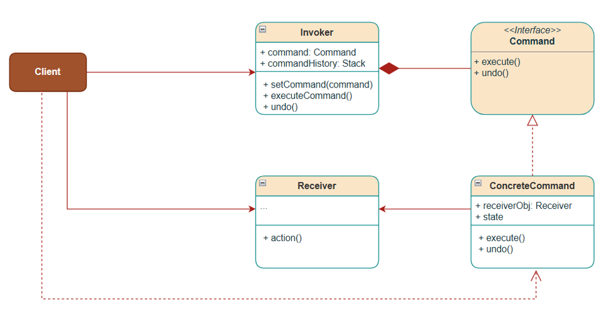
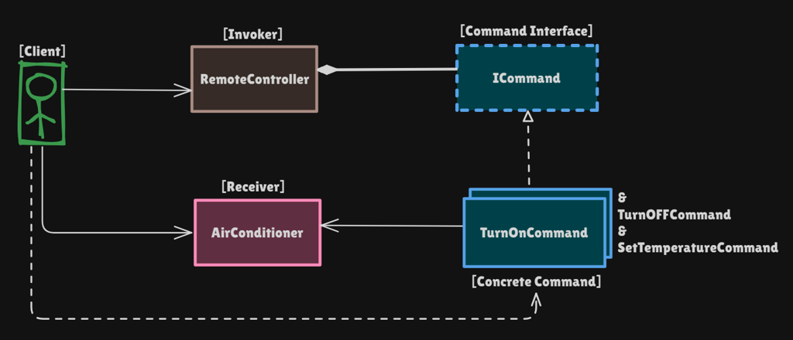
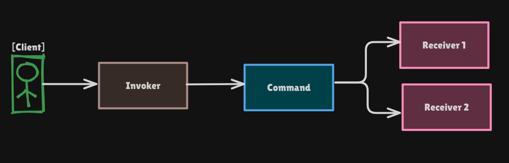

# Command Pattern

Behavioral pattern: **wrap a request as an object** so you can parameterize invokers, queue work, and **undo/redo** by storing prior state. The sender (remote) is decoupled from the receiver (AC).

This package follows the Concept & Coding LLD note: AC remote with undo. A bulb receiver shows the remote does not change when you add a device.

**Code:** `com.lld.patterns.command`, `.ac`, `.bulb`, `.invoker`, `.demo`

## Why this pattern is required

Without Command, the client (or a fat remote) calls the device directly:

```text
airConditioner.turnOn();
airConditioner.setTemperature(25);
bulb.turnOn();
```

That produces:

1. **No abstraction** — the remote knows `AirConditioner` and `Bulb` APIs. A smart hub with 20 devices bloates the remote.
2. **Undo/redo is clumsy** — the invoker must remember every device’s previous state itself. Commands that store `previousState` / `previousTemperature` make undo a stack pop.
3. **Hard maintenance / SOLID** — new commands (`swing`, `fan speed`) mean editing the remote. Testing a button requires a real AC.
4. **No queue / macro / log** — you cannot persist “turn on then 25°C” as data. A command object *is* that data.

Command is required when you need **decoupled invoker vs receiver**, **parameterized buttons**, or **undo/history**.

## Structure

**Class diagram** (from the LLD note):



**Structure** using the AC remote:



**Flow** (client → invoker → command → receivers):



| Role | In this codebase | Job |
|------|------------------|-----|
| **Receiver** | `AirConditioner`, `Bulb` | Real work (`turnOn`, `setTemperature`) |
| **Command** | `ICommand` | `execute()` / `undo()` |
| **Concrete commands** | `TurnOnCommand`, `TurnOffCommand`, `SetTemperatureCommand`, `BulbOnCommand` | Bind one action + saved state |
| **Invoker** | `RemoteController` | `setCommand`, `pressButton`, history `Stack` |
| **Client** | `CommandPatternDemo` | Wires receiver + command into the remote |

```
Client
  creates AirConditioner, RemoteController
  remote.setCommand(new TurnOnCommand(ac))
        │
        ▼
Invoker.pressButton()
  command.execute()
  history.push(command)
        │
        ▼
TurnOnCommand  →  AirConditioner.turnOn()
        │
undo() pops history → command.undo() restores previousState
```

## Where to use it (and why there)

Use Command when the **request must be an object**: delayed, queued, logged, undone, or rebound to another button.

| Domain | Why Command | Commands |
|--------|-------------|----------|
| **Remote / smart home** | Buttons should not know AC internals; slots are rebound at runtime | On, off, set temp |
| **Undo / redo editors** | Each edit is a command with inverse | Type, delete, format |
| **Job / task queue** | Serialize a request and run later | `RecordInteractionCommand` in RecommendationService |
| **Transactional / wizard** | Macro = list of commands; rollback = undo in reverse | Checkout steps |
| **GUI buttons / menus** | Same `ICommand` for toolbar and shortcut | Save, paste |
| **Multiplayer / replay** | Log commands and replay | Move, fire |
| **Thread pool** | `Runnable` is a weak Command (`execute` only) | Worker jobs |

**Do not use it** for a single direct call with no undo, no queue, and one receiver — `ac.turnOn()` is enough.

## Pros and cons

**Pros**

- Invoker depends only on `ICommand`, not `AirConditioner`.
- New devices/commands without editing `RemoteController` (bulb demo).
- Undo via history stack + state inside each command.
- Parameterize (`SetTemperatureCommand(ac, 25)` vs 18).
- Easy to test: fake command or fake receiver.
- Macros = a command that holds other commands (Composite).

**Cons**

- Many small classes (`TurnOn`, `TurnOff`, …).
- Commands that capture stale state if the receiver changes underneath.
- Memory: history stack grows unless you cap it.
- Not every action has a clean inverse (send email).
- Overkill if you never queue or undo.

## How it follows SOLID

| Principle | How Command satisfies it | How the bad design breaks it |
|-----------|--------------------------|------------------------------|
| **S — Single Responsibility** | AC knows cooling. `TurnOnCommand` knows “call turnOn and remember prior on/off.” Remote knows buttons + stack. | Client does wiring, execution, and undo bookkeeping. |
| **O — Open/Closed** | Add `BulbOnCommand` / `SetFanCommand` without editing `RemoteController`. | Remote grows `if (device == BULB)`. |
| **L — Liskov Substitution** | Any `ICommand` can sit on a button; undo must not surprise (restore what execute changed). | `undo()` that turns a different device off. |
| **I — Interface Segregation** | `execute` + `undo` only. Receivers are not forced onto the invoker. | Remote interface listing every AC method. |
| **D — Dependency Inversion** | Invoker depends on `ICommand`. Commands depend on the receiver they wrap. | Remote fields of type `AirConditioner`. |

## How it differs from Bridge (and nearby patterns)

| | **Command** | **Bridge** | **Strategy** | **Observer** | **Chain of Responsibility** |
|--|-------------|------------|--------------|--------------|------------------------------|
| **Intent** | Turn a **request into an object** (queue, undo) | Split **abstraction × implementation** | Swap **how** one step is done | Notify **many** of state | Pass request along **handlers** |
| **Who runs the work** | Receiver, via command | Implementor | The strategy itself | Observers | A handler in the chain |
| **Invoker knows** | `execute()` / `undo()` | N/A | One strategy | N/A | Head of chain |
| **History** | Natural (`Stack<ICommand>`) | No | No | No | No |
| **This package** | AC remote | Not Command | Drive / pay | Weather / Notify Me | Logging / ATM |

**One-liner:** Command = **“the button holds an object that knows what to do later.”** Bridge = two hierarchies. Strategy = interchangeable algorithm **without** undo/history (Strategy often has no receiver). Command **always** points at a receiver and often stores state for undo.

Strategy vs Command: both are objects with one method. Strategy is **policy** chosen by the context. Command is a **deferred request** plus invoker. `PaymentStrategy.pay()` is Strategy. `TurnOnCommand.execute()` is Command.

## Run

```bash
cd DesignPatterns
javac -d out $(find src -name '*.java')
java -cp out com.lld.patterns.command.demo.CommandPatternDemo
```

## Interview questions and answers

**1. What is the Command pattern?**  
Encapsulate a request as an object with `execute` (and usually `undo`), so invokers are decoupled from receivers and you can queue, log, and undo.

**2. Roles?**  
Receiver (AC), Command (`ICommand`), ConcreteCommand, Invoker (`RemoteController`), Client.

**3. Why not call `ac.turnOn()` from the remote?**  
Then the remote is glued to AC. New bulb/TV means editing the remote. No first-class undo.

**4. How does undo work here?**  
Each command saves previous state in `execute`. `pressButton` pushes onto a stack. `undo` pops and calls `undo()` (turn off if it was off before turn-on; restore temperature).

**5. Why does the last temperature undo go to 0°C?**  
Initial `temperature` is 0. First `SetTemperatureCommand(25)` stores 0. After undoing 18→25, the next undo restores 0. Call that out so it does not look like a bug.

**6. Command vs Strategy?**  
Strategy: context **picks an algorithm**. Command: invoker **fires a stored request** at a receiver; undo/queue matter. See table.

**7. Command vs Bridge?**  
Bridge is structural (abstraction vs implementation). Command is behavioral (request object). A remote’s “protocol” vs “IR vs Bluetooth” could be Bridge; button actions are Command.

**8. Is `Runnable` / `java.lang.Runnable` Command?**  
Yes, a slim one: `run()` ≈ `execute()`, no undo, no receiver field required.

**9. Macro command?**  
A command whose `execute` runs a list of commands; `undo` undoes in reverse. Composite + Command.

**10. How does it follow SOLID?**  
Invoker closed to new devices (OCP), depends on `ICommand` (DIP). See table.

**11. Where do you store undo state — invoker or command?**  
**Command.** The invoker would need to know every field of every receiver. This note stores `previousState` / `previousTemperature` on the command.

**12. Redo?**  
Keep an undo stack and a redo stack. Undo pops to redo; redo executes again and pushes undo.

**13. Thread safety?**  
Do not `pressButton` and `undo` on the same remote from two threads without locking the stack.

**14. How do you unit-test?**  
Mock `ICommand` to test the remote’s stack. Test `SetTemperatureCommand` against a fake or real `AirConditioner` without a UI.

**15. Command vs Observer?**  
Observer: many listeners on **state change**. Command: one invoker **asks** a receiver to do work. A button can execute a command **and** observers can listen to AC state.

**16. Real code in this monorepo?**  
`RecommendationService` `RecordInteractionCommand` — feedback is an object, not a pile of facade ifs.

**17. What if undo is impossible?**  
`undo()` no-op or throw. Do not put those commands on an undo stack (or mark them non-undoable).

**18. Parameterized command?**  
`SetTemperatureCommand(ac, 25)` vs `(ac, 18)` — same class, different request data. That is the “parameterize” in the definition.

**19. Client vs invoker?**  
Client **creates** commands and receivers. Invoker **only** `execute`/`undo`. Mixing them is the naive `main` that calls `ac.turnOn()`.

**20. How would you add a fan-speed button?**  
`SetFanSpeedCommand implements ICommand` wrapping the AC (or a Fan receiver). `RemoteController` unchanged.
