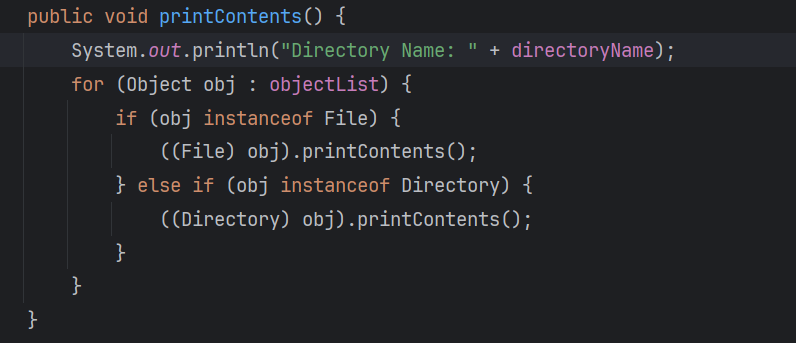
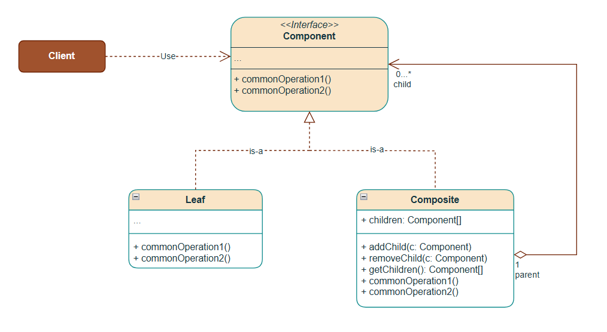
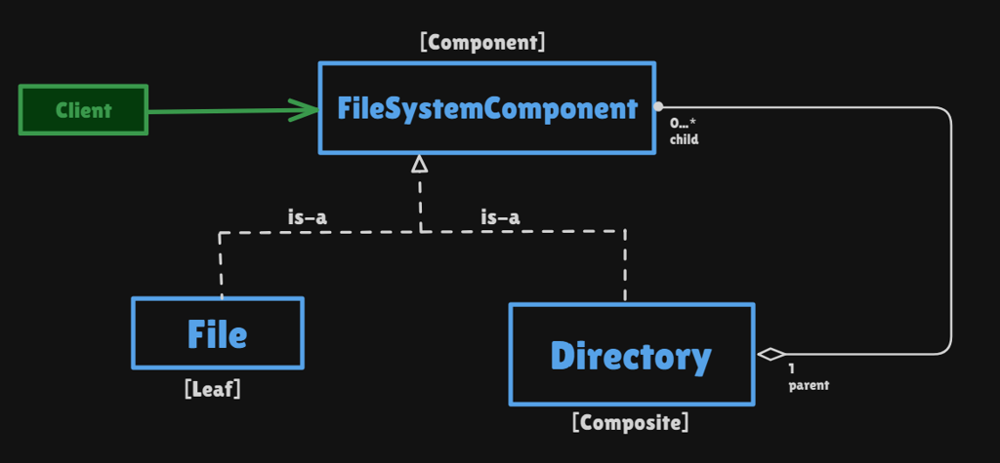

# Composite Pattern

Structural pattern: **compose objects into a tree** (part–whole) and let the client treat a **leaf** and a **group** the same way. One `printContents()` / `evaluate()` works on a file, a folder of folders, a number, or `2 * (1 + 7)`.

This package follows the Concept & Coding LLD note: **file structure** and **arithmetic expressions**. Org charts, buildings, and CAD trees are the same idea, not coded.

**Code:** `com.lld.patterns.composite.filesystem`, `.expression`, `.demo`

## Why this pattern is required

Without Composite, a folder holds `List<Object>` and the client (or `Directory.printContents`) branches on type:

```text
for (Object obj : objectList) {
  if (obj instanceof File) ((File) obj).printContents();
  else if (obj instanceof Directory) ((Directory) obj).printContents();
}
```

That produces:

1. **No common abstraction** — File and Directory are unrelated types. The client must know which is which.
2. **Open/Closed violation** — `CompressedFolder` / `Shortcut` means another `else if` everywhere you walked the tree.
3. **Rigid and tightly coupled** — the walk knows every concrete type.
4. **Same mess for math** — evaluating `2*(1+7)` without a shared `evaluate()` is nested `if`s on “is this a number or an operator.”

Composite is required when the domain **is a tree** and **the same operation** should run on a node whether or not it has children.

## Structure

**Problem** (`instanceof` in `printContents`):



**Class diagram** (from the LLD note):



**Structure** (file system):



| Role | File system | Arithmetic |
|------|-------------|------------|
| **Component** | `FileSystemComponent.printContents()` | `ArithmeticExpression.evaluate()` |
| **Leaf** | `File` | `NumberOperand` |
| **Composite** | `Directory` (`add` / `remove` + children) | `Expression` (left, right, `OperationType`) |
| **Client** | `CompositePatternDemo` | same demo; tree `2 * (1 + 7)` |

```
Movies
  receipt.pdf
  invoice.pdf
  torrentLinks.txt
  tomCruise.jpg
  ComedyMovies
    DumbAndDumber.mp4
    HangoverI.mp4

        *
       / \
      2   +
         / \
        1   7     →  16
```

**IS-A:** `File` is-a `FileSystemComponent`. `Directory` is-a `FileSystemComponent`.

**HAS-A:** `Directory` has-a list of `FileSystemComponent` (0..* children). `Expression` has-a left and right `ArithmeticExpression`.

This codebase uses the **safe** composite: `add`/`remove` live on `Directory` only. A `File` cannot get children. The **transparent** variant puts `add` on the component (leaves throw).

## Where to use it (and why there)

Use Composite when you have a **hierarchy of the same kind of thing**.

| Domain | Why Composite | Leaf / composite |
|--------|---------------|------------------|
| **File system** | Folders contain files and folders | File / Directory |
| **Arithmetic AST** | Ops contain numbers or ops | Number / Expression |
| **Org chart** | Manager has employees or managers | Employee / Department |
| **UI / CAD** | Group of shapes is a shape | Line / Group |
| **Buildings** | Floor has rooms; building has floors | Room / Floor |
| **Menus** | Menu of menus | Item / Menu |

**Do not use it** for a **linked list of wrappers around one core** (Decorator), or when types in the tree **do not share** an operation.

## Pros and cons

**Pros**

- Client calls `printContents()` / `evaluate()` once; recursion walks the tree.
- New leaf (`Shortcut`) or composite (`ZipFolder`) without editing the walk.
- Uniform API: you do not care file vs folder at the call site.
- Natural model for file systems, ASTs, org charts.

**Cons**

- Extra types vs two concrete classes and `instanceof` (worth it once the tree grows).
- **Safe vs transparent:** `add` only on `Directory` is type-safe; `add` on the component makes the client simpler but leaves must throw or no-op.
- Easy to build cycles (`dir.add(dir)`); this demo does not guard that.
- Sharing a subtree (DAG, not tree) makes `remove` and ownership messy.

## How it follows SOLID

| Principle | How Composite satisfies it | How the bad design breaks it |
|-----------|----------------------------|------------------------------|
| **S — Single Responsibility** | `File` prints a name. `Directory` prints then delegates. | `Directory.printContents` is printer **and** type switch. |
| **O — Open/Closed** | New `ZipFolder implements FileSystemComponent`; existing `printContents` loops unchanged. | New `else if (obj instanceof ZipFolder)`. |
| **L — Liskov Substitution** | Any child is a component; `child.printContents()` is valid. | Treating `File` as a `Directory` and calling `add`. |
| **I — Interface Segregation** | Tiny `printContents` / `evaluate`. Safe composite keeps `add` off the leaf. | Forcing `File` to implement `add`/`remove`. |
| **D — Dependency Inversion** | `Directory` depends on `FileSystemComponent`, not `File`. | `List<Object>` + casts to `File` and `Directory`. |

## How it differs from Decorator, Composite vs tree walkers

| | **Composite** | **Decorator** | **Interpreter** | **Visitor** |
|--|---------------|---------------|-----------------|-------------|
| **Intent** | **Tree of same-type parts**; uniform op | **Wrap one object** to add behavior | Grammar / eval of expressions | Add **ops** without changing node classes |
| **Shape** | Tree (nodes have 0..* children) | Linked list of wrappers | Often Composite under the hood | Walk + double dispatch |
| **This package** | Files; `2*(1+7)` | Pizza toppings | Arithmetic `evaluate` is Interpreter-like | Not coded |

**Composite vs Decorator (from the Decorator note):** Composite is a **tree of same-type parts** (menu of menus). Decorator is a **linked list of wrappers** around one core.

The arithmetic example is Composite **structure** (tree) plus a simple **Interpreter** (`evaluate` on each node). In interviews: “Composite for the tree; Interpreter if you stress the grammar.”

## Run

```bash
cd DesignPatterns
javac -d out $(find src -name '*.java')
java -cp out com.lld.patterns.composite.demo.CompositePatternDemo
```

## Interview questions and answers

**1. What is Composite?**  
A structural pattern that composes objects into a tree and lets clients treat leaves and composites uniformly.

**2. What problem does it solve?**  
`instanceof` walks, OCP breaks when you add `ZipFolder`, client must know File vs Directory.

**3. Component, leaf, composite?**  
Shared API; File / `NumberOperand` have no children; Directory / `Expression` have children and forward the operation.

**4. IS-A and HAS-A?**  
Both leaf and composite **are** the component. Composite **has** children of that component type.

**5. File system tree in this demo?**  
`Movies` contains four files and `ComedyMovies`, which contains two videos. One `moviesDirectory.printContents()`.

**6. Arithmetic tree?**  
`2 * (1 + 7)` → `Expression(2, Expression(1, 7, ADD), MULTIPLY)` → **16**.

**7. Safe vs transparent composite?**  
Safe: `add` only on `Directory` (this code). Transparent: `add` on `FileSystemComponent`; file throws. GoF often shows transparent.

**8. How does it follow SOLID?**  
Depend on `FileSystemComponent` (DIP); new types without editing the loop (OCP). See table.

**9. Composite vs Decorator?**  
Tree of parts vs stack of wrappers. See table.

**10. Composite vs Interpreter?**  
Interpreter is about **grammar and eval**. This math demo uses Composite nodes; `evaluate` is the interpret step.

**11. Why not `List<Object>`?**  
You lose compile-time safety and you write `instanceof` forever.

**12. Where do `add`/`remove` live?**  
On `Directory` here. Putting them on the interface makes the client not downcast, at the cost of meaningless `file.add(...)`.

**13. New type Shortcut?**  
`class Shortcut implements FileSystemComponent`. Directories already store components; no change to `printContents`.

**14. Cycles?**  
`parent.add(parent)` would recurse forever. Production: reject ancestors, or parent pointer checks.

**15. Java / UI examples?**  
Swing `JPanel` contains `Component`s; JavaFX `Parent`; DOM nodes; Android `ViewGroup`.

**16. Downsides?**  
Overkill for a flat list; over-wide component interface; shared subtrees.

**17. Should `evaluate` use Strategy for `+` vs `*`?**  
The `switch` on `OperationType` is a small Strategy smell. Fine for four ops; many ops → `Operation` strategy objects.

**18. Thread safety?**  
Do not mutate `children` while another thread prints. Build the tree, then share it read-only.

**19. Why `NumberOperand` not `Number`?**  
The note uses `Number`. This package avoids clashing with `java.lang.Number`. Same leaf role.

**20. How would you add `ZipFolder`?**  
`ZipFolder implements FileSystemComponent` with children; maybe `printContents` lists then unzipped names. Client still calls `printContents()` on the root.
