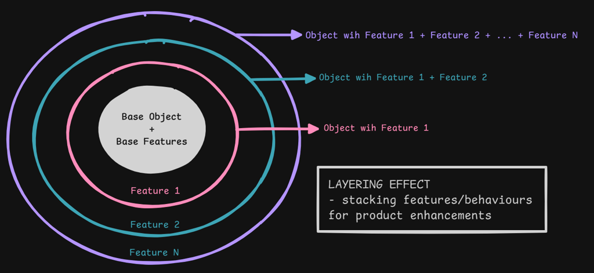
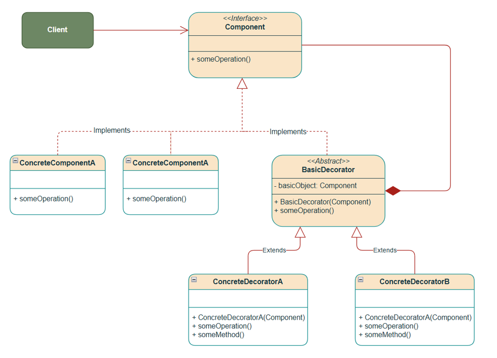
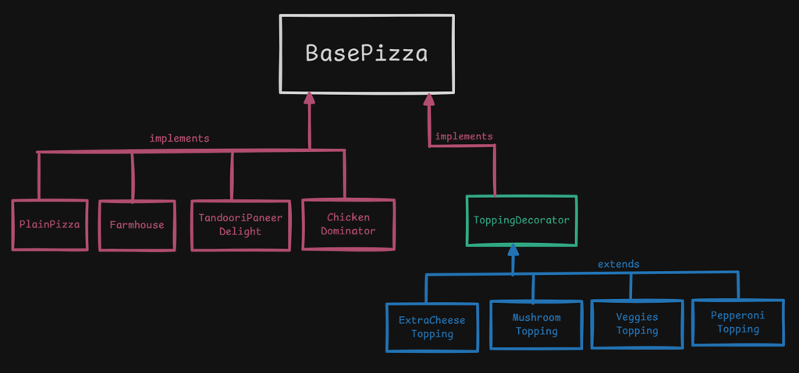

# Decorator Pattern

Structural pattern: **add behavior to an object at runtime by wrapping it**, without changing the original class. Wrappers share the same interface as the wrappee, so you can stack them.

This package follows the Concept & Coding LLD note: pizza shop (coffee cafe is the same idea, not coded).

**Code:** `com.lld.patterns.decorator.pizza`, `.demo`

## Why this pattern is required

Without Decorator you model every topping combo as a **subclass**:

```text
PlainPizza
MargheritaExtraCheese
MargheritaOlivesJalapenos
FarmhouseMushroomExtraCheese
ChickenDominatorMushroom
...
```

That is **class explosion**: `N` toppings → `2^N` combinations (coffee: milk+sugar, sugar+vanilla, milk+vanilla+syrup, …).

You also cannot change toppings **at runtime** if each combo is a frozen class. A boolean bag (`extraCheese`, `olives`, …) on one pizza class blows up `getCost()` with `if`s (OCP).

Decorator is required when **features combine independently** and you want to **wrap** (`new ExtraCheeseTopping(new PlainPizza())`) instead of subclassing every mix.

## Structure

**Use cases** (pizza + coffee):



**Class diagram** (from the LLD note):



**Structure** (pizza shop):



| Role | In this codebase | Job |
|------|------------------|-----|
| **Component** | `BasePizza` | `getDescription()`, `getCost()` |
| **Concrete component** | `PlainPizza`, `Farmhouse`, `TandooriPaneerDelight`, `ChickenDominator` | Base pie |
| **Decorator** | `ToppingDecorator` | IS-A pizza, HAS-A pizza |
| **Concrete decorator** | `ExtraCheeseTopping` (+20), `Veggies` (+30), `Mushroom` (+40), `Pepperoni` (+50) | Add description + cost, then delegate |
| **Client** | `DecoratorPatternDemo` | Nested `new` wrappers |

**IS-A:** `PlainPizza` is-a `BasePizza`. `ExtraCheeseTopping` is-a `ToppingDecorator` is-a `BasePizza`.

**HAS-A:** `ToppingDecorator` has-a `BasePizza` (the wrapped pizza, which may already be decorated).

```
getCost()
  MushroomTopping           +40
    PepperoniTopping        +50
      ExtraCheeseTopping    +20
        PlainPizza          200
                        = Rs.310
```

## Where to use it (and why there)

Use Decorator when **responsibilities stack** and order/combination is chosen at runtime.

| Domain | Why Decorator | Wrappers |
|--------|---------------|----------|
| **Pizza / coffee** | Toppings/add-ons combine freely | Cheese, mushroom; milk, syrup |
| **I/O streams** | `BufferedInputStream(new FileInputStream(...))` | Buffer, gzip, cipher |
| **UI** | Scrollbars, borders on a window | `ScrollDecorator(window)` |
| **HTTP / middleware** | Logging, auth, metrics around a handler | Same as wrapping |
| **Recommendations** | Fallback and diversity around any ranker | `FallbackDecorator`, `DiversityDecorator` in RecommendationService |
| **Pricing / tax** | Base price + GST + service charge | Each levy wraps |

**Do not use it** when there is one extra feature forever (just add a field), or when you need to **swap the whole algorithm** (Strategy), or **notify many** (Observer).

## Pros and cons

**Pros**

- Mix toppings at runtime without `FarmhouseMushroomCheese` classes.
- Open for new toppings (`JalapenoTopping`) without editing `PlainPizza`.
- Same interface: client always talks to `BasePizza`.
- Recursion: a decorator wraps a decorator.
- Alternative to inheritance for extension.

**Cons**

- Lots of small wrapper objects; debugging a stack is noisy.
- Identity: `pizza2 instanceof PlainPizza` is false after wrapping.
- Order can matter (`tax(discount(x))` vs `discount(tax(x))`).
- Easy to wrap the same topping twice unless you forbid it.
- Constructor nesting is ugly; a builder/factory helps.

## How it follows SOLID

| Principle | How Decorator satisfies it | How the bad design breaks it |
|-----------|----------------------------|------------------------------|
| **S — Single Responsibility** | `MushroomTopping` only adds mushroom. `PlainPizza` only the base pie. | One pizza class with every topping flag. |
| **O — Open/Closed** | New topping class; bases closed. | New combo subclass or new `if` in `getCost`. |
| **L — Liskov Substitution** | Any decorated pizza is still a `BasePizza` (`getDescription`/`getCost` still work). | Wrapper that drops the interface or changes cost semantics randomly. |
| **I — Interface Segregation** | Tiny `BasePizza`. | Forcing toppings to implement delivery/GPS. |
| **D — Dependency Inversion** | Decorator depends on `BasePizza`, not `Farmhouse`. | `ExtraCheese` constructor takes only `PlainPizza`. |

## How it differs from Bridge (and nearby patterns)

| | **Decorator** | **Bridge** | **Strategy** | **Chain of Responsibility** | **Adapter** |
|--|---------------|------------|--------------|------------------------------|-------------|
| **Intent** | **Add** behavior around an object | Split **abstraction × implementation** | Swap **how** a step is done | Route a request; may **stop** | Make **incompatible** APIs work |
| **Interface** | Wrapper **is-a** component | Abstraction ≠ implementor type | Context ≠ strategy | Handlers same type | Target ≠ adaptee |
| **How many run** | **All** wrappers + core | One implementor | One strategy | Some handlers | One adaptee |
| **Class explosion it fixes** | Combo subclasses (`CheeseOlivePizza`) | Cartesian product (`CircleRaster`) | Giant `switch` of algorithms | God dispatcher | — |
| **This package** | Pizza toppings | Not Decorator | Drive / pay | Logging / ATM | — |

**One-liner:** Decorator = **“wrap to add.”** Bridge = **“two dimensions vary independently”** (shape + renderer), not stacked toppings. A Bridge would be Pizza **style** (thin/pan) × **oven** (wood/electric) — not Extra Cheese wrapping Farmhouse.

Decorator vs CoR: both have `next`/`wrappee`. CoR **decides** whether to handle. Decorator **always** adds and forwards. Logging that always forwards is Decorator-like CoR.

Decorator vs Strategy: Strategy **replaces** the algorithm. Decorator **layers** on top of the existing object.

## Run

```bash
cd DesignPatterns
javac -d out $(find src -name '*.java')
java -cp out com.lld.patterns.decorator.demo.DecoratorPatternDemo
```

## Interview questions and answers

**1. What is Decorator?**  
A structural pattern that wraps an object to add behavior dynamically while keeping the same interface.

**2. What problem does it solve?**  
Class explosion from every combination of features (pizza toppings, coffee add-ons).

**3. IS-A and HAS-A?**  
Decorator **is-a** component (implements `BasePizza`) and **has-a** component (wraps another pizza).

**4. Why not inheritance for Extra Cheese + Veggies?**  
You would need a class per combo. Wrapping is `new VeggiesTopping(new ExtraCheeseTopping(plain))`.

**5. Java I/O?**  
`new BufferedReader(new InputStreamReader(new FileInputStream(file)))` is Decorator.

**6. Decorator vs Bridge?**  
Decorator stacks add-ons on one object. Bridge splits two hierarchies so they vary independently. See table.

**7. Decorator vs Adapter?**  
Adapter changes the **interface**. Decorator keeps the interface and **adds** behavior.

**8. Decorator vs Proxy?**  
Proxy controls **access** (lazy, remote, security) and often does not add business cost/description. Decorator **enhances**. Same structure.

**9. Decorator vs Strategy?**  
Strategy swaps the algorithm. Decorator wraps and forwards. Ranking: Strategy picks collab vs popularity; Decorator adds diversity on any ranker.

**10. How does it follow SOLID?**  
New topping class (OCP), depend on `BasePizza` (DIP). See table.

**11. Order of wrapping?**  
`getCost` unwinds outside-in. For tax vs discount, order is a business rule.

**12. Can you decorate twice with cheese?**  
Yes unless you check. Sometimes that is intended (double cheese).

**13. Abstract decorator empty?**  
`ToppingDecorator` holds the wrappee; concrete classes add cost/description. You could add default `getCost()` that only delegates.

**14. Farmhouse vs toppings?**  
Farmhouse is a **concrete component** (pre-formulated pie), not a topping. You can still wrap it with mushroom.

**15. Downsides?**  
Many objects, `instanceof` lies, nested constructors. Use a builder: `pizza.withCheese().withMushroom()`.

**16. Real code in this monorepo?**  
`DiversityDecorator` / `FallbackDecorator` around `RankingStrategy`.

**17. Coffee cafe?**  
Same pattern: `Espresso` component; `Milk`, `Foam`, `Syrup` decorators. Cappuccino = espresso + steamed milk + foam wraps.

**18. vs Composite?**  
Composite is a **tree of same-type parts** (menu of menus). Decorator is a **linked list of wrappers** around one core.

**19. Thread safety?**  
Immutable wraps are safer. Do not mutate the inner pizza after wrapping if another thread reads it.

**20. How would you add Jalapeno?**  
`JalapenoTopping extends ToppingDecorator` with +cost and description. No change to `PlainPizza` or other toppings.
