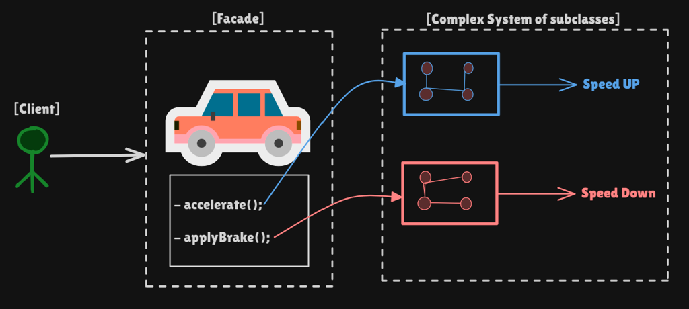
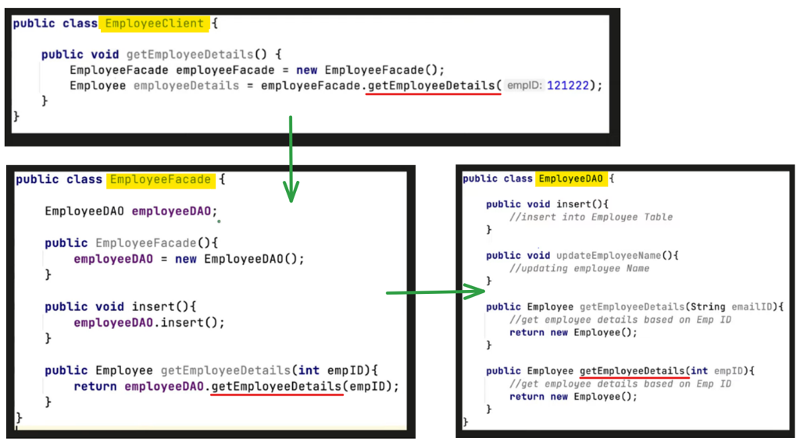
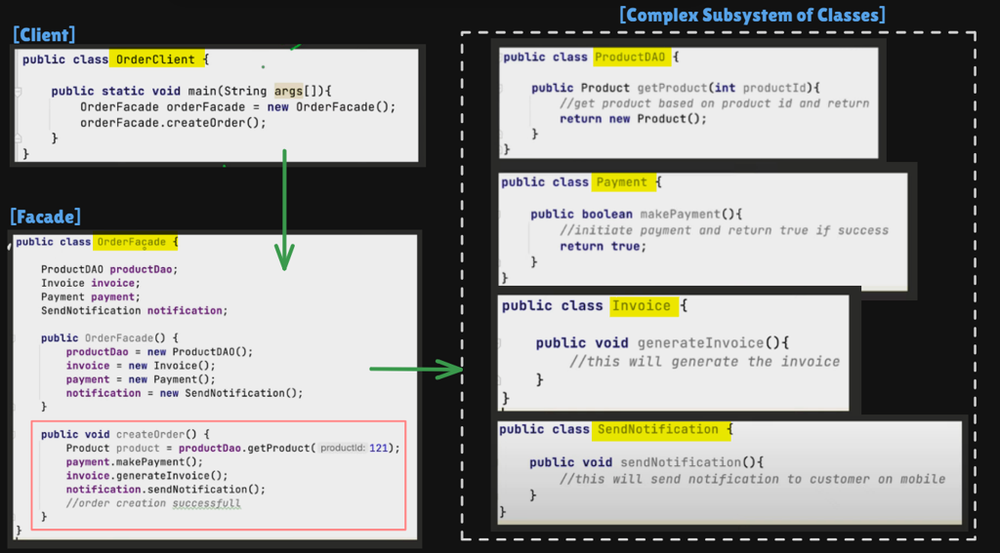
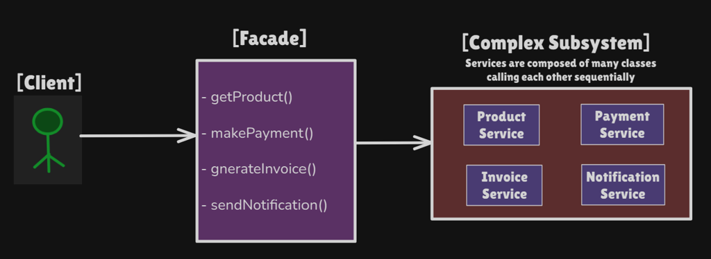
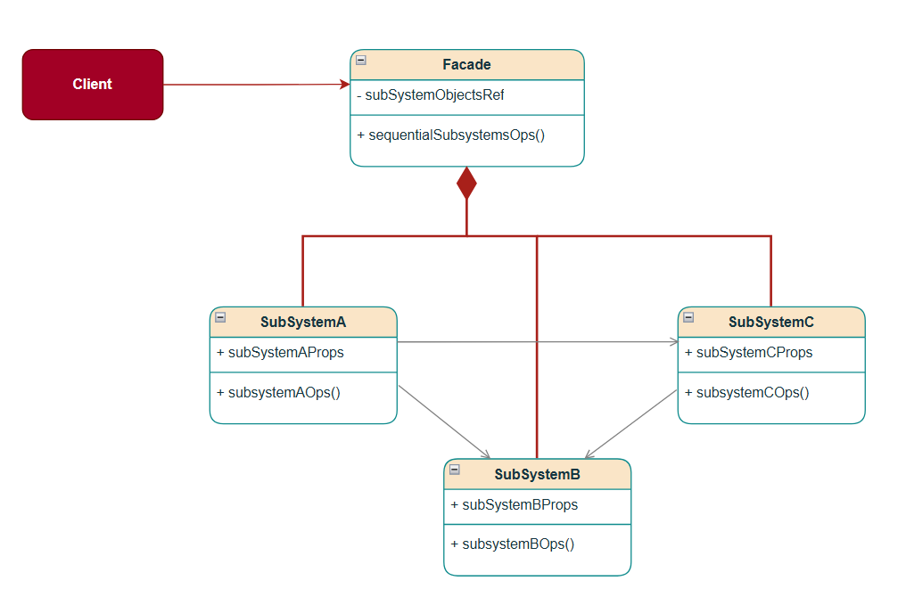
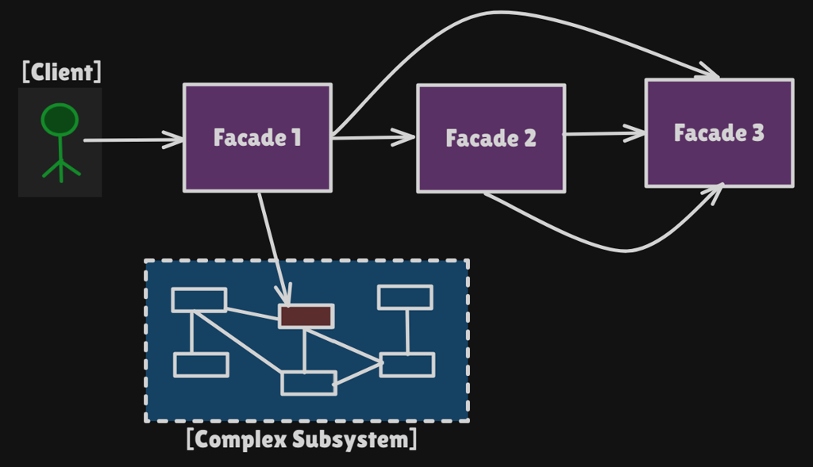
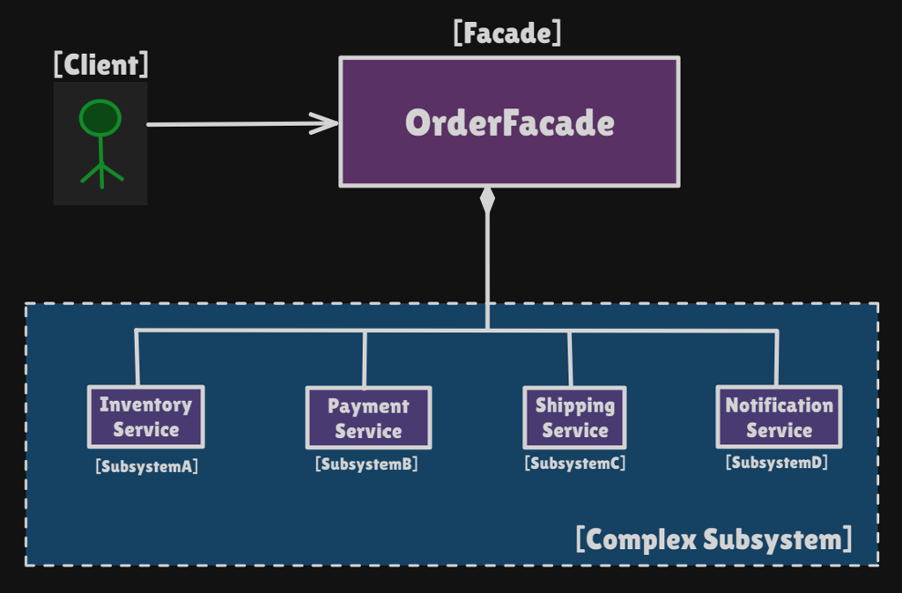

# Facade Pattern

Structural pattern: **a simplified interface over a complex subsystem**. The client calls one method; the facade talks to many services **in the right order**.

This package follows the Concept & Coding LLD note: order processing (`placeOrder`). Car pedals and employee ops are the same idea.

**Code:** `com.lld.patterns.facade.order`, `.demo`

## Why this pattern is required

Without Facade the client wires the workflow itself:

```text
inventory.checkStock(id)
payment.makePayment(method)
shipping.shipProduct(id)
notification.sendConfirmation(id)
```

That produces:

1. **No encapsulation** — the app knows every service and the sequence.
2. **Tight coupling** — a new `DiscountService` means editing **every** client.
3. **Wrong order / missed steps** — pay before stock, forget confirmation.
4. **Hard reuse** — mobile app, web, and cron each copy the same four calls.

Facade is required when you must **hide subsystem complexity** and **lock a use-case sequence** behind one entry point. Clients **may still** call `InventoryService` directly if they need to; Facade does not forbid that.

Car analogy: you press **accelerator / brake**. You do not fire injectors, ABS, and ECU in order yourself.

## Structure

**Car (real-life):**



**Employee ops / order processing / facade-of-facade:**







**Without Facade (client talks to every service):**



**Class diagram** (from the LLD note):



**Structure** (order processing):



| Role | In this codebase | Job |
|------|------------------|-----|
| **Facade** | `OrderFacade` | `placeOrder(productId, paymentMethod)` |
| **Subsystem A** | `InventoryService` | `checkStock` |
| **Subsystem B** | `PaymentService` | `makePayment` |
| **Subsystem C** | `ShippingService` | `shipProduct` |
| **Subsystem D** | `NotificationService` | `sendConfirmation` |
| **Client** | `FacadePatternDemo` | Two `placeOrder` calls |

```
Client
  orderFacade.placeOrder("MacBook Pro", "Credit Card")
        │
        ▼
OrderFacade
  1. inventory.checkStock
  2. payment.makePayment
  3. shipping.shipProduct
  4. notification.sendConfirmation
```

A facade can call **another facade** (checkout facade → payment facade) when a subsystem is itself a cluster of services.

## Where to use it (and why there)

Use Facade when **many collaborators** exist and the client should see **one use case**.

| Domain | Why Facade | One method hides |
|--------------------|------------------|
| **Checkout / order** | Stock → pay → ship → email must be ordered | `placeOrder` |
| **Car / appliance** | Pedal vs engine internals | `accelerate()` |
| **Employee HR API** | Hire = payroll + badge + email | `onboard(employee)` |
| **Home theater** | Watch movie = amp + blu-ray + lights | `watchMovie()` |
| **SLF4J / JDBC** | You don’t talk to every driver SPI | Logger / DataSource |
| **This monorepo** | Reco/Spotify door | `RecommendationFacade`, streaming facade-style services |
| **Compiler / IDE** | “Build” vs lexer, parser, codegen | `compile()` |

**Do not use it** as a **god class** that owns all of the business forever, or when you only wrap **one** object to control access — that is **Proxy**.

## Pros and cons

**Pros**

- Client: one `placeOrder` instead of four services.
- Sequence lives in one place (stock before pay).
- Subsystems can change behind the facade.
- Weaker coupling; easier onboarding.
- Optional: nested facades for large systems.

**Cons**

- Facade can become a **god object** if you dump every use case into it.
- Hides power — power users still need subsystem APIs (the note allows that).
- Extra layer; stack traces go Client → Facade → Service.
- Constructor `new` of all services (this demo) hurts tests — prefer injection.
- Does not add security by itself (unlike Proxy).

## How it follows SOLID

| Principle | How Facade satisfies it | How the bad design breaks it |
|-----------|-------------------------|------------------------------|
| **S — Single Responsibility** | `OrderFacade` orchestrates **place order**. `PaymentService` still only pays. | Client is UI **and** checkout workflow. |
| **O — Open/Closed** | Add `DiscountService` **inside** `placeOrder`; clients unchanged. | Every app copies a fifth call. |
| **L — Liskov Substitution** | If you extract `OrderPlacer`, any facade implementation must honor “stock then pay then ship.” | A facade that ships before pay. |
| **I — Interface Segregation** | Client sees `placeOrder` only. Admin tools can still call `InventoryService`. | Forcing the storefront to depend on `restockSku`. |
| **D — Dependency Inversion** | Ideal: facade depends on service **interfaces**, injected. This note `new`s concretes — mention that in interviews and inject in production. | Client depends on four concrete services. |

## How it differs from Bridge, Proxy, and Adapter

| | **Facade** | **Proxy** | **Adapter** | **Bridge** | **Decorator** |
|--|------------|-----------|-------------|------------|---------------|
| **Intent** | **Simplify** many objects / one workflow | **Control access** to **one** object | Make **incompatible** APIs match | Split **abstraction × implementation** | **Add** behavior, same API |
| **How many objects** | **Many** subsystems | **One** real subject | One adaptee | One implementor | One wrappee (+ stack) |
| **Interface** | Usually **narrower** than the subsystem | **Same** as the real object | **Different** (the target the client already uses) | Abstraction API vs implementor API | Same as component |
| **This note** | `OrderFacade` | Lazy/security/cache proxy | USB-C to HDMI | Shape + renderer | Pizza toppings |

**Facade vs Proxy (from the note):** Facade reduces **complexity** and holds **many** references. Proxy is a **stand-in for one** object (security, logging, caching, lazy load).

**Facade vs Adapter (from the note):** Facade **simplifies**. Adapter **translates** an existing interface into one the client already expects. You do not write an Adapter to hide checkout; you write a Facade. You write an Adapter when `LegacyPay.doPay()` must look like `PaymentService.makePayment`.

**Facade vs Bridge:** Bridge is for **two evolving hierarchies**. Facade is a **front door** to a pile of services that already exist.

## Run

```bash
cd DesignPatterns
javac -d out $(find src -name '*.java')
java -cp out com.lld.patterns.facade.demo.FacadePatternDemo
```

## Interview questions and answers

**1. What is Facade?**  
A structural pattern that provides a simple interface to a complex subsystem so the client does not orchestrate every part.

**2. When do you use it?**  
Whenever you must hide complexity: checkout, onboard employee, start a car, “watch movie.”

**3. Must the client only use the facade?**  
No. The note: clients can still call subsystems directly. Facade is a convenience and a policy for the common path.

**4. What goes wrong without it?**  
Wrong order, missed `sendConfirmation`, every client updated when Discount is added.

**5. Facade vs Proxy?**  
Facade: many objects, simplify. Proxy: one object, control access. See table.

**6. Facade vs Adapter?**  
Facade: simpler API over a subsystem. Adapter: compatibility between two interfaces.

**7. Facade vs Bridge?**  
Bridge decouples abstraction from implementation. Facade does not split two trees; it **aggregates** services.

**8. Facade vs Mediator?**  
Mediator: colleagues talk **to each other through** a hub. Facade: **client → facade → subsystems**; subsystems typically do not know the facade.

**9. Facade vs Decorator?**  
Decorator wraps one component to **add** behavior, same interface. Facade **narrows** the API.

**10. Can a facade use another facade?**  
Yes (scenario 3). Checkout facade may call a PaymentFacade.

**11. How does it follow SOLID?**  
Orchestration in one class (SRP), clients closed to new steps (OCP). Inject services for DIP.

**12. God facade?**  
Split by use case: `OrderFacade`, `ReturnsFacade`, `CatalogFacade` — not `EverythingFacade`.

**13. Sequence in this demo?**  
Stock → payment → ship → confirmation. Fail stock or pay → return, no ship.

**14. Real code in this monorepo?**  
`RecommendationFacade`: auth, rate limit, cache, rank, filters — one `recommend` for the client.

**15. Is Facade just a function?**  
It is an object that **owns** subsystem references and a stable API. A static `OrderService.place()` can be a poor-man’s facade.

**16. Testing?**  
Inject fake inventory/payment. This demo’s `new` in the constructor is simple, not ideal for tests.

**17. Thread safety?**  
Stateless services: facade can be shared. If payment holds a session, do not share one facade across users without care.

**18. vs microservice API gateway?**  
Gateway is Facade **at the network edge**. Same intent, different scale.

**19. Does Facade hide information for security?**  
Not by itself. It hides **complexity**. For access control use Proxy or auth in the facade **and** in services.

**20. How would you add discounts?**  
`DiscountService` inside `placeOrder` after stock (or after pay). `ECommerceApp` still only calls `placeOrder`.
