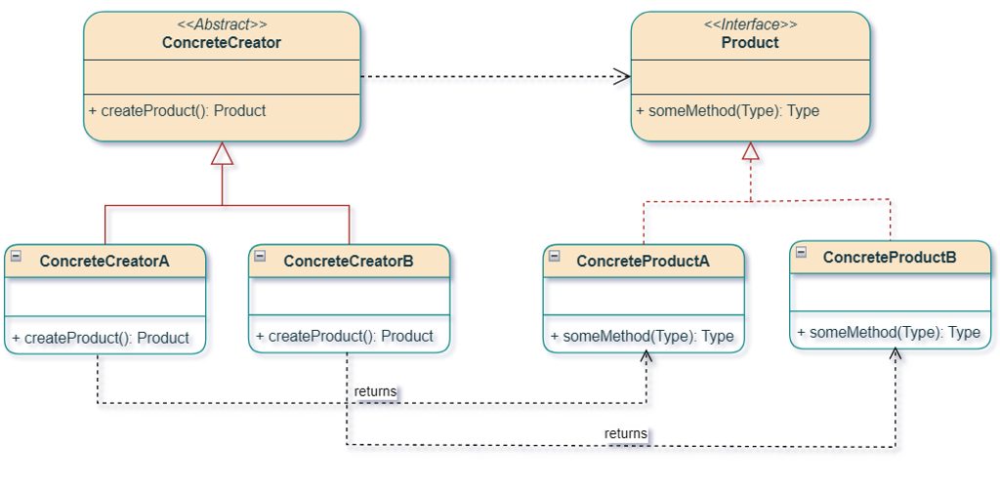
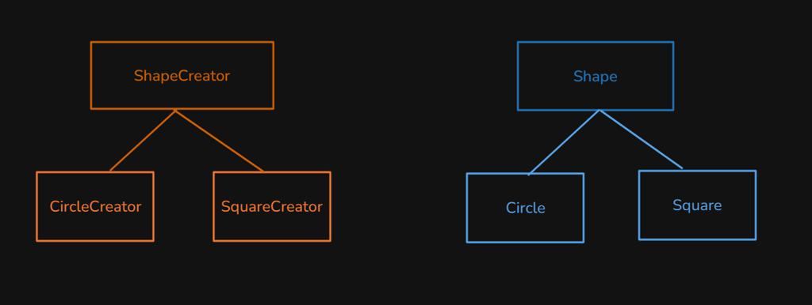

# Factory Method (and Simple Factory)

Creational: **hide `new` behind a method** that returns a common interface (`Shape`). The client draws and computes area without naming `Circle` or `Square`.

This package follows the Concept & Coding LLD note: **Simple Factory** (one `switch`) vs **Factory Method** (one creator class per product). Diagrams label the creator `ShapeCreator`; the code uses `ShapeFactory`.

**Code:** `com.lld.patterns.factory.shape`, `.simple`, `.method`, `.demo`

## Why this pattern is required

Without a factory the client instantiates concretes:

```text
Shape s = new Square();  // client locked to Square
s.draw();
```

That produces:

1. **Tight coupling** — every UI that needs a shape imports `Circle`, `Square`, `Rectangle`.
2. **Creation logic scattered** — constructors, defaults, validation copied at every `new`.
3. **Hard to swap at runtime** — config says `"SQUARE"` but the code still says `new Circle()`.
4. **Simple Factory still bloated** — one `switch (ShapeType)` that grows with every new shape (**OCP**).

Factory Method is required when **subclasses must decide which product to build**, especially as a framework extension point. Simple Factory is enough when you have a **small, closed** set of types and one static method.

## Structure

**Class diagram** (Factory Method, from the LLD note):



**Parallel trees** (creator × product):



| Role | Simple Factory | Factory Method |
|------|----------------|----------------|
| **Product** | `Shape` | `Shape` |
| **Concrete products** | `Circle`, `Rectangle`, `Square` | same |
| **Creator** | one `simple.ShapeFactory` | abstract `method.ShapeFactory.createShape()` |
| **Concrete creators** | — | `CircleCreator`, `RectangleCreator`, `SquareCreator` |
| **Client** | `createShapeInstance(SQUARE)` | `new SquareCreator().createShape()` |

```
Simple Factory
  ShapeFactory.createShapeInstance(SQUARE) → new Square()

Factory Method
  ShapeFactory factory = new SquareCreator();
  factory.createShape()  →  new Square()
```

The note’s concrete creators were named `getShapeInstance()` while the abstract method was `createShape()`. This code uses **`createShape()`** on both.

## Where to use it (and why there)

| Domain | Why a factory | Simple vs Method |
|--------|---------------|------------------|
| **Shapes / documents** | Client should not `new Circle` | Method if plugins add shapes |
| **This repo Null Object** | `VehicleFactory.getVehicle` | **Simple** factory + null object |
| **JDBC** | `DriverManager` / `Connection` | Framework + drivers ≈ Method |
| **Collections** | `Collections.emptyList()` | Simple / static |
| **Frameworks** | User subclasses `createProduct()` | **Factory Method** |

**Do not use Factory Method** for one class forever (`new` is fine). Do not confuse with **Abstract Factory** (families of products: `Button` + `Checkbox` for Light vs Dark).

## Factory Method vs Simple Factory (from the note)

**Simple Factory**

- Static method, parameter (`ShapeType`) picks the class.
- **Not** a GoF pattern — a programming idiom.
- **Violates OCP** when you add `TRIANGLE`: edit the `switch`.

**Factory Method**

- Inheritance: each concrete creator handles **one** product.
- **Follows OCP** for the creator hierarchy: add `TriangleCreator`, do not edit `CircleCreator`.
- Useful in **frameworks** as an extension point.

Honest caveat: the note’s `FactoryMethodDemo` still `switch`es on `ShapeType` to pick a creator. That **client switch** is the same OCP smell. The GoF client holds a `ShapeFactory` already (`new SquareCreator()`), or a registry/DI injects it.

## Pros and cons

**Pros**

- Client depends on `Shape`, not `new Square()`.
- Creation policy lives in one place (simple) or one class per type (method).
- Easy to add `Triangle` as `TriangleCreator` without touching `SquareCreator`.

**Cons**

- Factory Method: more types (`N` products → `N` creators).
- Simple Factory: one class becomes a magnet for every `new`.
- Returning `null` for a null `ShapeType` (the note) is an NPE trap; prefer throw or Null Object.

## How it follows SOLID

| Principle | Simple Factory | Factory Method |
|-----------|----------------|----------------|
| **S** | Factory only creates; `Circle` only draws. | Same; each creator has one product. |
| **O** | **Broken** for new `ShapeType`. | Creators closed; new creator class. Client switch still open. |
| **L** | Any `Shape` from the factory must `draw`/`computeArea`. | Any `ShapeFactory` must return a valid `Shape`. |
| **I** | Tiny `Shape`. | Tiny `createShape()`. |
| **D** | Client depends on `Shape`, but also on the concrete factory class. | Client can depend on abstract `ShapeFactory`. |

## How it differs from Abstract Factory, Template Method, and `new`

| | **Factory Method** | **Simple Factory** | **Abstract Factory** | **Template Method** |
|--|--------------------|--------------------|----------------------|---------------------|
| **Creates** | One product type per subclass | One product from a `switch` | A **family** (button + checkbox) | Not about products; algorithm steps |
| **How** | Override `createShape()` | Static `if`/`switch` | Factory of factories | Inheritance of steps |
| **This repo** | `SquareCreator` | `simple.ShapeFactory` | `CarFactory` (interior + exterior) | `PaymentFlow.sendMoney` |

Factory Method **is** a Template Method whose varying step is “create the object” (see Template README Q8).

## Run

```bash
cd DesignPatterns
javac -d out $(find src -name '*.java')
java -cp out com.lld.patterns.factory.demo.FactoryPatternDemo
```

## Interview questions and answers

**1. What is Factory Method?**  
A creational pattern: an interface/abstract method for creating a product; subclasses choose the concrete class.

**2. Why not `new` in the client?**  
Couples the client to every product. Creation (defaults, caching) leaks into UI.

**3. Simple Factory vs Factory Method?**  
Simple: one static `switch`. Idiom, OCP-weak. Method: one creator per product, OCP on that hierarchy. See table.

**4. Is Simple Factory a GoF pattern?**  
No. The note: programming idiom.

**5. Product vs creator here?**  
`Shape` / `Circle`. `ShapeFactory` / `SquareCreator`.

**6. Parallel hierarchies?**  
Creators mirror products: `CircleCreator` → `Circle`.

**7. `createShape` vs `getShapeInstance`?**  
Same factory method. The PDF mixed names; this code uses `createShape()`.

**8. Does Factory Method follow OCP “perfectly”?**  
Creators yes. A client `switch (ShapeType)` still needs a new case. Inject the creator.

**9. vs Abstract Factory?**  
One product vs a **family** of related products.

**10. vs Template Method?**  
Factory Method is Template Method specialized to construction.

**11. vs Null Object’s `VehicleFactory`?**  
That is Simple Factory (plus Null Object for unknown type).

**12. vs Singleton?**  
Singleton: one instance of one class. Factory: which subclass to build (many instances).

**13. Return `null` for null type?**  
The note does. Safer: throw or `NullShape`.

**14. `default` in the switch?**  
`IllegalStateException` if a new enum constant is added and not handled (Java exhaustiveness).

**15. Frameworks?**  
Override `createDocument()` / `createButton()` in a subclass. The framework calls the factory method.

**16. How would you add Triangle?**  
`Triangle implements Shape`, `TriangleCreator extends ShapeFactory`. Simple Factory: also edit the `switch` and `ShapeType`.

**17. Static factory vs Factory Method?**  
`Integer.valueOf` is a static factory method (Effective Java), not GoF Factory Method.

**18. DIP?**  
Depend on `Shape` and abstract `ShapeFactory`. Demo’s `new SquareCreator()` is still a concrete — DI would inject it.

**19. Thread safety?**  
Stateless creators are fine to share. Don’t put mutable cache on the factory without locks.

**20. Why two `ShapeFactory` classes?**  
Packages `simple` vs `method`. Same name, different pattern. Don’t merge them in an interview answer.
