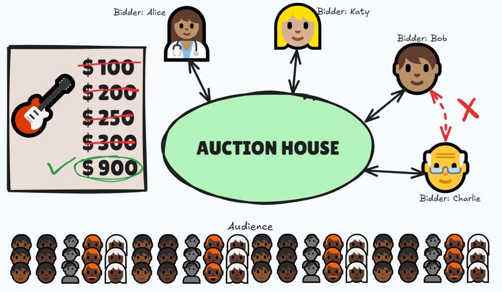
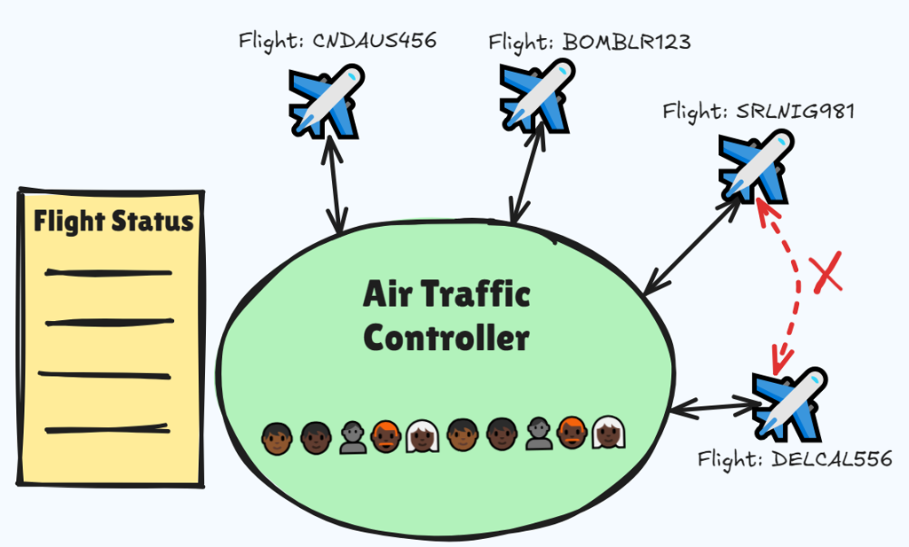
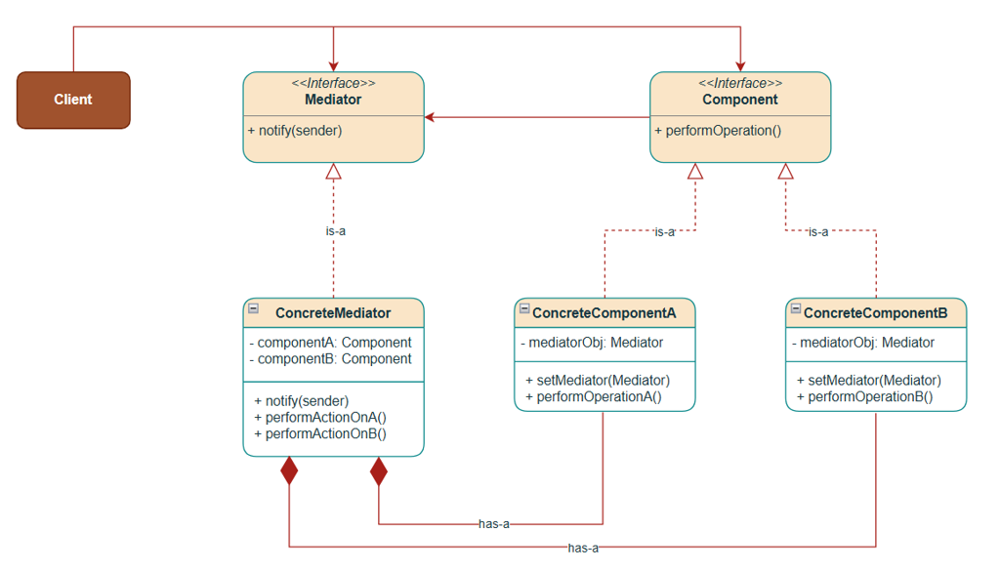
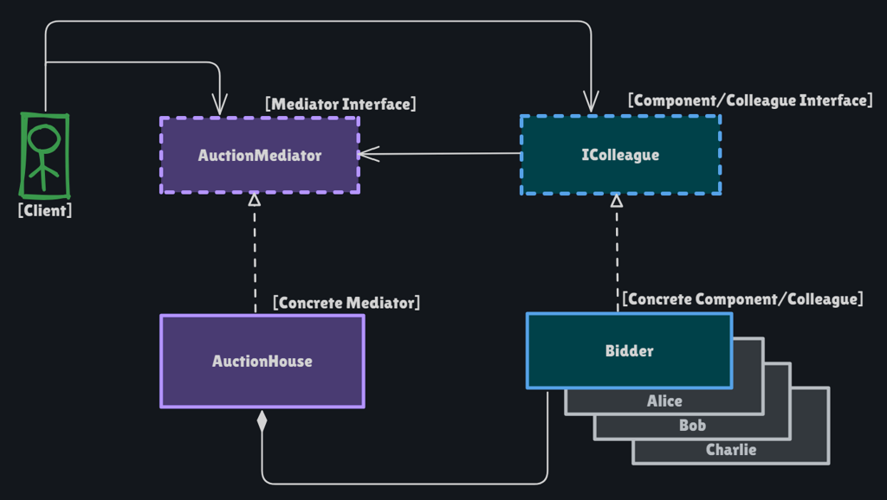

# Mediator Pattern

Behavioral pattern: **put how objects talk in one mediator** so colleagues do not point at each other. Each bidder (or plane) only knows the auction house (or tower). When state changes, the hub notifies the rest.

This package follows the Concept & Coding LLD note: **online auction**. Air traffic control is the same idea, not coded.

**Code:** `com.lld.patterns.mediator.auction`, `.demo`

## Why this pattern is required

Without Mediator, every bidder knows every other bidder:

```text
alice.notify(bob, amount);
alice.notify(charlie, amount);
bob.notify(alice, amount);
// n colleagues → n(n-1) links; validate "bid > high" in every class
```

That produces:

1. **Tight coupling** — Alice compiles against Bob and Charlie. A new Dana means editing every bidder.
2. **Scattered rules** — “must beat current high” lives in many places; easy to accept a tie in one path.
3. **Many-to-many mesh** — chat without a room, planes without a tower.
4. **Hard tests** — you cannot test bid policy without constructing the whole clique.

Mediator is required when **several objects interact in a protocol** and you want **one place** for that protocol. Observer is the wrong tool if *every* colleague both sends and receives through a shared policy (bids, clearances). Facade is the wrong tool if subsystems must **talk back to each other**.

## Structure

**Auction house (colleagues must not talk peer-to-peer):**



**Airline / ATC (same shape):**



**Class diagram** (from the LLD note):



**Structure** (this codebase):



| Role | In this codebase | Job |
|------|------------------|-----|
| **Mediator** | `AuctionMediator` | `registerBidder`, `placeBid`, `closeAuction` |
| **Concrete mediator** | `AuctionHouse` | Starting price, high bid, notify others |
| **Colleague** | `IColleague` | `placeBid`, `receiveBidNotification`, `getName` |
| **Concrete colleague** | `Bidder` | Holds **only** the mediator; registers in the constructor |
| **Client** | `MediatorPatternDemo` | Alice / Bob / Charlie; admin `closeAuction()` |

```
Alice.placeBid(150)
        │
        ▼
AuctionHouse.placeBid(alice, 150)
  if amount <= high → reject, no notify
  else high = amount, winner = alice
       notify Bob, Charlie   (not Alice)
```

Bid must be **strictly greater** than the current high (`<=` is rejected). Alice’s `$300` after Charlie’s `$300` fails; Bob’s `$900` wins.

## Where to use it (and why there)

Use Mediator when **interaction is many-to-many** and **must stay consistent**.

| Domain | Why Mediator | Hub |
|--------|--------------|-----|
| **Auction** | Bidders must not collude; one bid ledger | `AuctionHouse` |
| **ATC / airline** | Planes must not negotiate headings | Tower |
| **Chat room** | Users do not hold sockets to every peer | Room / server |
| **UI dialogs** | Button, list, and form fields update each other | Dialog mediator |
| **Air traffic of objects in a game** | Units collide / score through a match | Game controller |

**Do not use it** for **one subject, many listeners** with no reverse protocol (weather station — **Observer**), or for **client-only** simplification of services that do not know each other (**Facade**).

## Pros and cons

**Pros**

- Bidders never import each other. Add Dana with `new Bidder("Dana", house)`.
- Bid rules live in `AuctionHouse` (too-low, notify-except-self, winner).
- Colleagues stay small: place bid, receive notification.
- Replaces a complete graph of references with a star.

**Cons**

- Mediator can become a **god object** (every auction rule, payments, shipping…).
- Extra hop: Bidder → House → other Bidders.
- Colleagues still depend on the mediator interface (not zero coupling).
- Easy to overuse vs Observer when the flow is really one-way notify.

## How it follows SOLID

| Principle | How Mediator satisfies it | How the bad design breaks it |
|-----------|---------------------------|------------------------------|
| **S — Single Responsibility** | `Bidder` bids. `AuctionHouse` runs the auction protocol. | Each bidder validates, stores the high, and notifies peers. |
| **O — Open/Closed** | New `SilentBidder` implementing `IColleague`; house unchanged. | Every peer class grows a `notifyDana`. |
| **L — Liskov Substitution** | Any `IColleague` can register and receive. | A bidder that ignores the mediator and pings Bob directly. |
| **I — Interface Segregation** | Tiny colleague API. Admin uses `closeAuction` on the mediator, not on Bidder. | Forcing bidders to implement `closeAuction`. |
| **D — Dependency Inversion** | `Bidder` depends on `AuctionMediator`, not `AuctionHouse`. | `Bidder` holds `List<Bidder>` of concretes. |

## How it differs from Observer, Facade, and Chat-as-Observer

| | **Mediator** | **Observer** | **Facade** |
|--|--------------|--------------|------------|
| **Intent** | Colleagues interact **through a hub** | One subject **notifies many** | Client gets a **simple API** over many services |
| **Who talks** | Many ↔ many (via mediator) | One → many | Client → facade → subsystems |
| **Do colleagues know each other?** | **No** | Observers usually **do not** know each other; they also **do not send** domain protocol to the subject beyond subscribe | Subsystems typically **do not** know the facade |
| **This repo / note** | Auction bids | Weather / Notify Me | `OrderFacade` |

**Mediator vs Observer (from the Observer note):** Observer is one-to-many from a subject. Mediator is **many-to-many** through a hub. Chat room / auction = Mediator. Weather station = Observer.

This auction **uses notify** (`receiveBidNotification`) *inside* the mediator. That is fine: Observer is a mechanism; Mediator is the **interaction policy** (who may bid, who hears it).

**Mediator vs Facade (from the Facade note):** Facade: **client → facade → subsystems**; services do not call back through the facade to each other. Mediator: **colleagues → mediator → colleagues**.

## Run

```bash
cd DesignPatterns
javac -d out $(find src -name '*.java')
java -cp out com.lld.patterns.mediator.demo.MediatorPatternDemo
```

## Interview questions and answers

**1. What is Mediator?**  
A behavioral pattern that encapsulates how a set of objects interact so they do not refer to each other.

**2. When do you use it?**  
Auctions, ATC, chat rooms, UI widgets that must stay in sync.

**3. Mediator vs colleague here?**  
`AuctionHouse` is the hub. `Bidder` is a colleague that only calls `mediator.placeBid`.

**4. Why not Alice → Bob directly?**  
n² links, duplicated “is this bid high enough,” and collusion. The red X on the auction/ATC diagrams.

**5. Bid rule in this demo?**  
`bidAmount <= currentHighestBid` is rejected and **no one** is notified. Else update high and notify every colleague **except** the bidder.

**6. Who wins?**  
Bob at `$900` for Vintage Guitar (start `$100`). Alice’s second `$300` fails because Charlie already has `$300`.

**7. Mediator vs Observer?**  
Hub protocol vs one-way subscribe. See table. Auction is Mediator even though it notifies.

**8. Mediator vs Facade?**  
Colleagues know the mediator and call it. Facade’s subsystems usually do not know the facade.

**9. How does it follow SOLID?**  
Protocol in the house (SRP), new bidder class (OCP). See table.

**10. God mediator?**  
Split by use case: `BiddingMediator` vs `PaymentMediator`, or extract bid-policy objects. Do not dump shipping into `AuctionHouse`.

**11. Registration?**  
`Bidder` constructor calls `mediator.registerBidder(this)` so the client does not forget.

**12. Notify by name vs identity?**  
The note compares `getName()`. This code uses `colleague != bidder` so two “Alex” accounts still notify correctly.

**13. closeAuction with no bids?**  
`currentHighestBidder == null` → `"Auction closed with no bids."` Starting price is not a bid.

**14. Java / UI examples?**  
`java.util.concurrent` executors as a hub; UI dialog controllers; chat servers.

**15. Thread safety?**  
One auction house mutated by many bidders needs synchronization (or a single-threaded event loop). This demo is single-threaded.

**16. Can the mediator hold concrete `Bidder`?**  
Prefer `List<IColleague>` (this code) so a bot bidder can join.

**17. Airline example?**  
Planes send position to the tower; tower updates others and the status board. Planes do not radio each other for clearance.

**18. vs Event bus?**  
A global event bus is a **mediator without** the domain rules. `AuctionHouse` *is* the rules plus notify.

**19. Testing?**  
Fake `IColleague` to assert who got `receiveBidNotification`. Fake mediator to unit-test `Bidder.placeBid` forwarding.

**20. How would you add a reserve price?**  
Inside `AuctionHouse.closeAuction` (or `placeBid`): if high < reserve, no winner. Bidders unchanged.
