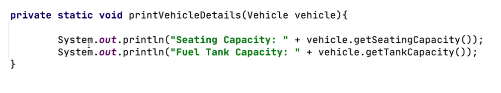
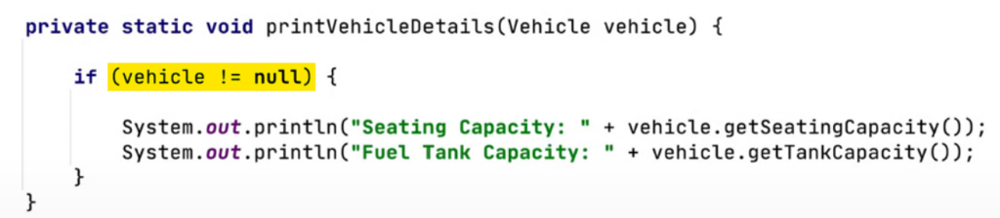
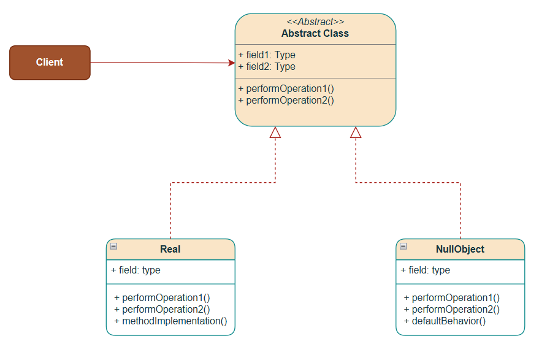
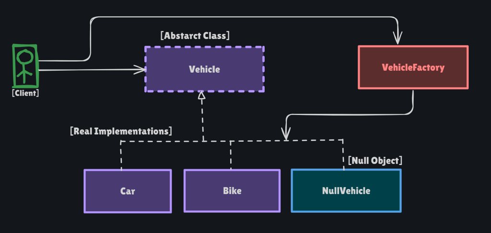

# Null Object Pattern

Behavioral pattern: **return a real object that does nothing (or a default) instead of `null`**. The client calls `start()` / `stop()` through the same `Vehicle` type and never writes `if (vehicle != null)`.

This package follows the Concept & Coding LLD note: vehicle factory. Unknown type → `NullVehicle`, not `null`.

**Code:** `com.lld.patterns.nullobject.vehicle`, `.demo`

## Why this pattern is required

Without Null Object the factory returns `null` and every caller must guard:

```text
Vehicle v = VehicleFactory.getVehicle(type);  // may be null
if (v != null) {
  v.start();
  v.stop();
}
```

That produces:

1. **NPEs** if any call site forgets the check — poor UX and a bad habit.
2. **Scattered `if (x != null)`** — the same guard in `printVehicleDetails`, `testDrive`, and every new use.
3. **The check is not the domain** — “no such vehicle” should be an object with a defined policy (do nothing), not a language hole.
4. **Optional/`instanceof` noise** — you still cannot treat “missing” as a `Vehicle`.

Null Object is required when **absence is a valid case** and the right behavior is **no-op or defaults**, not an exception and not a crash.

## Structure

**Problem — call getters with no null check (NPE):**



**Band-aid — null check at every call site:**



**Class diagram** (from the LLD note):



**Structure** (factory + NullVehicle):



| Role | In this codebase | Job |
|------|------------------|-----|
| **Abstract / interface** | `Vehicle` | `start`, `stop`, getters |
| **Real objects** | `Car`, `Bike` | Actual start/stop and data |
| **Null object** | `NullVehicle` | Logs do-nothing; defaults (`Default`, `0`, not for test drive) |
| **Factory** | `VehicleFactory.getVehicle(type)` | `"car"` / `"bike"` or **`new NullVehicle()`** |
| **Client** | `NullObjectPatternDemo` | `testDrive` has **no** null check |

```
getVehicle("car")   → Car      → start/stop move
getVehicle("bike")  → Bike     → start/stop move
getVehicle("null")  → NullVehicle → start/stop do nothing  (not NPE)
```

## Where to use it (and why there)

Use Null Object when **missing is normal** and **doing nothing is correct**.

| Domain | Why Null Object | Instead of |
|--------|-----------------|------------|
| **This package** | Unknown vehicle type | `return null` |
| **Collections** | Empty list / empty iterator | `null` list |
| **Logging** | `NullLogger` in tests | `if (log != null)` |
| **Discount** | `NoDiscount` | `discount == null ? 0` |
| **Customer** | `GuestUser` with no email | `user != null` |
| **Optional** | Java `Optional` is a cousin | still not a polymorphic no-op type |

**Do not use it** to hide **bugs** (a missing order id should throw), or when the caller **must** distinguish missing vs present (then `Optional` or an error). Do not confuse with **Proxy** (Proxy stands in for a *real* object that will work; Null Object *is* the absence).

## Pros and cons

**Pros**

- `testDrive(vehicle)` never NPEs; factory never returns `null`.
- One `NullVehicle` instead of a check at every call site.
- Default data (`seatingCapacity = 0`) is explicit.
- Easy to swap in tests (`NullLogger`).

**Cons**

- Callers can **fail to notice** that nothing happened (silent no-op). This demo logs `[-] Null Vehicle`.
- A **god** null object that pretends to succeed at money/moves is dangerous.
- `instanceof Car` in `printVehicleDetails` is still a smell — full polymorphism would be `vehicle.printDetails()`.
- Not a substitute for `Optional` when “empty” must be handled differently from “do nothing.”

## How it follows SOLID

| Principle | How Null Object satisfies it | How the bad design breaks it |
|-----------|------------------------------|------------------------------|
| **S — Single Responsibility** | `Car` drives. `NullVehicle` represents absence. | Every client is also a null-guard. |
| **O — Open/Closed** | New `Truck` in the factory; clients still call `start()`. | New type + more null checks in old methods. |
| **L — Liskov Substitution** | `NullVehicle` is a `Vehicle`; `start()`/`stop()` are safe. A null object that throws on `start()` breaks LSP. | Returning `null` is **not** a `Vehicle`. |
| **I — Interface Segregation** | Tiny `Vehicle` API. | Forcing `NullVehicle` to implement `refuelAtPump` with fake side effects. |
| **D — Dependency Inversion** | Client depends on `Vehicle`, not `Car`. Factory hides construction. | Client `new Car(...)` and special-cases missing types. |

## How it differs from Optional, Proxy, and Strategy

| | **Null Object** | **Optional** | **Proxy** | **Strategy** |
|--|-----------------|--------------|-----------|--------------|
| **Intent** | Polymorphic **do-nothing / default** object | Explicit **empty vs value** | Stand-in that **forwards** to a real object | Swap **algorithms** |
| **Client** | Calls the interface as usual | Must `ifPresent` / `orElse` | Calls the same API; work still happens | Picks a real behavior |
| **This package** | `NullVehicle` | — | Employee DAO proxy | Drive / pay |

**vs returning `null`:** null is not a type; Null Object **is**.

**vs `Optional<Vehicle>`:** Optional forces the client to unwrap. Null Object lets the client stay on `Vehicle`. Use Optional when ignoring absence would be wrong.

**vs Proxy:** Proxy eventually hits `EmployeeDaoImpl`. Null Object never does real work.

## Run

```bash
cd DesignPatterns
javac -d out $(find src -name '*.java')
java -cp out com.lld.patterns.nullobject.demo.NullObjectPatternDemo
```

The note’s solution demo called `testDrive(car)` again after the bike (copy-paste). This demo uses `testDrive(bike)`.

## Interview questions and answers

**1. What is Null Object?**  
A behavioral pattern: a special implementation of the interface that does nothing or returns defaults, used instead of `null`.

**2. What problem does it solve?**  
NPEs and repetitive `if (x != null)` after a factory/`find` that used to return null.

**3. Key points from the note?**  
Return a Null Object, not `null`. Clean call sites. Do-nothing or default behavior.

**4. Factory in this demo?**  
`"car"` → Toyota, `"bike"` → Yamaha, anything else → `new NullVehicle()`.

**5. What does `NullVehicle` do?**  
`start`/`stop` log do-nothing. Model/color `"Default"`, capacities `0`, not available for test drive.

**6. Does `testDrive` check null?**  
No. That is the point.

**7. Why still `instanceof` in `printVehicleDetails`?**  
The note prints Car vs Bike fields differently. NullVehicle matches neither, so no details line — then `testDrive` still runs. Prefer `vehicle.printDetails()` on the abstract type in production.

**8. Java `instanceof Car car`?**  
Pattern matching (Java 16+). This repo uses a classic cast so it matches the rest of the catalog.

**9. How does it follow SOLID?**  
`NullVehicle` is a substitutable `Vehicle` (LSP). Clients closed to new missing-type handling (OCP). See table.

**10. Singleton null object?**  
Common (`NullVehicle.INSTANCE`) so `==` works. This note constructs `new NullVehicle()` each time.

**11. vs Optional?**  
Optional is a box. Null Object is a `Vehicle`. See table.

**12. vs Proxy?**  
Proxy forwards to a real object. Null Object *is* the empty case.

**13. When is it wrong?**  
Missing payment, missing user in auth — fail loud. Silent `NullPayment` that “succeeds” is a bug.

**14. Collections?**  
`Collections.emptyList()` is a Null Object for lists.

**15. Logging?**  
`Logger` interface + `NullLogger` so production code never checks `if (logger != null)`.

**16. Downsides?**  
Hidden no-ops; over-wide defaults; still need a way to detect “was this null object?” if the UI must show “not found.”

**17. How to detect NullVehicle if needed?**  
`instanceof NullVehicle`, or `isNull()` on `Vehicle` (default `false`, override `true`). Prefer not to spread that.

**18. Factory `type.equals("car")`?**  
If `type` is null, NPE. This code uses `"car".equals(type)` and treats null type as NullVehicle.

**19. Thread safety?**  
Immutable `NullVehicle` is fine to share. A singleton is enough.

**20. How would you add `truck`?**  
`if ("truck".equals(type)) return new Truck(...)`. Unknown strings still hit `NullVehicle`. `testDrive` unchanged.
