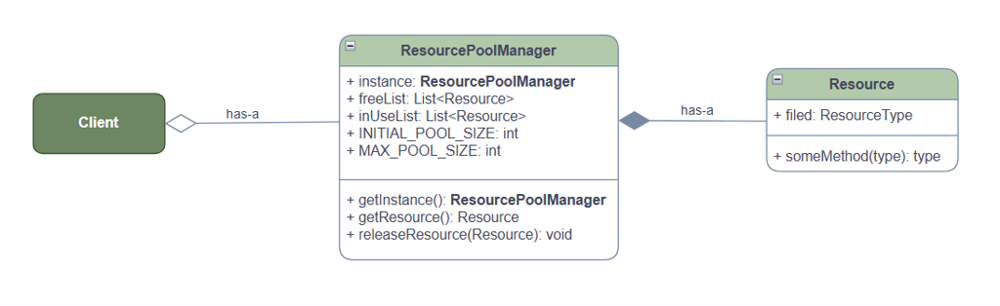
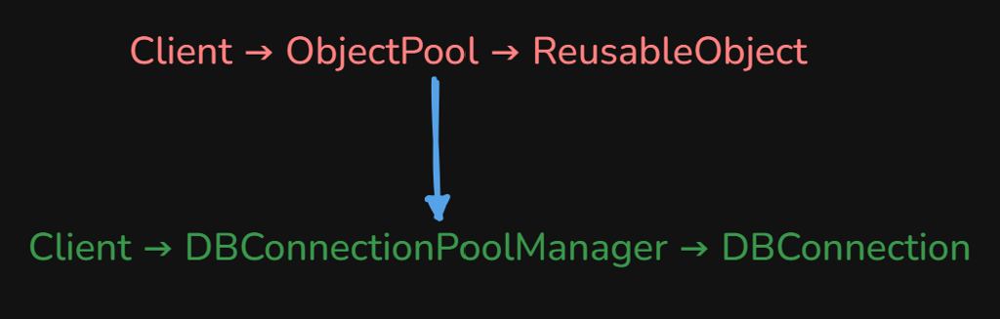

# Object Pool Pattern

Creational pattern: **keep a set of expensive objects and reuse them**. Borrow from the pool, use, **return**. Used when create/destroy is costly, you need the same type often, and you must **cap** how many exist (DB connections).

This package follows the Concept & Coding LLD note: `DBConnection` pool. JDBC is simulated so the demo runs without MySQL. The note combines Object Pool with **Singleton** and **thread-safe** acquire/release.

**Code:** `com.lld.patterns.objectpool.db`, `.demo`

## Why this pattern is required

Without a pool every query does `new DBConnection()` (real JDBC `DriverManager.getConnection`):

```text
open socket → handshake → auth → use once → close
```

That produces:

1. **CPU/latency** — handshake on every request.
2. **Resource exhaustion** — unbounded sockets vs DB `max_connections`.
3. **A naive pool with `new DBConnectionPoolManager()`** — a **second** pool of 3 more connections, **past MAX**, two free/in-use lists, **memory leak**, unreliable cap. That is the note’s “problem” demo.

Object Pool is required when instances are **expensive and reusable**. It is usually a **singleton** so the cap is global.

## Structure

**Class diagram** (from the LLD note):



**Mapping:**



| Role | In this codebase | Job |
|------|------------------|-----|
| **Reusable object** | `DBConnection` | Expensive resource (simulated open) |
| **Object pool** | `DBConnectionPoolManager` | Free list + in-use list; initial 3, max 6 |
| **Client** | `ObjectPoolPatternDemo` | `getDBConnection` / `releaseDBConnection` |

```
Borrow  →  free.removeLast() → inUse.add()
Return  →  inUse.remove(conn) → free.add(conn)
Empty free and inUse < 6  →  create one more, then borrow
Empty free and inUse == 6 →  return null (pool full)
```

**Flow:** borrow → use → return.

## Where to use it (and why there)

| Domain | Why a pool | Cap |
|--------|------------|-----|
| **DB connections** | Handshake is slow; DB limits sessions | `MAX_POOL_SIZE` |
| **Threads** | `Executor` / thread pool | pool size |
| **TCP / HTTP clients** | Sockets | max idle |
| **Games** | Bullets, particles | avoid GC spikes |

**Do not use it** for cheap objects (`new String`), or when each use needs a **fresh** identity with no reset. Reset dirty state on release (this demo has none).

## Pros and cons

**Pros** (from the note)

- Less create/destroy of heavy objects.
- Lower latency (pre-warmed initial 3).
- Prevents exhaustion (max 6; 7th is `null`).

**Cons** (from the note)

- **Leak** if the client never `release`s (try/finally).
- Extra memory for idle objects.
- Thread safety is mandatory (lists).
- More complexity than `new`.

Also: double-release can put the same conn on free twice (`List.remove` then `add`); this note does not guard that.

## How it follows SOLID

| Principle | How the pool satisfies it | How `new` every time / two managers breaks it |
|-----------|---------------------------|-----------------------------------------------|
| **S** | Manager owns pooling. `DBConnection` is the resource. | Client opens, tracks, and caps connections. |
| **O** | New resource type → another pool class (or generic pool). | Copy-paste pool logic per resource. |
| **L** | Borrowed `DBConnection` must still be a usable connection. | Returning a closed/stale conn without reset. |
| **I** | Tiny get/release API. | Forcing the client to know free/in-use lists. |
| **D** | Client depends on the manager API, not `DriverManager`. | Client `getConnection` everywhere. |

## How it differs from Singleton, Flyweight, and Prototype

| | **Object Pool** | **Singleton** | **Prototype** | **Flyweight** |
|--|-----------------|---------------|---------------|---------------|
| **How many objects?** | **Up to N**, reused | **Exactly one** | Many clones | Many *logical* objects, shared *intrinsic* state |
| **This repo** | Up to 6 connections | One `DBConnectionEager` | `Student.clone()` | Not coded |
| **Must return?** | **Yes** | N/A | No | No |

The **manager** is a Singleton; the **connections** are a pool. Do not make `DBConnection` itself a singleton.

The note’s DCL on `getInstance()` omitted `volatile`. This code uses **`volatile`** (same fix as the Singleton package).

## Run

```bash
cd DesignPatterns
javac -d out $(find src -name '*.java')
java -cp out com.lld.patterns.objectpool.demo.ObjectPoolPatternDemo
```

Expect: 3 opens at start, 3 more as the pool grows to 6, 7th `null`, release #6 then reuse **same instance**, `getInstance()` twice → **same manager**.

## Interview questions and answers

**1. What is Object Pool?**  
A creational pattern that reuses a fixed set of expensive objects instead of creating/destroying them each time.

**2. When do you use it?**  
Expensive create, repeated need, hard limit (DB, threads, sockets).

**3. Borrow / return?**  
`getDBConnection` takes from free (or grows up to max). `releaseDBConnection` moves in-use → free.

**4. Why Singleton on the manager?**  
A second `new PoolManager()` creates another initial 3 and **breaks MAX**. One process-wide pool.

**5. Why synchronized get/release?**  
Two threads must not both take the last free connection (or corrupt the lists).

**6. Why `volatile` on the instance?**  
DCL without volatile can publish a half-built manager. See Singleton README.

**7. What if the pool is full?**  
This note returns `null`. Production: block, timeout, or throw.

**8. Resource leak?**  
Forgot `release` → connection stuck in in-use forever. Use try/finally or try-with-resources wrapper.

**9. Initial vs max?**  
Warm 3 for latency; grow to 6 under load; never more.

**10. vs Singleton?**  
Pool = many reusable instances. Singleton = one object. The **pool manager** is the singleton.

**11. vs Flyweight?**  
Flyweight shares immutable identity (tree type). Pool reuses mutable resources that must be exclusive while in use.

**12. vs Prototype?**  
Prototype copies. Pool **hands out the same object** again after release.

**13. HikariCP / Apache DBCP?**  
Production object pools. Same idea, plus timeouts, validation, leak detection.

**14. Thread pool?**  
`ExecutorService` is an object pool of threads.

**15. How does it follow SOLID?**  
Cap and lists in one class (SRP). Client doesn’t `DriverManager` (DIP).

**16. Double release?**  
`remove` no-ops if already free, then `add` duplicates the conn on free. Guard with `inUse.contains`.

**17. Reset on release?**  
Clear transaction, rollback, unstick session. Stale state is a classic pool bug.

**18. Memory?**  
Idle connections hold sockets. Size the pool to traffic, not “as large as possible.”

**19. Testing?**  
This demo fakes JDBC. Inject a `ConnectionFactory` in production for tests.

**20. How would you wait when full?**  
`wait()`/`notify` in synchronized get/release, or a `BlockingQueue` of free connections with timeout.
