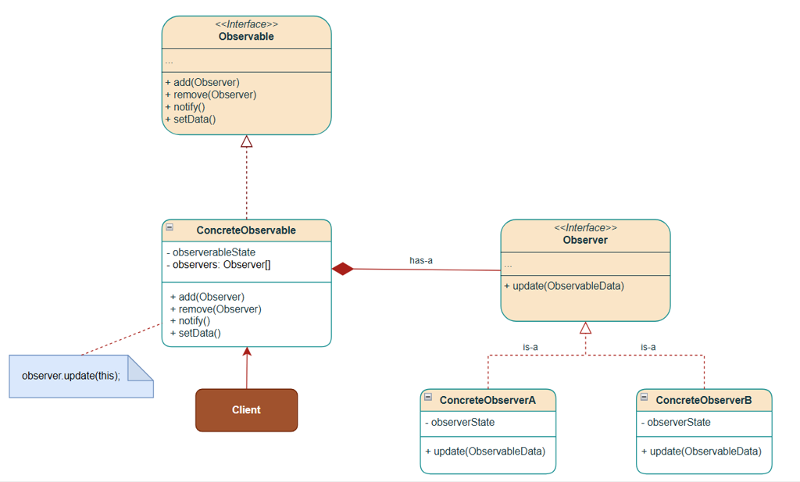
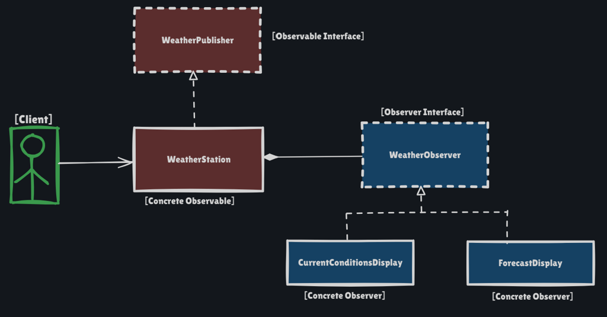

# Observer Pattern

Behavioral pattern: **a subject keeps a list of observers and notifies them automatically when its state changes.** Observers can be added or removed at runtime.

This package follows the Concept & Coding LLD note: weather station displays and e-commerce “Notify Me”.

**Code:** `com.lld.patterns.observer.weather`, `.stock`, `.demo`

## Why this pattern is required

Without Observer, the subject **knows every listener by name** and calls them in-line:

```text
weatherStation.setReadings(...)
tv.show(...)
phone.show(...)
forecast.recompute(...)
emailUsers(...)   // next week: Slack, SMS, analytics...
```

That produces:

1. **Tight coupling** — `WeatherStation` compiles against TV, phone, forecast, email. A new display means editing the station.
2. **Open/Closed violation** — every new subscriber type opens the subject.
3. **SRP violation** — the station both measures weather **and** orchestrates every UI/channel.
4. **No runtime subscribe/unsubscribe** — you cannot drop ForecastDisplay mid-session without more `if`s.
5. **Duplicated notify loops** — every product in e-commerce copies “email these users when stock > 0”.

Observer is required when **many objects must react to one object’s state**, and **the set of reactors is not known at compile time** (follows, Notify Me, dashboards).

## Structure

**Class diagram** (from the LLD note):



**Structure** using the weather-station example:



| Role | Weather example | Stock “Notify Me” |
|------|-----------------|-------------------|
| **Observable / Subject** | `WeatherObservable` | `StockAvailabilityObservable` |
| **Concrete subject** | `WeatherStation` (temp, humidity, pressure) | `IphoneProductObservable` (quantity) |
| **Observer** | `WeatherObserver.update()` | `StockNotificationObserver.update()` |
| **Concrete observers** | `CurrentConditionsDisplay`, `ForecastDisplay` | `EmailNotificationObserver`, `PushNotificationObserver` |
| **Client** | `ObserverPatternDemo` | same |

```
Client registers observers
        │
        ▼
Subject (WeatherStation / IphoneProduct)
  observers: List<Observer>
  setState() / restock()
        │  notifyObservers()
        ▼
Observer.update()
  ├── CurrentConditionsDisplay  (pulls station.toString())
  ├── ForecastDisplay
  ├── EmailNotificationObserver
  └── PushNotificationObserver
```

**Weather** uses a **pull** model: `update()` has no payload; displays read the station.

**Notify Me** uses a **push-ish** model: `update()` means “back in stock”; observers already know how to notify their user. Notifications fire **only when stock goes from 0 → positive**, not on every restock while already available.

## Where to use it (and why there)

Use Observer when **one-to-many state broadcast** is the problem, and subscribers should **not** be hardcoded into the publisher.

| Domain | Why Observer | Subject / observers |
|--------|----------------|---------------------|
| **Weather / IoT telemetry** | Many dashboards, same sensor stream; add a display without touching the station | Station → current, forecast, logging |
| **E-commerce Notify Me** | Users subscribe only while OOS; channels differ (email vs push) | SKU stock → email, push, SMS |
| **Social follow / feed** | Follow graph is runtime; poster must not import every follower’s UI | Profile → follower notifications |
| **Stock tickers** | Price changes; investors attach/detach | Quote → charts, alerts, bots |
| **YouTube / newsletter** | Publisher does not know subscriber list at compile time | Channel → subscribers |
| **UI MVC** | Model change refreshes many views | Model → views |
| **In this monorepo** | Reco/Spotify event bus: generate slate / listen event → notifications | Event bus → listeners |

**Do not use it** when there is a single hardcoded collaborator (just call the method), or when you need **guaranteed delivery / topics / multiple publishers** — that is closer to a message broker / pub-sub, not a simple in-process Observer list.

## Pros and cons

**Pros**

- Subject and observers are loosely coupled (depend on interfaces).
- Add/remove listeners at runtime (`removeObserver(forecastDisplay)`).
- Open for new observer types (`SmsNotificationObserver`) without editing the product.
- Each observer reacts in its own way (display vs email vs push).
- Matches real “subscribe” language (Instagram follow, Notify Me).

**Cons**

- Notification order is undefined unless you document it.
- Easy **memory leaks** if observers are not unregistered (UI screens, sessions).
- `notify` while an observer unregisters → `ConcurrentModificationException` unless you copy the list (this code copies).
- Cascading updates / infinite loops if observers mutate the subject.
- Debugging is harder: “who got this event?” is a list, not a direct call.
- Naive Observer is in-process and synchronous; slow observers block `setWeatherReadings`.
- Pull model can over-fetch; push model couples observers to event payload shape.

## How it follows SOLID

| Principle | How Observer satisfies it | How the bad design breaks it |
|-----------|---------------------------|------------------------------|
| **S — Single Responsibility** | Station stores readings and the observer list. Displays render. Email observer sends mail. | Station would own TV + forecast + mail. |
| **O — Open/Closed** | New `AnalyticsDisplay` or `SmsNotificationObserver` without editing `WeatherStation` / `IphoneProductObservable`. | `if (email) … else if (push)` inside `restock`. |
| **L — Liskov Substitution** | Any `WeatherObserver` can be notified; `CurrentConditionsDisplay` and `ForecastDisplay` are interchangeable at the list. | A special-cased `if (observer instanceof Forecast)` in the station. |
| **I — Interface Segregation** | `update()` is tiny. Stock observers add `getUserId()` only because unsubscribe UX needs it. | Forcing every observer to implement display + email + push. |
| **D — Dependency Inversion** | Station depends on `WeatherObserver`, not `ForecastDisplay`. Product depends on `StockNotificationObserver`. | `WeatherStation` fields of type `TvDisplay`. |

## How it differs from Bridge (and from Strategy)

Same as Strategy: people see **composition** and mix the names. Intent is different.

| | **Observer** | **Bridge** | **Strategy** |
|--|----------------|------------|--------------|
| **Intent** | **Notify many** dependents of a state change | Let **abstraction and implementation** vary independently | Swap **one algorithm** for a step |
| **Cardinality** | 1 subject → **N** observers | 1 abstraction → **1** implementor (often) | 1 context → **1** strategy at a time |
| **Who initiates** | Subject **broadcasts** after `setState` | Client uses abstraction; implementor is plugged in | Context **delegates** `pay()` / `drive()` |
| **Runtime change** | Subscribe / unsubscribe | Swap renderer / device | Swap algorithm |
| **Smell it fixes** | Hardcoded listener calls | Cartesian subclass matrix (`CircleRaster`…) | Giant `switch` of algorithms |
| **This package** | Weather + Notify Me | Not Observer | Drive mode / payment |

**One-liner:** Observer = **publish state to a dynamic list**. Bridge = **split two hierarchies**. Strategy = **pick how to do one job**.

Observer vs **pub-sub**: Observer is usually a **direct pointer** from subject to observers. Pub-sub inserts a **broker and topics**; publishers do not hold subscriber lists.

Observer vs **Mediator**: Observer is one-to-many from a subject. Mediator is **many-to-many** through a hub so colleagues do not point at each other.

## Run

```bash
cd DesignPatterns
javac -d out $(find src -name '*.java')
java -cp out com.lld.patterns.observer.demo.ObserverPatternDemo
```

## Interview questions and answers

**1. What is the Observer pattern?**  
A subject maintains observers and notifies them of state changes. Observers register and unregister at runtime.

**2. Other names?**  
Subject/Observer, Observable/Observer, Publisher/Subscriber (in-process). Java once had `java.util.Observable` (deprecated).

**3. When do you use it?**  
One-to-many reactions to state: weather displays, stock Notify Me, follows, UI views on a model, in-process event listeners.

**4. Push vs pull?**  
**Pull:** `update()` with no args; observer reads the subject (weather demo). **Push:** `update(event)` carries data so observers need not know the subject. Pull keeps the observer interface stable; push avoids extra queries.

**5. Why copy the observer list before notify?**  
An observer may `removeObserver(this)` inside `update()`. Iterating the live `ArrayList` then throws `ConcurrentModificationException`. Copy (or snapshot) first.

**6. Why notify only on 0 → in-stock, not every restock?**  
Notify Me means “tell me when I can buy again,” not “spam on every warehouse refill.” That is domain policy inside the subject, still Observer.

**7. How does it follow SOLID?**  
Depend on `WeatherObserver` (DIP), add observer classes not `if` channels (OCP), station does not send email (SRP).

**8. Observer vs Strategy?**  
Strategy: context **chooses one** algorithm and **calls it**. Observer: subject **does not choose**; it **notifies all**. Payment is Strategy. “Back in stock” is Observer.

**9. Observer vs Bridge?**  
Bridge decouples abstraction from implementation (two hierarchies). Observer decouples **publisher from N listeners**. See table above.

**10. Observer vs Mediator?**  
Mediator: colleagues talk through one object. Observer: many listen to one subject’s state. Chat room is Mediator; weather station is Observer.

**11. Observer vs pub-sub / Kafka?**  
In-process Observer: subject holds references. Distributed pub-sub: broker, durability, consumer groups. Do not pretend `ArrayList<Observer>` is Kafka.

**12. Memory leaks?**  
Long-lived subject + forgotten observer (Activity, session). Always unsubscribe (this demo removes John/Katy after they buy).

**13. Thread safety?**  
`setWeatherReadings` from a sensor thread and `addObserver` from UI need a concurrent list or a lock. This demo is single-threaded.

**14. Notification order?**  
Registration order unless you sort. Do not rely on it for business rules.

**15. What if an observer throws?**  
Later observers never run. Catch per observer or use an event bus with error isolation.

**16. Can the subject be an observer of something else?**  
Yes (chained). Watch for cycles.

**17. How do you unit-test it?**  
Fake observer that records `update()` counts. Restock from 0 should increment; restock while in stock should not (Notify Me).

**18. Is MVC Observer?**  
Classic Smalltalk MVC: views observe the model. Same idea as `CurrentConditionsDisplay`.

**19. Why not have `WeatherStation` call `display()` on a list of `Display` types?**  
That still couples to display. Observer lets **non-display** listeners exist (analytics, email) behind `update()`.

**20. How would you add SMS Notify Me?**  
`SmsNotificationObserver implements StockNotificationObserver`. Product class unchanged — that is the OCP demo.
