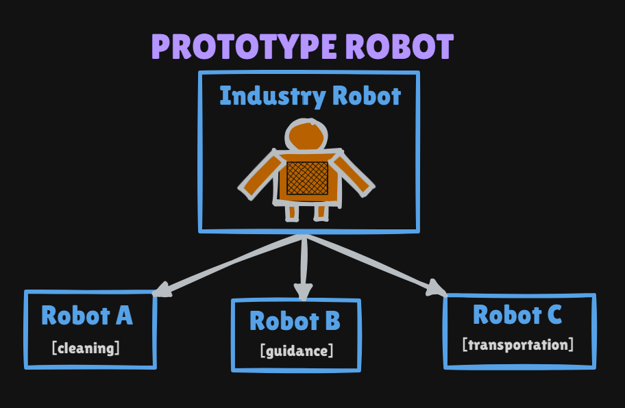
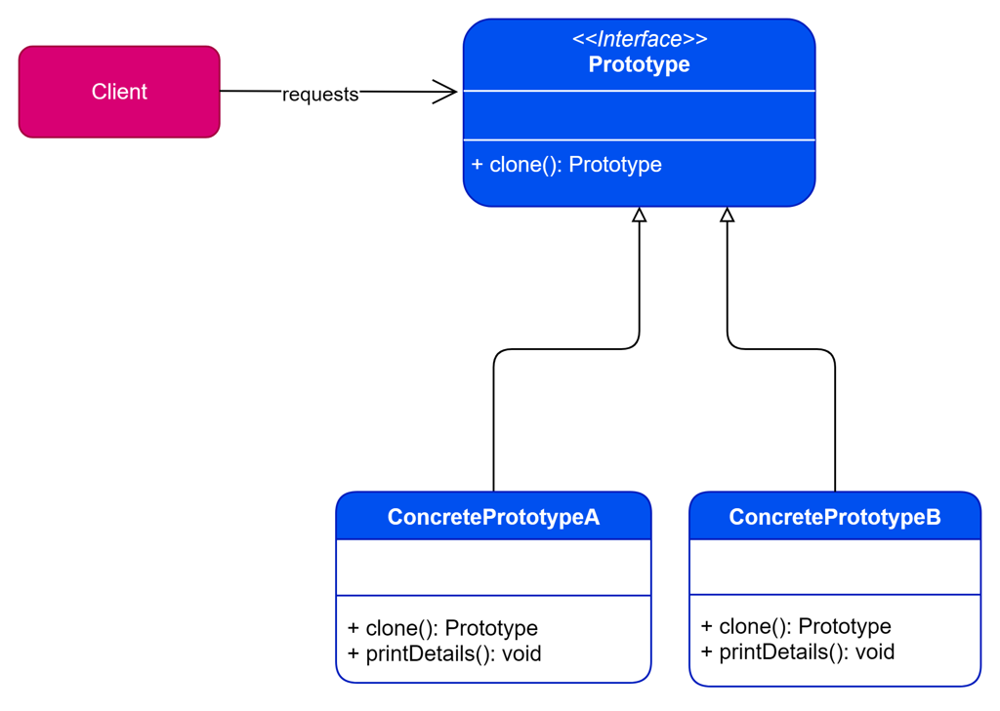

# Prototype Pattern

Creational pattern: **make new objects by cloning an existing instance** instead of `new` from scratch. Useful when construction is expensive (robots, DB-loaded graphs) or when the client **cannot see private fields** needed to copy.

This package follows the Concept & Coding LLD note: **Student** clone. Industrial robots (clone a base model, then specialize cleaning / guidance / transport) are the same idea, not coded.

**Code:** `com.lld.patterns.prototype.student`, `.demo`

## Why this pattern is required

Without Prototype the client copies field-by-field:

```text
Student clone = new Student();
clone.id = org.id;
clone.name = org.name;
clone.branch = org.branch;
// clone.rollNo = org.rollNo;  // compile error — rollNo is private
```

That produces:

1. **Cannot copy private state** — `rollNo` stays 0 / default. The clone is wrong.
2. **Client owns cloning** — every caller repeats the field list; miss one field when `Student` grows.
3. **Not selective** — the note: the client cannot choose a supported clone policy (shallow vs “copy these fields”).
4. **Expensive `new` + setup** — robots / loaded students: clone the prototype, then tweak.

Prototype is required when **the object should clone itself** (`clone()` has access to privates) through a common interface.

## Structure

**Robot analogy** (clone the industry prototype, then specialize):



**Class diagram** (from the LLD note):



| Role | In this codebase | Job |
|------|------------------|-----|
| **Prototype** | `StudentPrototype` | `clone()` |
| **Concrete prototype** | `Student` | Copy ctor from `id, name, branch, rollNo` |
| **Client** | `PrototypePatternDemo` | `student.clone()`, then `setInHighSchool(true)` |

```
Rita (id=5, rollNo=224, inHighSchool=false)
        │ clone()
        ▼
copy   (same id/name/branch/rollNo, inHighSchool still false)
        │ setInHighSchool(true)
        ▼
clone customized   Same object? false
```

`clone()` is **not** `Object.clone()` / `Cloneable` here. It is the interface method that returns `StudentPrototype` (client casts to `Student`).

## Where to use it (and why there)

| Domain | Why Prototype | After clone |
|--------|---------------|-------------|
| **Student (this package)** | Private `rollNo`; client must not copy fields | Set `inHighSchool` |
| **Robots** | Expensive base model | Cleaning vs guidance vs transport |
| **Game units** | Prefab monster | Tint, HP, weapon |
| **Documents** | Template loaded from disk | Fill name/date |

**Do not use it** when a constructor is cheap and all fields are public, or when you need a **brand-new** object with no shared ancestry (Factory). Watch **shallow vs deep** copy for nested mutable objects.

## Pros and cons

**Pros**

- Private `rollNo` is copied inside `Student.clone()`.
- Client does not list fields. New fields can be added in one `clone()`.
- Fast copies vs re-running expensive setup.
- `student == studentClone` is **false** — distinct instances.

**Cons**

- **Shallow copy** of a `List` field would share the list (this demo has none).
- `clone()` in the note **drops `inHighSchool`** (not in the copy ctor). Always reset after clone if you care.
- Cast `(Student) student.clone()` if the interface returns `StudentPrototype`. Prefer `Student clone()` as a covariant override.
- Java `Object.clone()` is a famous footgun (`Cloneable` is a marker, `CloneNotSupportedException`). This note avoids it.

## How it follows SOLID

| Principle | How Prototype satisfies it | How client-side copy breaks it |
|-----------|----------------------------|--------------------------------|
| **S** | `Student` knows its own copy. Client prints/customizes. | Client is copier **and** user of Student. |
| **O** | New subtype `GraduateStudent` implements `clone()`. Client still calls `clone()`. | Client `if`s on type to copy extra fields. |
| **L** | `clone()` must return a usable `StudentPrototype` of the same kind. | Clone that is a different type or half-empty. |
| **I** | Tiny `clone()`. | Forcing the client to call 10 setters to “clone.” |
| **D** | Client can depend on `StudentPrototype`, not field layout. | Client coupled to every field’s visibility. |

## How it differs from Factory, Singleton, and `new`

| | **Prototype** | **Factory Method** | **Singleton** | **`new` + setters** |
|--|---------------|--------------------|---------------|---------------------|
| **Creates** | A **copy** of an existing instance | A **new** instance of a chosen class | The **same** instance | New instance, client fills fields |
| **Knows privates?** | Yes (inside `clone`) | Constructor can | N/A | No |
| **This repo** | `Student.clone()` | `SquareCreator` | `DBConnectionEager` | Problem demo |

## Run

```bash
cd DesignPatterns
javac -d out $(find src -name '*.java')
java -cp out com.lld.patterns.prototype.demo.PrototypePatternDemo
```

## Interview questions and answers

**1. What is Prototype?**  
A creational pattern: new objects by cloning existing ones rather than constructing from scratch.

**2. When do you use it?**  
Expensive create; private state the client cannot copy; many similar objects (robots, prefabs).

**3. Why not copy fields in the client?**  
Private `rollNo` is inaccessible. You miss fields. Cloning belongs on the class.

**4. Who implements `clone()`?**  
The concrete prototype (`Student`), not the client.

**5. Same object?**  
`false`. Clone is a second instance with copied state.

**6. Shallow vs deep?**  
Shallow: copy references. Deep: clone nested objects. Strings/ints here are fine shallow.

**7. Does this use `Cloneable`?**  
No. Custom `StudentPrototype.clone()`. Cleaner than `Object.clone()`.

**8. Covariant `Student clone()`?**  
Java allows overriding to return `Student`. Then no cast. The note returns `StudentPrototype`.

**9. `inHighSchool` after clone?**  
Copy ctor does not set it → `false`. Demo then `setInHighSchool(true)` only on the clone. Original Rita stays `false`.

**10. Prototype registry?**  
A map of named prototypes (`"defaultStudent"`). Client asks the registry to clone. Not in this note.

**11. vs Factory Method?**  
Factory: pick a class and `new`. Prototype: pick an instance and copy (state included).

**12. vs Singleton?**  
Opposite: many copies vs one instance.

**13. vs copy constructor only?**  
A copy ctor is Prototype without the interface. The interface lets you clone through `StudentPrototype` without knowing `Student`.

**14. How does it follow SOLID?**  
Clone inside the class (SRP). New subtypes add `clone()` (OCP). See table.

**15. Mutable clone then original?**  
Changing the clone must not change the original (and nested lists unless deep-copied).

**16. Thread safety?**  
Don’t clone while another thread mutates. Prefer immutable prototypes.

**17. Serialization as clone?**  
Works as a deep-ish copy; slow. Prototype `clone()` is the usual API.

**18. Robot example?**  
Clone industry robot, then set task: cleaning / guidance / transportation.

**19. Downsides?**  
Forgotten fields in `clone()`, shallow-copy bugs, clone graphs with cycles.

**20. How would you add `email`?**  
Private field + copy it inside `clone()` / copy ctor. Client unchanged aside from `printDetails`.
