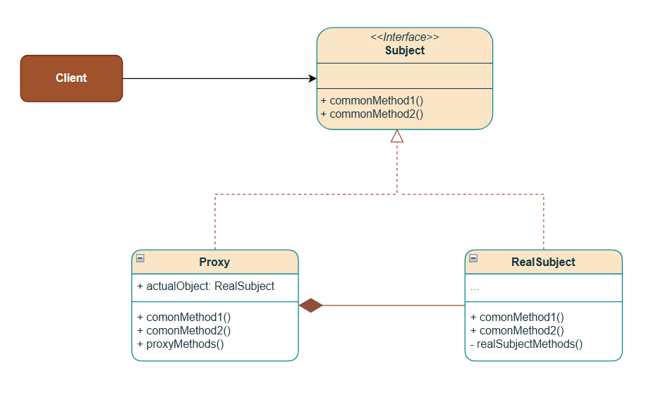
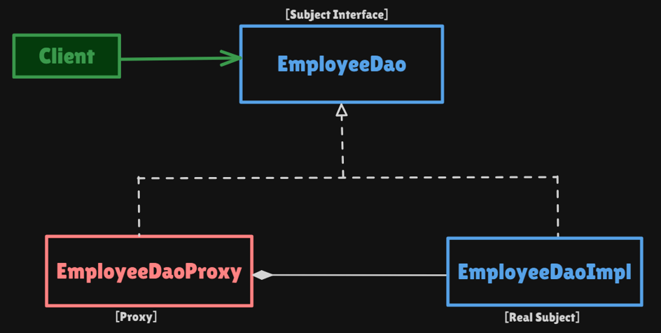

# Proxy Pattern

Structural pattern: **a stand-in for another object** that **controls access** to it. The client talks to the same interface; the proxy may check permissions, lazy-create the real object, log, or cache — then forward.

This package follows the Concept & Coding LLD note: employee DAO protection proxy (`EmployeeDao` / `EmployeeDaoProxy`).

**Code:** `com.lld.patterns.proxy.employee`, `.demo`

## Why this pattern is required

Without Proxy the client (or every caller) talks to the real object and must remember the extra rules:

```text
if (!role.equals("ADMIN")) throw ...
employeeDao.createEmployee(obj);   // real DB write
```

That produces:

1. **No encapsulation of access** — every screen copies the ADMIN check. Miss one call and a USER writes to the DB.
2. **Eager expensive work** — you construct the heavy DAO / connection even if the user only needed a check that will fail.
3. **Cross-cutting mixed into the DAO** — logging, cache, and security live inside `EmployeeDaoImpl`, so you cannot reuse the real object without those concerns.
4. **Client knows the real type** — swapping in a remote stub or a lazy loader means editing every `new EmployeeDaoImpl()`.

Proxy is required when you need a **placeholder with the same API** that **gates, delays, or wraps** one real object. Facade is the wrong tool here: you are not simplifying *many* services; you are controlling *one*.

## Structure

**Class diagram** (from the LLD note):



**Structure** (employee DAO):



| Role | In this codebase | Job |
|------|------------------|-----|
| **Subject** | `EmployeeDao` | `getEmployeeInfo`, `createEmployee` |
| **Real subject** | `EmployeeDaoImpl` | Fetch / create (stands in for DB) |
| **Proxy** | `EmployeeDaoProxy` | Holds `empDaoObj` + `clientRole`; throws `"Access Denied"` |
| **Client** | `ProxyPatternDemo` | Uses `EmployeeDao`; does not know real vs proxy |

```
Client
  EmployeeDao dao = new EmployeeDaoProxy("USER");
  dao.getEmployeeInfo(101)     → USER allowed → EmployeeDaoImpl
  dao.createEmployee(...)      → USER denied  → RuntimeException
  dao = new EmployeeDaoProxy("ADMIN");
  dao.createEmployee(...)      → ADMIN allowed → EmployeeDaoImpl
```

The client is **not aware** whether the `EmployeeDao` is real or a proxy.

## Where to use it (and why there)

Use Proxy when **one object** needs a **gate or placeholder**. The note’s four cases:

| Kind | Why Proxy | Example |
|------|-----------|---------|
| **Access control** | Restrict ops by role | This package: USER read, ADMIN create |
| **Lazy loading** | Delay expensive create until first use | Virtual proxy: load image / ORM entity on first `get` |
| **Pre/post processing** | Audit, log, metrics without touching business code | Log around `createEmployee` |
| **Caching** | Reuse a prior result | Cache `getEmployeeInfo(id)` |

Other common names: **protection** (security), **virtual** (lazy), **remote** (stub over the network), **smart reference** (ref-count, connection).

**Do not use it** to hide a *workflow of many services* — that is **Facade**. Do not use it to *add pizza toppings* — that is **Decorator** (same wrapper shape, different intent).

## Pros and cons

**Pros**

- Client stays on `EmployeeDao`; swap proxy vs real without changing callers.
- Security / lazy / cache live in the proxy; `EmployeeDaoImpl` stays the business.
- You can stack concerns later (logging proxy wrapping a protection proxy) without editing the impl.
- Same interface ⇒ Liskov: anywhere a DAO is expected, a proxy works.

**Cons**

- Extra object and hop; stack traces go Client → Proxy → Impl.
- Protection proxy is **not** real security if callers can still `new EmployeeDaoImpl()`.
- Lazy proxy can hide latency (first call is slow).
- Easy to over-proxy every class in the system.

## How it follows SOLID

| Principle | How Proxy satisfies it | How the bad design breaks it |
|-----------|------------------------|------------------------------|
| **S — Single Responsibility** | Impl fetches/creates. Proxy checks role. | `EmployeeDaoImpl` does DB **and** ACL **and** logging. |
| **O — Open/Closed** | Add `GUEST` rules or a logging proxy class; impl stays closed. | New role means editing every `if` in the impl. |
| **L — Liskov Substitution** | Proxy **is-a** `EmployeeDao`; client methods still mean get/create. | Proxy that silently no-ops `createEmployee` instead of denying. |
| **I — Interface Segregation** | Tiny DAO API. | Forcing the proxy to implement payroll, badge, email. |
| **D — Dependency Inversion** | Client depends on `EmployeeDao`, not `EmployeeDaoImpl`. | `EmployeeManagement` does `new EmployeeDaoImpl()`. |

This demo `new`s the impl inside the proxy (as in the note). Production: inject `EmployeeDao` into the proxy for tests.

## How it differs from Facade, Decorator, and Adapter

| | **Proxy** | **Facade** | **Decorator** | **Adapter** |
|--|-----------|------------|---------------|-------------|
| **Intent** | **Control access** to **one** object | **Simplify** a **workflow** of many | **Add** behavior, same API | Make **incompatible** APIs match |
| **How many objects** | One real subject | Many subsystems | One wrappee (+ stack) | One adaptee |
| **Interface** | **Same** as the real object | Usually **narrower** | Same as component | **Different** (the target) |
| **This note / repo** | `EmployeeDaoProxy` | `OrderFacade` | Pizza toppings | USB-C to HDMI |

**Proxy vs Facade (from the Facade note):** Facade reduces **complexity** and holds **many** references. Proxy is a **stand-in for one** object (security, logging, caching, lazy load).

**Proxy vs Decorator:** Same “wrapper implements the interface” shape. Decorator **always** forwards and **enriches** (cost, description). Proxy **may refuse**, **delay** creation, or **cache** — it does not change `getEmployeeInfo`’s meaning.

**Proxy vs Adapter:** Adapter changes the **shape** of an API. Proxy keeps the shape and sits in front of an object that already matches.

## Run

```bash
cd DesignPatterns
javac -d out $(find src -name '*.java')
java -cp out com.lld.patterns.proxy.demo.ProxyPatternDemo
```

## Interview questions and answers

**1. What is Proxy?**  
A structural pattern that provides a placeholder for another object to control access to it.

**2. When do you use it?**  
Access control, lazy loading, logging/monitoring around a call, caching, remote stubs.

**3. Subject vs real vs proxy?**  
`EmployeeDao` is the subject. `EmployeeDaoImpl` does the work. `EmployeeDaoProxy` implements the same interface, holds the impl, checks `clientRole`.

**4. Does the client know it is a proxy?**  
No. The note: operations go through the subject; client is unaware of real vs proxy.

**5. Protection rules in this demo?**  
`getEmployeeInfo`: ADMIN or USER. `createEmployee`: ADMIN only. Anyone else → `RuntimeException("Access Denied")`.

**6. Proxy vs Facade?**  
Proxy: one object, control access. Facade: many objects, simplify. See table.

**7. Proxy vs Decorator?**  
Same structure. Decorator adds behavior and always delegates. Proxy controls *whether / when / how often* you reach the real object.

**8. Proxy vs Adapter?**  
Adapter translates interfaces. Proxy does not.

**9. Types of proxy?**  
Protection (this code), virtual/lazy, remote, cache, smart reference, logging.

**10. How does it follow SOLID?**  
ACL in the proxy (SRP), client depends on `EmployeeDao` (DIP). See table.

**11. Can the client skip the proxy?**  
Yes if it can construct `EmployeeDaoImpl`. A factory that only returns `EmployeeDao` (always the proxy) closes that hole.

**12. Lazy loading?**  
Proxy holds a null real object; on first `getEmployeeInfo` it `new`s `EmployeeDaoImpl`. The note says the proxy can be extended this way.

**13. Caching?**  
Proxy map `empID → info`; skip the impl on a hit.

**14. Java examples?**  
`java.lang.reflect.Proxy`, RMI stubs, Spring AOP / `@Transactional` proxies, Hibernate lazy entities.

**15. Why not put `if (ADMIN)` inside `EmployeeDaoImpl`?**  
Then every use of the impl carries security, tests need roles, and you cannot reuse the DAO internally for trusted jobs.

**16. Downsides?**  
Extra layer, false sense of security, latency hiding with virtual proxies.

**17. Thread safety?**  
A shared cache proxy needs synchronization. This protection proxy is stateless besides role + impl; one instance per user is simplest.

**18. vs microservice API gateway?**  
Gateway is often a **remote + protection** proxy at the edge. Facade if it *orchestrates* many backends.

**19. Liskov trap?**  
A proxy that changes method meaning (create succeeds but does not persist) breaks substitution. Throwing on denied access is an explicit contract.

**20. How would you add delete?**  
Add `deleteEmployee` to `EmployeeDao`; impl deletes; proxy allows ADMIN only. Client still only sees `EmployeeDao`.
