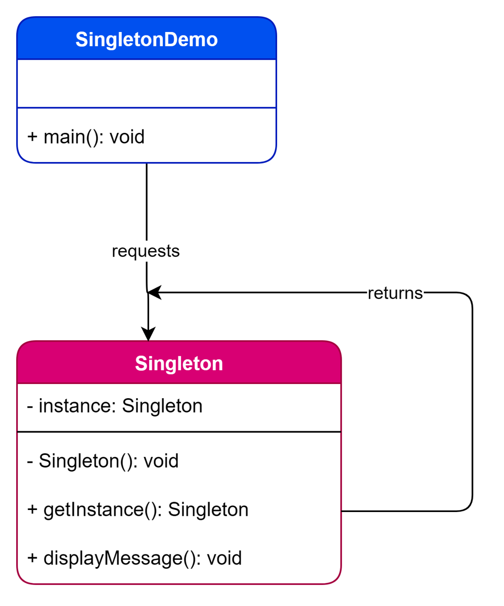
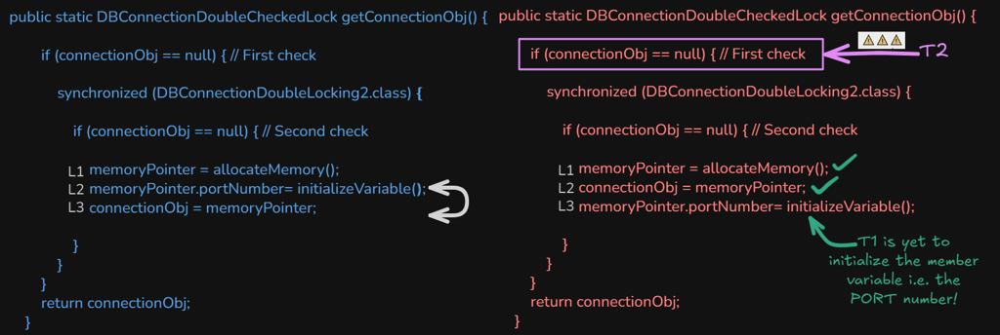
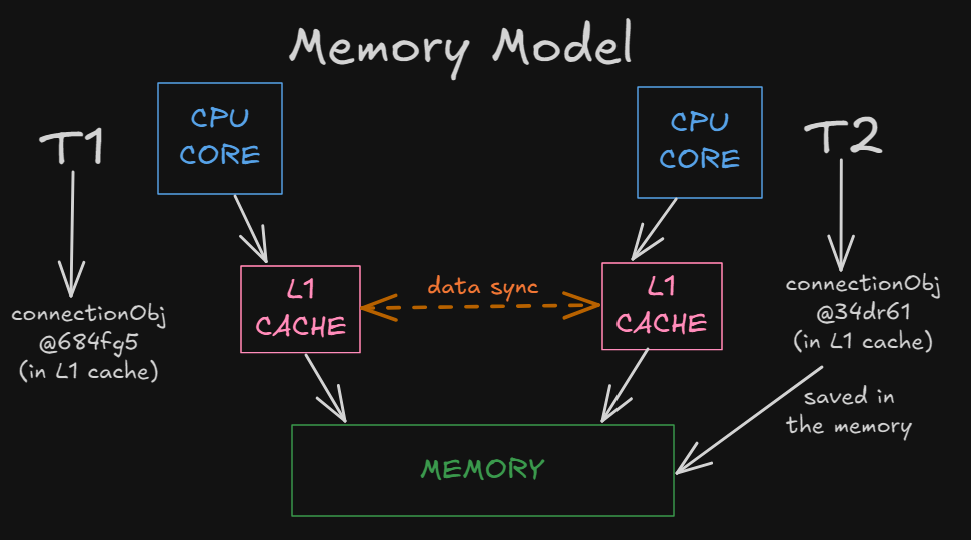
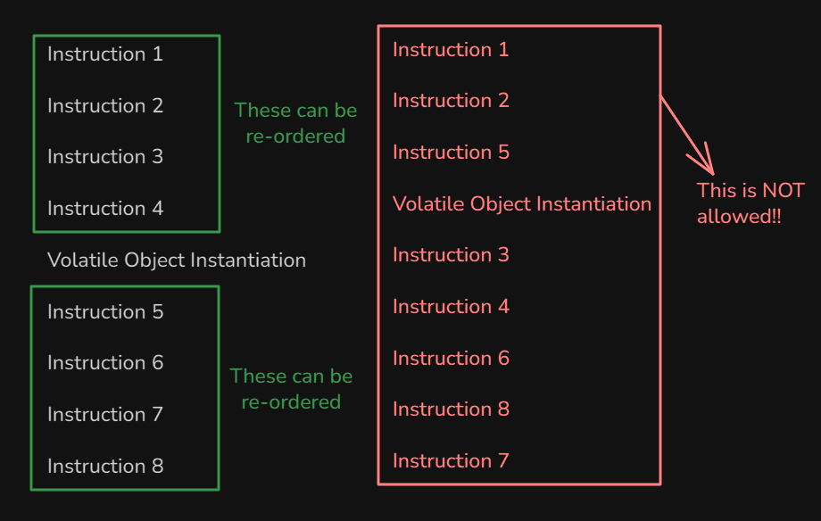
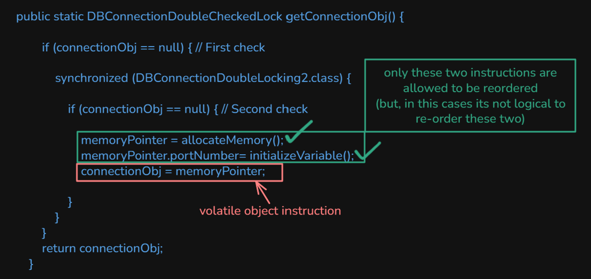

# Singleton Pattern

Creational pattern: **exactly one instance** of a class, with a global access point (`getInstance()`). Used when one object must coordinate a resource (DB pool, config, logger) no matter how many clients ask.

This package follows the Concept & Coding LLD note: four `DBConnection*` variants, then why naive double-checked locking is broken and why **`volatile`** fixes it.

**Code:** `com.lld.patterns.singleton.eager`, `.lazy`, `.threadsafe`, `.dcl`, `.demo`

## Why this pattern is required

Without Singleton (or an equivalent DI scope) every caller does `new DBConnection()`:

```text
new DBConnection();  // thread A
new DBConnection();  // thread B  → two pools, two sockets, split state
```

That produces:

1. **Many instances of a unique resource** — two loggers, two config objects, two connection managers.
2. **No shared coordinator** — caches and locks diverge.
3. **`new` everywhere** — you cannot prove there is one object.
4. **Hidden cost** — eager work you did not need, or races if you try to lazy-init by hand in every client.

Singleton is required when the domain says **there must be one**. It is overused when a normal instance or a DI singleton-scope would do.

## Structure

**Class diagram** (from the LLD note):



| Variant | Class | When created | Thread-safe? | Cost |
|---------|--------|--------------|--------------|------|
| **1. Eager** | `DBConnectionEager` | Class load (`static final`) | Yes (class init lock) | May create unused instance |
| **2. Lazy** | `DBConnectionLazy` | First `getInstance()` | **No** | Cheap, racy |
| **3. Synchronized method** | `DBConnectionThreadSafe` | First call | Yes | **Every** call locks |
| **4. DCL (broken)** | `DBConnectionDoubleLocking` / `…LockIssue` | First call | **Not fully** (JMM) | Fast after init |
| **4b. DCL + volatile** | `DBConnectionDoubleCheckedLockFix` | First call | Yes | Fast after init; industry DCL |

All share: **private constructor**, **static instance**, **static getter**. Eager also uses **`final`**.

```
getInstance()
  eager:        return INSTANCE;          // already built
  lazy:         if null then new          // two threads can both new
  synchronized: lock whole method
  DCL:          if null { lock { if null new } }
```

## Double-checked locking: the bug and `volatile`

`new DBConnection(5567)` is not one CPU step:

1. Allocate memory  
2. Init fields (`portNumber = 5567`)  
3. Publish the reference to `connectionObj`

**Issue 1 — instruction reordering:** the JVM may do 1 → **3 → 2**. Another thread’s first `if (connectionObj == null)` sees non-null and uses **port still 0**.



**Issue 2 — L1 / JMM visibility:** without a barrier, T1’s write may sit in cache; T2 can still see `null` and construct a **second** instance, or see a stale `portNumber`.



**Fix — `private static volatile … connectionObj`:**

- Writes go to main memory; other threads see them (**visibility**).  
- Volatile store is a **barrier**: init of `portNumber` cannot move after publishing the reference.





## Where to use it (and why there)

| Domain | Why one instance |
|--------|------------------|
| **DB / pool** | One manager for connections (this note) |
| **Logger / config** | One process-wide sink or settings object |
| **Runtime caches** | One in-memory catalog |
| **Hardware** | One spooler, one window manager |

**Do not use it** for every service (hidden global state, hard tests). Prefer constructor injection with a single instance created in `main` / Spring `@Scope("singleton")`.

## Pros and cons

**Pros**

- Guaranteed one object (`eager1 == eager2`).
- Lazy variants skip work until first use.
- DCL + volatile: safe and cheap after the first create.

**Cons**

- Global mutable state; tests share it (no easy reset).
- Private ctor fights inheritance and mocks.
- Class-loader / serialization / reflection can still make a second instance.
- Eager can be wasteful; synchronized method can be slow; broken DCL can be **wrong**.

## How it follows SOLID

| Principle | How Singleton sits with it | How a naive `new` everywhere breaks it |
|-----------|----------------------------|----------------------------------------|
| **S** | One class owns “the” connection. | Every module constructs its own DB. |
| **O** | Weak — a singleton is often a closed global. New behavior → edit the class or wrap it. | Same, plus many copies. |
| **L** | Subclassing a singleton is awkward (private ctor). Prefer composition. | — |
| **I** | Keep `displayMessage` / connection API small. | Fat “god” singleton. |
| **D** | **Often violated** — clients call `getInstance()` (concrete). Inject a `ConnectionProvider` in production. | Clients `new` concretes too. |

Interviews: Singleton is useful and **clashes with DIP** unless you still inject the abstraction.

## How it differs from Factory, DI, and enum

| | **Singleton** | **Factory** | **DI container singleton** | **`enum` singleton** |
|--|---------------|-------------|----------------------------|----------------------|
| **Intent** | One instance | Create the right subtype | Lifecycle of *any* bean | One instance, JVM-enforced |
| **This note** | `getInstance()` | `VehicleFactory` (Null Object) | Spring default scope | Bloch’s preferred Java form (not in the PDF) |

## Run

```bash
cd DesignPatterns
javac -d out $(find src -name '*.java')
java -cp out com.lld.patterns.singleton.demo.SingletonPatternDemo
```

All identity checks print `true`. The volatile demo’s second call passes port `9999` but the instance **keeps 5567** (first wins).

## Interview questions and answers

**1. What is Singleton?**  
A creational pattern that restricts a class to one instance and provides global access to it.

**2. How do you enforce it in Java?**  
Private constructor + static instance + static `getInstance()`.

**3. Eager vs lazy?**  
Eager: create at class load, always thread-safe, maybe unused. Lazy: first use, must handle threads.

**4. Why is simple lazy unsafe?**  
Two threads can both see `instance == null` and both `new`.

**5. Synchronized `getInstance`?**  
Safe. Slow: 100 threads serialize on every call even after the object exists.

**6. What is double-checked locking?**  
Check null, lock, check null again, then `new`. After init, most calls skip the lock.

**7. Why is DCL without `volatile` broken?**  
Reordering can publish the reference before fields init; caches can hide writes. See diagrams.

**8. What does `volatile` do here?**  
Visibility to main memory + happens-before so construction finishes before other threads read the reference.

**9. `final` on eager instance?**  
Cannot reassign the static field after class init.

**10. Enum singleton?**  
`enum Conn { INSTANCE; }` — serialization and reflection safe. Effective Java. Not in this PDF.

**11. Bill Pugh / holder class?**  
Inner `Holder { static final T I = new T(); }` — lazy and thread-safe without DCL. Class load of Holder is the lock.

**12. How does it follow SOLID?**  
One coordinator (SRP). `getInstance()` is a DIP smell; inject in real apps.

**13. Reflection / clone / deserialize?**  
Can create a second instance. Guard with exceptions, `readResolve`, or use enum.

**14. When not to use it?**  
Per-request objects, anything you must fake in unit tests, multi-tenant state.

**15. Same as Spring singleton?**  
Spring “singleton” is **one per container**, not JVM-wide, and is injected.

**16. `getConnectionObj(int port)` after first create?**  
Later ports are ignored. Don’t use a singleton if you need one connection per port.

**17. `==` vs `.equals`?**  
Identity (`==`) is the singleton test. This demo prints `Same instance? true`.

**18. Thread-safe eager without synchronized?**  
Yes. JVM class initialization is synchronized.

**19. Downsides of a DB singleton?**  
Hidden coupling, one global connection in tests, hard shutdown/reset.

**20. Production pick?**  
Enum or holder class, or DI. If you write DCL, **`volatile` is mandatory** (this note’s fix).
