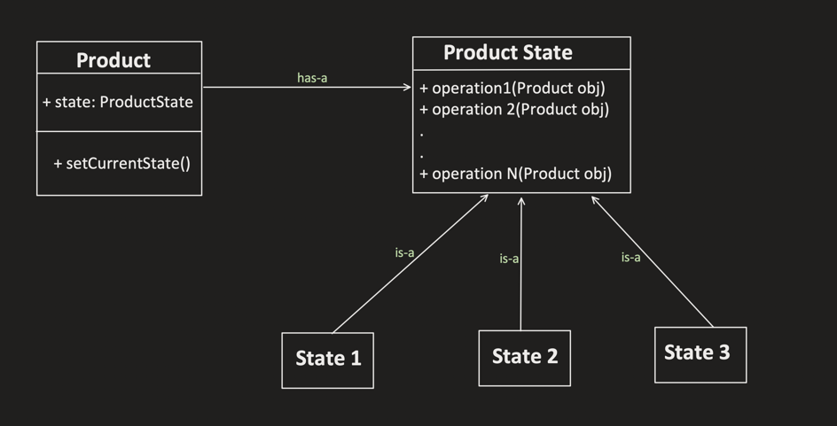
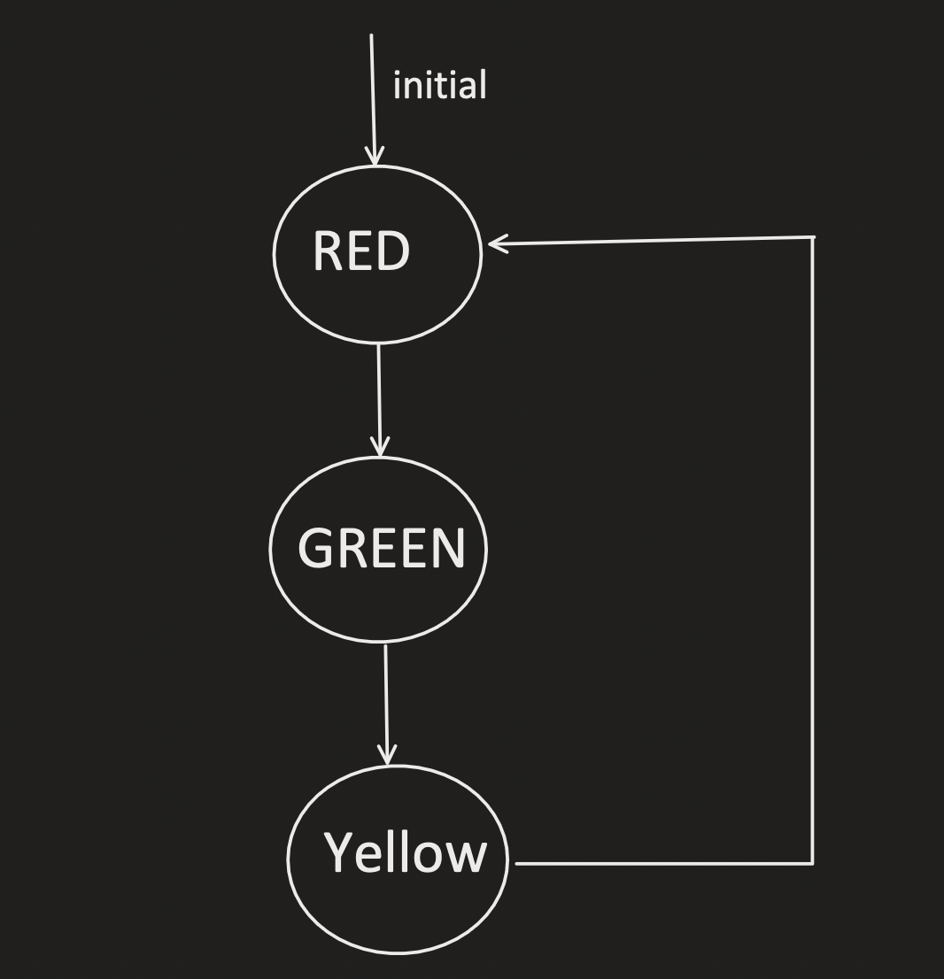
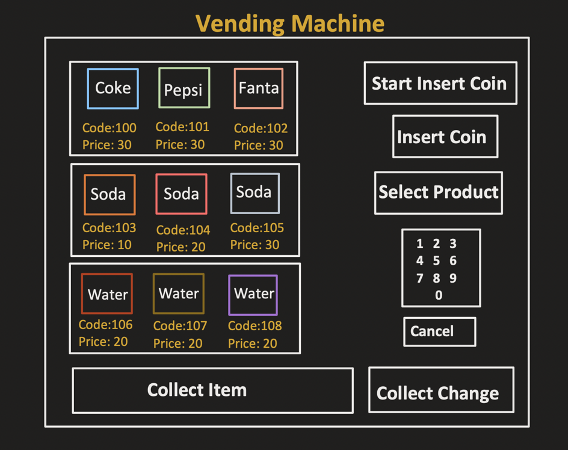
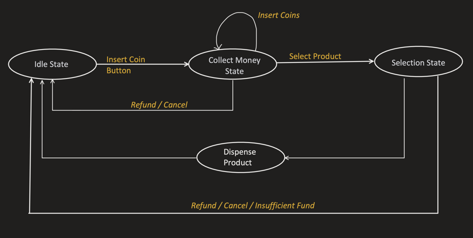
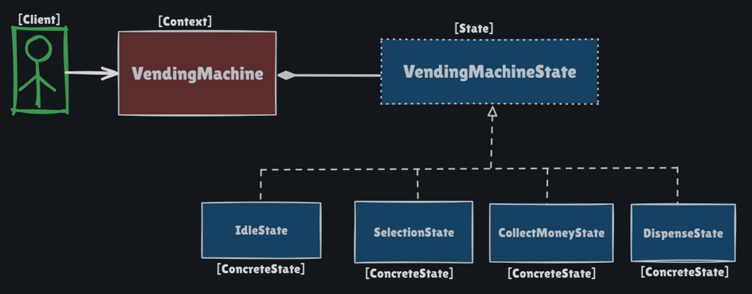

# State Pattern

Behavioral pattern: **an object changes its behavior at runtime when its internal state changes** — it looks as if the object changed class. Each state is a class; the context **delegates** every operation to the current state, which then **transitions** to the next state.

This package follows the Concept & Coding LLD note: traffic light (tiny UML) and a full **vending machine**.

**Code:** `com.lld.patterns.state.traffic`, `.vending`, `.demo`

## Why this pattern is required

Without State you encode the machine as a giant `switch (state)` (or nested `if`s) on the context:

```text
void insertCoin(Coin c) {
  switch (current) {
    case IDLE: throw ...
    case HAS_MONEY: coins.add(c);
    case SELECTION: throw ...
    case DISPENSE: throw ...
  }
}
```

That produces:

1. **Massive conditionals** on *every* operation (`insertCoin`, `chooseProduct`, `refund`, …).
2. **Open/Closed violation** — a new `MaintenanceState` touches every method.
3. **Transitions buried in switches** — easy to forget `IDLE` after refund.
4. **Hard tests** — you cannot unit-test “HasMoney accepts coins” without the whole switch.
5. **The object’s behavior depends on mode** — traffic light `change()` means Stop vs Go vs Slow down. That *is* State.

State is required when **the same API means different things in different modes**, and **modes transition** after operations.

## Structure

**Class diagram** (from the LLD note):



**Traffic signal (real-life UML example):**



**Vending flow and states:**





**Vending machine as State:**



| Role | Traffic | Vending |
|------|---------|---------|
| **Context** | `TrafficLight` | `VendingMachine` |
| **State** | `TrafficLightState.action(signal)` | `State` (insert, select, refund, …) |
| **Concrete states** | Red → Green → Yellow → Red | `IdleState`, `HasMoneyState`, `SelectionState`, `DispenseState` |
| **Client** | `change()` three times | `StatePatternDemo` |

```
Idle  --click insert coin-->  HasMoney  --insert coins-->  HasMoney
                                  │ refund
                                  ▼
                                Idle
HasMoney --start selection--> Selection --choose (paid enough)--> Dispense --> Idle
Selection --insufficient--> refund --> Idle
```

Invalid operations (insert coin in `IdleState`, choose product in `HasMoneyState`) **throw** — the note’s “exception for operations that do not apply.”

## Where to use it (and why there)

Use State when **behavior is a function of mode**, and **operations cause transitions**.

| Domain | Why State | States |
|--------|-----------|--------|
| **Traffic light** | Same `change()`; meaning depends on color | Red, Green, Yellow |
| **Vending machine** | Insert/select/refund legal only in some modes | Idle, HasMoney, Selection, Dispense |
| **Media player** | Play in Stopped vs Playing vs Paused | Stopped, Playing, Paused |
| **TCP / connection** | Same `send` illegal before connected | Listen, Syn, Established, Close |
| **Order / booking** | Cancel allowed in PLACED, not DELIVERED | Placed, Paid, Shipped |
| **Playback** (Spotify LLD here) | Player state machine | `PlayerState` |
| **Workflow / ATM** | Card → pin → amount → cash | Session states |

**Do not use it** for a boolean flag that never grows (`isOn`) or for **choosing an algorithm independent of object lifecycle** — that is **Strategy**.

## Pros and cons

**Pros**

- Each state’s rules live in one class (`HasMoneyState.insertCoin`).
- Add a state without editing every `switch`.
- Transitions are explicit (`setVendingMachineState(new SelectionState())`).
- Illegal ops fail fast.
- Traffic and vending share the same idea: context + current state object.

**Cons**

- Many classes (four vending states + inventory types).
- States often know concrete next states (`new GreenState()`) — coupling.
- Context can become a bag of data (`coinList`, `inventory`) that every state pokes.
- Easy to forget to transition (stuck in Dispense).
- Overkill for two modes that never change.

## How it follows SOLID

| Principle | How State satisfies it | How the bad design breaks it |
|-----------|------------------------|------------------------------|
| **S — Single Responsibility** | `SelectionState` owns “enough money? change? go dispense.” `VendingMachine` holds data + current state. | One class with four enums × seven methods. |
| **O — Open/Closed** | New `MaintenanceState` as a class; existing states stay unless they must enter it. | Edit every `switch`. |
| **L — Liskov Substitution** | Any `State` can be `vendingMachineState`. Idle must not silently accept `chooseProduct`. | A state that ignores the contract (dispense without payment). |
| **I — Interface Segregation** | Traffic’s `action` is tiny. Vending’s `State` is a fat interface of machine ops — a known trade-off so the context has one type. | Separate interfaces per event if the surface explodes. |
| **D — Dependency Inversion** | Context depends on `State` / `TrafficLightState`, not `HasMoneyState`, except at construction. | `if (state instanceof HasMoneyState)`. |

## How it differs from Bridge (and nearby patterns)

| | **State** | **Strategy** | **Bridge** | **Command** |
|--|-----------|--------------|------------|-------------|
| **Intent** | Behavior follows **internal mode**; states **transition** | Client **picks** an algorithm | Split **abstraction × implementation** | Request as object + undo |
| **Who chooses next** | The **current state** (Red → Green) | Client / factory | N/A | Invoker |
| **States know each other?** | Often yes (`new YellowState()`) | Strategies usually independent | Implementors independent | Commands independent |
| **This package** | Light + vending | Drive / pay | Not State | AC remote |

**One-liner:** State = **“the object is in a mode and the mode decides what happens next.”** Strategy = **“someone injected how to do this step.”** Bridge = **two hierarchies**, not a lifecycle. Command = **queued request**, not a machine mode.

State vs Strategy (the interview trap): same UML (context has-a behavior object). Difference is **intent and transitions**. You do not `setStrategy(Green)` from the client after every tick — Green **replaces itself** with Yellow.

## Run

```bash
cd DesignPatterns
javac -d out $(find src -name '*.java')
java -cp out com.lld.patterns.state.demo.StatePatternDemo
```

## Interview questions and answers

**1. What is the State pattern?**  
An object delegates to a state object that implements mode-specific behavior and typically transitions the context to another state.

**2. When do you use it?**  
Traffic lights, vending machines, TCP, orders, players — anything with a **state machine**.

**3. State vs a `switch` on enum?**  
Enum switch is fine for two states. When every method has a switch and transitions multiply, extract state classes (OCP).

**4. State vs Strategy?**  
Strategy: interchangeable algorithms, **no** mandated transitions. State: **this mode, then that mode**. Client does not pick Green the way it picks UPI.

**5. State vs Bridge?**  
Bridge is structural (abstraction vs implementor). State is behavioral (lifecycle). Same composition shape, different reason.

**6. Who owns the transition?**  
Usually the **state** (`RedState.action` sets Green). Sometimes a table in the context. This code: states call `setState` / `setVendingMachineState`.

**7. Why throw on illegal operations?**  
The note: operations that do not apply throw. Inserting a coin in Idle without pressing the button is invalid.

**8. Vending happy path?**  
Idle → InsertCoinButton → HasMoney → coins (nickel+quarter=30) → Selection → code 102 (Coke 12) → change 18 → Dispense → Idle; slot 102 sold out.

**9. Insufficient funds?**  
`SelectionState` refunds and throws `insufficient amount`, back to Idle.

**10. Why `DispenseState` constructor dispenses immediately?**  
This note’s design: entering Dispense **is** dispensing, then Idle. No extra client call.

**11. How does it follow SOLID?**  
New state class (OCP), context depends on `State` (DIP). See table.

**12. Flyweight states?**  
If states are stateless, share one `IdleState` instance. Here constructors print and Idle clears coins — not shared.

**13. Thread safety?**  
Two users on one machine need a lock around “read state + operate + transition.”

**14. How do you unit-test?**  
Start in HasMoney, `insertCoin`, assert list size. From Selection with underpay, assert Idle and exception.

**15. Context data vs state data?**  
Shared data (`inventory`, `coinList`) stays on **context**. Mode-only data stays on the state.

**16. Missing `HasMoney` → still insert?**  
After first insert-coin **button**, more `insertCoin` calls stay in HasMoney. Idle does not accept coins until the button.

**17. Real code in this monorepo?**  
Spotify `PlayerState` — playback is a state machine, not a boolean `playing`.

**18. Can states be enums with methods (Java)?**  
Yes (`enum Traffic { RED { action...}}`). Classes scale better when states need fields or different collaborators.

**19. State vs Observer?**  
State changes **how the object itself responds**. Observer **notifies others** of a change. A vending machine can use both (state + “sold out” listeners).

**20. How would you add MaintenanceState?**  
New class: reject vend, allow `updateInventory`. Idle/HasMoney can transition into it on a key. Existing purchase path stays closed.
