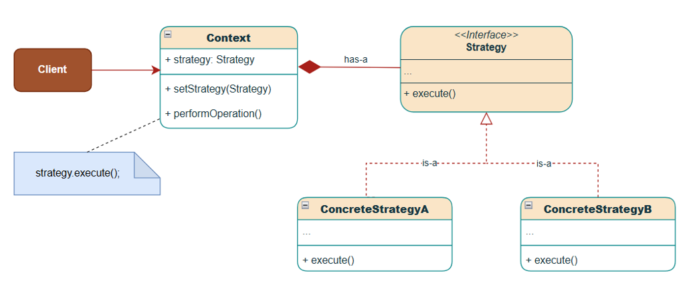
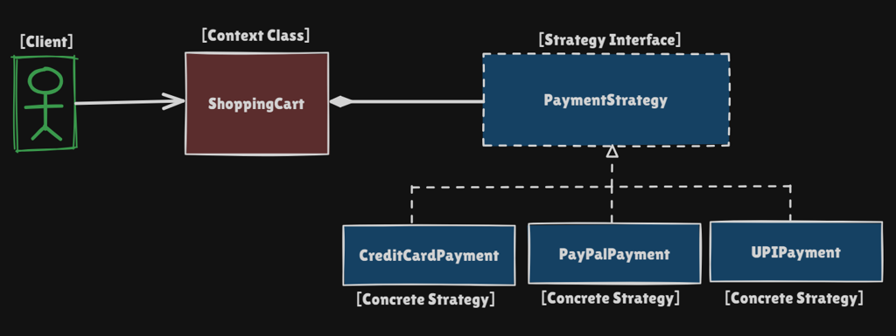

# Strategy Pattern

Behavioral pattern: **define a family of algorithms, put each in its own class, and make them interchangeable at runtime.**

This package follows the Concept & Coding LLD note: vehicle drive modes and shopping-cart payments.

**Code:** `com.lld.patterns.strategy.vehicle`, `.payment`, `.demo`

## Why this pattern is required

Without Strategy you encode “which algorithm?” as `if` / `switch` / subclass overrides.

That produces:

1. **Massive conditionals** — `PaymentProcessor.processPayment(type)` grows with every rail (card, PayPal, UPI, cash, crypto).
2. **Open/Closed and SRP violations** — adding crypto means editing the same class that already owns checkout orchestration.
3. **Duplication** — `SportsVehicle` and `OffRoadVehicle` both override `drive()` with the same sports logic because it is not shared as an object.
4. **Tight coupling** — context knows every algorithm’s internals.
5. **Hard tests** — you cannot unit-test “UPI pay” without constructing the whole processor and hitting the `switch`.

Strategy is required when **the same action has several interchangeable implementations**, and **which one runs can change without rewriting the caller**.

## Structure

**Class diagram** (from the LLD note):



**Structure** using the payment example:



| Role | In this codebase | Job |
|------|------------------|-----|
| **Strategy** | `DriveStrategy`, `PaymentStrategy` | Contract (`drive()`, `pay(amount)`) |
| **Concrete strategy** | `SportsDrive`, `EVDrive`, `UPIPayment`, … | One algorithm |
| **Context** | `Vehicle`, `ShoppingCart` | Holds a strategy and **delegates** |
| **Client** | `StrategyPatternDemo` | Picks the strategy (constructor or setter) |

```
Client
  │  new SportsVehicle(new SportsDrive())
  │  cart.setPaymentStrategy(new UPIPayment(...))
  ▼
Context (Vehicle / ShoppingCart)
  │  drive() / checkout()
  ▼
Strategy interface
  ├── NormalDrive / SportsDrive / EVDrive
  └── CreditCardPayment / PayPalPayment / UPIPayment
```

Two injection styles (both valid):

- **Constructor** — vehicle is born with a drive mode (stable default).
- **Setter** — cart changes payment on the same instance at checkout (true runtime swap).

## Where to use it (and why there)

Use Strategy when **one responsibility has multiple algorithms** and you select among them by config, user choice, experiment, or environment — **not** when two *independent* dimensions both need to vary (that is Bridge).

| Domain | Why Strategy | What the strategies are |
|--------|----------------|-------------------------|
| **Checkout / payments** | User picks rail at runtime; PCI / UPI / wallet logic must not live in `ShoppingCart` | Card, PayPal, UPI, COD, crypto |
| **Vehicle / product variants** | Drive *behavior* is shared across types (sports SUV and sports sedan); do not copy-paste overrides | Normal, sports, EV, off-road |
| **Shipping / pricing** | Courier cost depends on member tier, distance, weight — same `quote()` API | Flat fee, distance, weight, premium discount |
| **Recommendation ranking** | HOME vs PDP vs cold-start need different scorers; adding collaborative must not edit the facade | Popularity, content, collab, tags (see `RecommendationService`) |
| **Compression / encryption / sort** | Same `compress(bytes)` / `encrypt(bytes)` / `sort(list)` with different algos | Gzip vs Brotli, AES vs RSA wrapper, quicksort vs mergesort |
| **Tax / discount / fare** | Rules change by region or campaign; keep `Order` free of `if (IN) else if (US)` | GST, VAT, promo stack |
| **Retry / backoff / load balancing** | Ops policy, not domain object internals | Exponential vs linear; round-robin vs least-conn |
| **Validation / serialization** | Plug JSON vs protobuf, or strict vs lenient validators | Format strategies |

**Do not use it** when there is only one algorithm and it will stay one, or when the “strategy” has no interchangeable contract (then you have random classes, not Strategy).

## Problems without Strategy (from the note)

**Vehicles:** `Vehicle.drive()` prints Normal. `SportsVehicle` overrides to Sports. `OffRoadVehicle` **copies the same override** because sports is not a reusable object. A new sports-capable type repeats that code.

**Payments:** one `switch (type)` with credit card / PayPal / net banking / cash. Crypto means **opening that class again**.

**With Strategy:** sports logic lives once in `SportsDrive`. `SportsVehicle` and `OffRoadVehicle` both take `new SportsDrive()`. Crypto is `CryptoPayment implements PaymentStrategy` — `ShoppingCart` unchanged.

## Pros and cons

**Pros**

- Swap algorithms at runtime without changing context.
- Open for new strategies; closed for modification of context.
- Each algorithm is a small, testable class.
- Shared behavior is composition, not copy-paste overrides.
- Context stays readable: `checkout` does not contain payment rails.

**Cons**

- More types (`N` strategies + interface + context). Overkill for two static `if`s that never grow.
- Client must know which concrete strategy to construct (often pair with **Factory**).
- Extra indirection; stack traces go Context → Strategy.
- Strategies that need lots of context data can leak a fat `Context` object into the interface.
- If every strategy is used once and never swapped, you paid for flexibility you do not use.

## How it follows SOLID

| Principle | How Strategy satisfies it | How the bad design breaks it |
|-----------|---------------------------|------------------------------|
| **S — Single Responsibility** | `ShoppingCart` orchestrates checkout; `UPIPayment` owns UPI. `Vehicle` is a vehicle; `EVDrive` is electric driving. | `PaymentProcessor` owns routing **and** every rail’s logic. |
| **O — Open/Closed** | Add `CryptoPayment` / `EcoDrive` without editing cart or `Vehicle`. | New rail = edit the `switch`. New sports type = another override copy. |
| **L — Liskov Substitution** | Any `PaymentStrategy` can replace another in `checkout`; any `DriveStrategy` can replace another in `drive()`. Subclasses of `Vehicle` remain substitutable because they do not change the contract. | Stringly-typed `switch` has no subtype contract; a missing `case` throws at runtime. |
| **I — Interface Segregation** | Strategies are tiny: `pay(double)` or `drive()`. Clients do not depend on unused payment methods. | A god `PaymentProcessor` forces everyone to compile against cash, UPI, and card. |
| **D — Dependency Inversion** | Context depends on **abstractions** (`DriveStrategy`, `PaymentStrategy`), not `CreditCardPayment`. Inject via constructor or setter. | Context `new`s or `switch`es on concretes. |

Composition over inheritance: drive *capability* is not a subclass tree (`SportsOffRoadElectricVehicle`); it is a plugged-in strategy.

## How it differs from Bridge

Both use **composition** and look like “Context has a Strategy/Implementor.” Interviews expect you to separate **intent**.

| | **Strategy** | **Bridge** |
|--|----------------|------------|
| **Intent** | Swap **one family of algorithms** for a single behavior | Let **two hierarchies** vary independently (abstraction × implementation) |
| **What varies** | *How* a step is done (pay, drive, rank, compress) | *What* you model **and** *how it is implemented* (shape + renderer, remote + device, notification + channel) |
| **Typical smell it fixes** | Giant `switch` / duplicated overrides of **one** method | Cartesian explosion: `CircleVector`, `CircleRaster`, `SquareVector`, `SquareRaster` |
| **Who chooses** | Client / factory chooses the algorithm; often **runtime** (user picked UPI) | You split design so abstraction and implementor can both grow; binding is often **structural**, not “user picked algorithm” |
| **UML** | Context → Strategy; many ConcreteStrategies | Abstraction → Implementor; RefinedAbstractions × ConcreteImplementors |
| **This repo** | `ShoppingCart` → `PaymentStrategy` | Not implemented here. Example: `View` (list vs grid) **bridged** to `Theme` (dark vs light) so you do not create ListDark, ListLight, GridDark, GridLight |
| **Same class count?** | One context, many algos | Two trees; Bridge is the **link** between them |

**One-liner:** Strategy = **interchangeable algorithms**. Bridge = **decouple abstraction from implementation** so both can extend without a subclass matrix.

You can use them together: a `Remote` (Bridge abstraction) might use a `VolumeCurve` Strategy for how volume steps — different problems.

## Run

```bash
cd DesignPatterns
javac -d out $(find src -name '*.java')
java -cp out com.lld.patterns.strategy.demo.StrategyPatternDemo
```

## Interview questions and answers

**1. What is the Strategy pattern?**  
A behavioral pattern that encapsulates a family of algorithms behind a common interface and lets the context delegate to a chosen implementation, which can change at runtime.

**2. When do you reach for it?**  
When you have multiple ways to do the same thing, the choice is independent of the context’s other logic, and new ways will keep appearing (payments, ranking, shipping, compression).

**3. Strategy vs `if`/`switch`?**  
`switch` is fine for two stable cases. When cases grow, each arm mixed into one method violates OCP/SRP and is painful to test. Strategy turns each arm into a class.

**4. Strategy vs inheritance (override `drive()` in subclasses)?**  
Inheritance ties one algorithm to one type. Shared sports driving across `SportsVehicle` and `OffRoadVehicle` duplicates overrides. Strategy shares the algorithm as an object any vehicle can hold.

**5. Strategy vs Factory?**  
Factory **creates** the object. Strategy **is** the behavior object. You often `PaymentStrategy s = PaymentFactory.create(type)` then `cart.setPaymentStrategy(s)`.

**6. Strategy vs State?**  
Strategy: client (or policy) **chooses** the algorithm; states do not have to know each other. State: the object’s **mode** changes the next behavior; states often transition (`Green → Yellow`). Payment is Strategy. Order lifecycle (PLACED → SHIPPED) is State.

**7. Strategy vs Template Method?**  
Template Method: **inheritance** — base class defines the skeleton, subclasses fill steps. Strategy: **composition** — whole algorithm is a separate object. Prefer Strategy when you need to swap at runtime or avoid a rigid base class.

**8. Strategy vs Bridge?**  
See table above. Same structure (composition), different reason: algorithms vs two-dimensional hierarchy.

**9. Strategy vs Decorator?**  
Decorator **adds** behavior around an existing object (same interface, stacked). Strategy **replaces** the algorithm. Ranking: Strategy picks collab vs popularity; Decorator adds diversity on top of any ranker (`RecommendationService`).

**10. How does it follow SOLID?**  
See SOLID table. The sound-bite: depend on `PaymentStrategy` (DIP), add classes not `switch` arms (OCP), one reason to change per strategy (SRP).

**11. Constructor injection vs setter?**  
Constructor: required, immutable default (goods truck always `NormalDrive`). Setter: same cart, different rail per checkout. You can offer both (`Vehicle` in this package does).

**12. Who creates the concrete strategy?**  
Client for demos. In production, **Factory / DI / config / experiment bucket** so UI does not `new UPIPayment()`. Context should not `new` concretes if you care about DIP.

**13. How do you unit-test it?**  
Mock `PaymentStrategy` to test `ShoppingCart.checkout`. Test `UPIPayment` with a fake UPI id — no `switch` required. That isolation is a main reason the pattern exists.

**14. Downsides?**  
Class explosion, client complexity, overkill for one algorithm. Mitigate with Factory and by not introducing a strategy until a second algorithm is real.

**15. Real systems in this monorepo?**  
`RecommendationService` `RankingStrategy` + `RankingStrategyFactory`: popularity, content, collaborative, similar-items, selected tags — same pattern as payments, at ranking time.

**16. Can strategies share data?**  
Pass what they need in the constructor (`cardNumber`, `upiId`) or pass a context DTO into `pay(Order)`. Avoid a god context that every strategy pokes.

**17. Thread safety?**  
Stateless strategies are naturally shareable. Stateful ones (buffers, counters) should not be a singleton shared across requests unless synchronized.

**18. Is `java.util.Comparator` Strategy?**  
Yes. `sort(list, comparator)` is context + strategy. Lambdas are compact concrete strategies.

**19. How would you add crypto pay without touching cart?**  
`class CryptoPayment implements PaymentStrategy`. Client/factory selects it. That is the OCP demo in the original note.

**20. What if two strategies must run together?**  
Composite Strategy (hybrid ranking) or a pipeline — still one `rank()` contract. Do not stuff two algorithms into the context.
