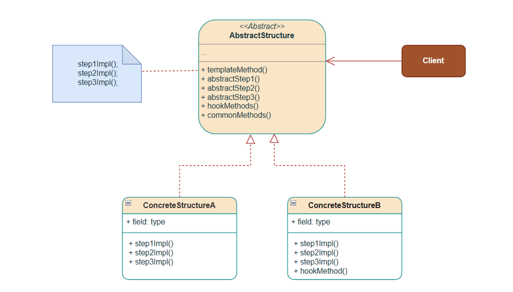
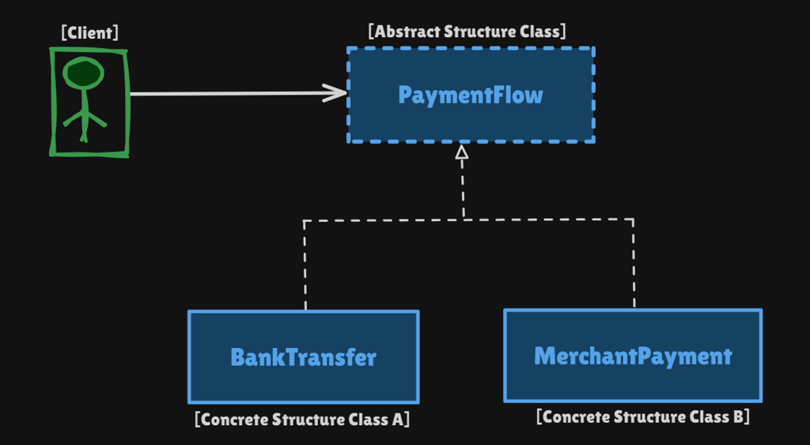

# Template Method Pattern

Behavioral pattern: **put the skeleton of an algorithm in a base class** and let subclasses fill in (or hook) individual steps **without changing the order of the workflow**.

This package follows the Concept & Coding LLD note: payment workflows (`BankTransfer` vs `MerchantPayment`).

**Code:** `com.lld.patterns.templatemethod.payment`, `.demo`

## Why this pattern is required

Without Template Method you either:

- **Copy the same sequence** in every payment type (`validate → debit → fees → credit`), or
- **One class with `if (MERCHANT)`** inside a shared `sendMoney()`.

That produces:

1. **Duplicated workflow** — the *order* of steps is business-critical; copy-paste drifts (someone credits before debit).
2. **Open/Closed violation** — a new UPI flow means editing the god `sendMoney` or cloning the whole method.
3. **No protected skeleton** — a subclass can skip `validateRequest` if `sendMoney` is not `final`.
4. **Hooks vs required steps mixed** — OTP is optional for bank transfer, required for merchant; that belongs in a **hook**, not another `if` in the base class’s core.

Template Method is required when **the steps are the same, the implementations differ**, and the **sequence must stay in the base class**.

## Structure

**Class diagram** (from the LLD note):



**Structure** using payment workflows:



| Role | In this codebase | Job |
|------|------------------|-----|
| **Abstract class** | `PaymentFlow` | Template `sendMoney()` (final) |
| **Abstract steps** | `validateRequest`, `debitAmount`, `calculateFees`, `creditAmount` | Subclasses **must** implement |
| **Hook** | `requiresOTPAuthentication()` default `false` | Optional override (merchant → `true`) |
| **Common method** | `logTransaction()` | Shared; not part of the skeleton in this note |
| **Concrete classes** | `BankTransfer`, `MerchantPayment` | Bank: 0% fee, full credit. Merchant: OTP, 2% fee, remaining credit |
| **Client** | `TemplateMethodDemo` | Calls `sendMoney()` then `logTransaction()` |

```
Client
  PaymentFlow flow = new MerchantPayment()
  flow.sendMoney()          // final template — order locked
        │
        ▼
  validateRequest()         // abstract
  debitAmount()             // merchant: if hook OTP then debit
  calculateFees()
  creditAmount()
  flow.logTransaction()     // common method, called by client here
```

**Hollywood principle:** “Don’t call us, we’ll call you.” `sendMoney` calls the subclass steps; the client does not call `validateRequest` itself.

## Where to use it (and why there)

Use Template Method when **one invariant pipeline** has **variant steps**, and you control that with **inheritance**.

| Domain | Why Template Method | Invariant / variants |
|--------|---------------------|----------------------|
| **Payment / money movement** | Always validate → debit → fee → credit; rails differ | Bank vs merchant vs UPI |
| **Data import / ETL** | Open file → parse → validate → persist | CSV vs JSON vs XML parsers |
| **Game / AI turn** | Collect input → update → render | Human vs CPU fill `collectInput` |
| **Build / CI jobs** | Checkout → compile → test → publish | Java vs Node fill compile/test |
| **HttpServlet** | `service()` is the template; `doGet` / `doPost` are steps | Java EE classic |
| **Sorting (GoF)** | `sort()` skeleton; `compare` is the step | (Today often Strategy instead) |
| **Test fixtures** | `@Before` / `@After` around a test body | JUnit is a template-ish lifecycle |

**Do not use it** when you need to **swap the whole algorithm at runtime** or avoid inheritance — that is **Strategy** (composition). If only *one* step varies and you already have a deep class tree, prefer Strategy for that step.

## Pros and cons

**Pros**

- One place for the workflow; order cannot drift (`final sendMoney`).
- Subclasses only write the parts that differ.
- Hooks for optional behavior (OTP) without forcing every subclass.
- Shared `logTransaction` stays DRY.
- Easy to read: open `PaymentFlow` and you see the business process.

**Cons**

- **Inheritance** — rigid; a class can have only one template parent.
- Fragile base class: changing the skeleton breaks all subclasses.
- Liskov risk: a subclass that no-ops `validateRequest` still “is a” `PaymentFlow`.
- More types than a single class with two strategies.
- Hooks that are never called from the template (OTP is used inside `MerchantPayment.debitAmount`, not from `sendMoney`) can confuse readers — prefer calling hooks from the template when you can.

## How it follows SOLID

| Principle | How Template Method satisfies it | How the bad design breaks it |
|-----------|----------------------------------|------------------------------|
| **S — Single Responsibility** | Base owns *sequence*. `BankTransfer` owns bank fees/credit. | One class with bank *and* merchant branches. |
| **O — Open/Closed** | New `UpiPayment extends PaymentFlow`; `sendMoney` stays closed. | Edit the shared `if (type)` pipeline. |
| **L — Liskov Substitution** | Client holds `PaymentFlow` and calls `sendMoney()`; bank and merchant must honor the same step contract (validate actually validates). | Subclass that skips debit but still reports success. |
| **I — Interface Segregation** | Abstract methods are the payment steps only. Hook is optional. | Forcing bank transfer to implement `scanQr()`. |
| **D — Dependency Inversion** | Client depends on `PaymentFlow`, not `MerchantPayment`, except at construction. | Client calls `merchant.otp()` then `merchant.debit()` by name. |

**OCP caveat:** the pattern is closed for *sequence* changes (good) and open for *step* implementations. If the sequence itself must vary, Template Method is the wrong tool.

## How it differs from Bridge (and nearby patterns)

| | **Template Method** | **Strategy** | **Bridge** | **Command** |
|--|---------------------|--------------|------------|-------------|
| **Intent** | Lock **algorithm skeleton**; vary **steps** | Swap **entire algorithm** | Split **abstraction × implementation** | Request as **object** + undo |
| **Mechanism** | **Inheritance** (subclass hooks) | **Composition** (inject strategy) | Composition of two hierarchies | Invoker → command → receiver |
| **Who decides order** | Base class (`final sendMoney`) | Context / client | N/A | Command / invoker |
| **Runtime swap** | Usually construct the subclass once | Yes (`setStrategy`) | Swap implementor | `setCommand` |
| **This package** | Bank vs merchant payment | Drive / pay | Not Template | AC remote |

**One-liner:** Template Method = **“same recipe, different ingredients, inheritance.”** Strategy = **“different recipes, composition.”** Bridge = **two dimensions vary independently**, not steps of one algorithm.

Template vs Strategy (the interview pair): both vary behavior. Use Template when the **outline is stable** and you own the class hierarchy. Use Strategy when you must mix algorithms independently of the class (and avoid a deep inheritance tree). You can combine them: template step `calculateFees()` **delegates** to a `FeeStrategy`.

## Run

```bash
cd DesignPatterns
javac -d out $(find src -name '*.java')
java -cp out com.lld.patterns.templatemethod.demo.TemplateMethodDemo
```

## Interview questions and answers

**1. What is Template Method?**  
A behavioral pattern: the base class defines the algorithm’s steps and order; subclasses implement (or hook) individual steps.

**2. What is a hook?**  
A method in the base with a **default** body. Subclasses may override. Here `requiresOTPAuthentication()` defaults to `false`; merchant returns `true`.

**3. Why is `sendMoney` `final`?**  
So subclasses cannot reorder or skip steps. That is the whole point of a skeleton.

**4. Abstract method vs hook vs common method?**  
**Abstract:** must implement (`validateRequest`). **Hook:** optional (`requiresOTPAuthentication`). **Common:** implemented once for all (`logTransaction`).

**5. Hollywood principle?**  
The framework (template) calls you. Client calls `sendMoney()`; `sendMoney` calls `validateRequest()`.

**6. Template Method vs Strategy?**  
Template: inheritance, fixed order. Strategy: composition, interchangeable whole algorithms. See table.

**7. Template Method vs Bridge?**  
Bridge decouples abstraction from implementation (two trees). Template fills steps of **one** algorithm. Payment rails as strategies would be Strategy; IR vs Bluetooth for a remote would be Bridge.

**8. Template vs Factory Method?**  
Factory Method is a Template Method whose varying step is **“create the object.”** `factoryMethod()` is the hook; `operation()` is the template.

**9. Why not put OTP in `sendMoney`?**  
Then every flow would see an OTP step. A hook (or a step that checks the hook) keeps bank transfer free of OTP. This note checks the hook inside `MerchantPayment.debitAmount`.

**10. How does it follow SOLID?**  
New payment type = new subclass (OCP). Client uses `PaymentFlow` (DIP, LSP). See table.

**11. Downsides of inheritance?**  
One parent, fragile base, harder to test steps in isolation than Strategy objects. Prefer Strategy if you already compose fees, validation, etc.

**12. Can the template call the hook?**  
Yes — better style: `if (requiresOTPAuthentication()) authenticate()` inside `sendMoney`. This codebase follows the note and uses the hook from the subclass debit step.

**13. `HttpServlet`?**  
`service()` dispatches to `doGet`/`doPost` — Template Method.

**14. How do you unit-test?**  
Test `BankTransfer.sendMoney()` output/order. Subclass `PaymentFlow` in a test with fake steps to assert `sendMoney` calls them in order.

**15. What if one flow needs an extra step (KYC)?**  
Hook `afterValidate()` default empty, or a new abstract step (forces all subclasses). Extra required step for everyone belongs in the template; optional belongs in a hook.

**16. Template vs Decorator?**  
Decorator **adds** wrapping around an object at runtime. Template **fills holes** in a fixed recipe at compile-time via subclassing.

**17. Is `sort` + `compare` Template or Strategy?**  
GoF `sort` template + primitive `compare` is Template. `Collections.sort(list, comparator)` is Strategy. Java moved toward Strategy.

**18. Liskov trap?**  
A `BrokenPayment` that implements `creditAmount` as no-op still compiles. Contract: each step must do its named job.

**19. When would you refactor this to Strategy?**  
If you want bank validation *with* merchant fees, mix-and-match. Extract `FeeCalculator` strategies and keep a thin template or drop the template.

**20. How would you add UPI?**  
`class UpiPayment extends PaymentFlow` with UPI-specific validate/debit/fees/credit. Optionally override the OTP hook. `PaymentFlow.sendMoney` unchanged.
