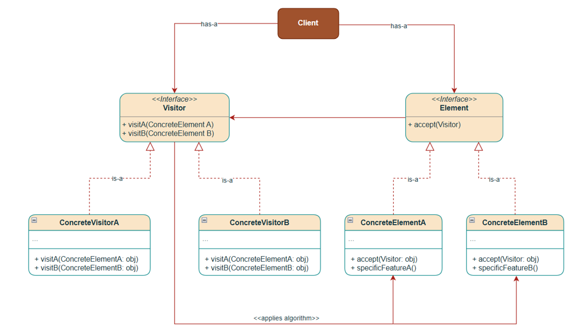
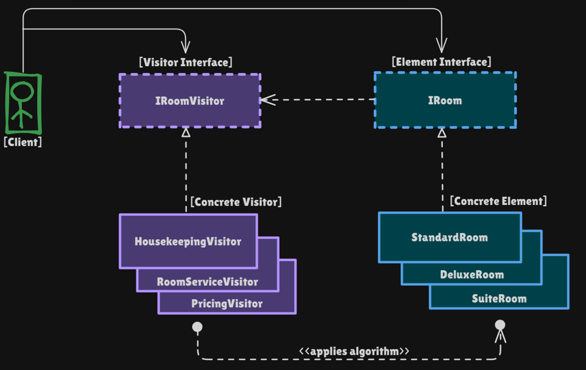

# Visitor Pattern

Behavioral pattern: **add new operations to an object structure without changing the element classes**. Algorithms live in **visitors**; rooms only `accept`. Java is single-dispatch; Visitor simulates **double dispatch**.

This package follows the Concept & Coding LLD note: hotel rooms (standard / deluxe / suite) × housekeeping, room service, pricing.

**Code:** `com.lld.patterns.visitor.hotel`, `.demo`

## Why this pattern is required

Without Visitor every operation sits on the room:

```text
class SuiteHotelRoom {
  clean();
  deliverRoomService(...);
  calculatePrice();
  // next month: inspect(), invoiceGst(), ...
}
```

That produces:

1. **OCP / SRP** — each new hotel service **edits** every room class. A room is data **and** housekeeping **and** pricing.
2. **Scattered logic** — “how to clean a deluxe jacuzzi” mixed with “Rs. per night.”
3. **Hard tests** — you cannot unit-test pricing without constructing a full room API.
4. **Tight coupling** — new `PenthouseRoom` copies three methods; new `InspectVisitor` cannot exist without touching rooms.

Visitor is required when the **element set is stable** and **operations keep growing**.

## Structure

**Class diagram** (from the LLD note):



**Hotel mapping:**



| Role | In this codebase | Job |
|------|------------------|-----|
| **Element** | `IRoom.accept(visitor)` | First dispatch |
| **Concrete elements** | `StandardRoom`, `DeluxeRoom`, `SuiteRoom` | `visitor.visitX(this)` |
| **Visitor** | `IRoomVisitor` | `visitStandardRoom` / `visitDeluxeRoom` / `visitSuiteRoom` |
| **Concrete visitors** | `HousekeepingVisitor`, `RoomServiceVisitor`, `PricingVisitor` | The algorithms |
| **Client** | `VisitorPatternDemo` | `room.accept(visitor)` |

```
room.accept(housekeeping)
  DeluxeRoom.accept  →  housekeeping.visitDeluxeRoom(this)
  (jacuzzi? extra text)
```

## Double dispatch

**Single dispatch (Java):** `room.accept()` without a visitor — only the **runtime type of `room`** picks the method.

**Double dispatch:** `myroom.accept(myvisitor)`

1. **First:** runtime type of `myroom` → `StandardRoom.accept`  
2. **Second:** that method calls `myvisitor.visitStandardRoom(this)` → runtime type of **visitor** + the **room type** encoded in the method name

Java cannot overload `visit(IRoom)` and pick `visit(DeluxeRoom)` from a `IRoom` reference (that would still be single dispatch on the visitor only, with the argument compile type `IRoom`). Each element **names** the visit method.

## Where to use it (and why there)

| Domain | Stable elements | Growing operations |
|--------|-----------------|-------------------|
| **Hotel (this package)** | Room types | Clean, serve, price |
| **Compilers** | AST nodes | type-check, print, codegen |
| **Documents** | Paragraph, image | export PDF / HTML |
| **Shapes** | Circle, rect | draw, area, serialize |

**Do not use it** if **room types** change often (every new room edits **every** visitor). Then put methods on the elements or use a different split.

## Visitor vs Strategy (from the note)

| | **Visitor** | **Strategy** |
|--|-------------|--------------|
| **Intent** | New **operations** on **many types** | Swap **one** algorithm for one job |
| **Tied to** | Specific element types (`visitDeluxeRoom`) | Independent of the context object |
| **This repo** | Housekeeping vs pricing on rooms | Drive / pay |
| **One-liner** | Different operations on **many** types | Different ways to do **one** thing |

## Pros and cons

**Pros**

- Add `InspectVisitor` without editing `StandardRoom`.
- Related logic (all pricing) in one class; `getTotalRevenue()`.
- Easy to run the same visitor over an array of `IRoom`.

**Cons**

- New `PenthouseRoom` → new method on `IRoomVisitor` **and** every visitor.
- Breaks encapsulation: visitors need getters (`hasJacuzzi`).
- More types; `accept` boilerplate on every element.
- Cyclic dependency: element package knows visitor interface.

## How it follows SOLID

| Principle | How Visitor satisfies it | How bloated `SuiteHotelRoom` breaks it |
|-----------|--------------------------|----------------------------------------|
| **S** | Room holds room data. `PricingVisitor` prices. | One class: clean + food + money. |
| **O** | New operation = new visitor. New **room type** opens visitors. | New operation edits every room. |
| **L** | Any `IRoom` must `accept` and call the matching `visit*`. | `accept` that calls the wrong visit method. |
| **I** | Visitor lists visit methods for known rooms. | One room interface with `clean`, `price`, `serve`. |
| **D** | Client depends on `IRoom` + `IRoomVisitor`. | Client depends on `SuiteHotelRoom` methods. |

## How it differs from Interpreter and Composite

Visitor often **walks** a Composite (file tree, AST). Interpreter puts `evaluate` on nodes; Visitor extracts `evaluate` into a visitor so you can add `print` without touching nodes.

## Run

```bash
cd DesignPatterns
javac -d out $(find src -name '*.java')
java -cp out com.lld.patterns.visitor.demo.VisitorPatternDemo
```

Pricing: 1000+2000+5000+1000+2000 = **Rs.11000**.

## Interview questions and answers

**1. What is Visitor?**  
A behavioral pattern that represents an operation on elements of a structure so you can add operations without changing the element classes.

**2. What is double dispatch?**  
The method depends on the **runtime type of two objects** (element and visitor).

**3. Why Java needs this trick?**  
Java is single dispatch. `visitor.visit(room)` with `IRoom room` will not pick `visit(DeluxeRoom)`.

**4. `accept` vs `visit`?**  
`accept` is on the element (dispatch 1). `visitX` is on the visitor (dispatch 2).

**5. Walk through `DeluxeRoom` + housekeeping.**  
`accept` → `visitDeluxeRoom(this)` → 45 min + jacuzzi text if true.

**6. When OCP holds / fails?**  
Holds for new **operations**. Fails for new **element types**.

**7. vs Strategy?**  
Strategy: one job, swap algorithm. Visitor: many types, add operations. See table.

**8. vs adding methods on `IRoom`?**  
Every new service edits all rooms. Visitor isolates the service.

**9. Encapsulation?**  
Visitors need public state (`getNumberOfRooms`). Trade-off for OCP on operations.

**10. How does it follow SOLID?**  
New visitor class (OCP for ops). Room not a god class (SRP).

**11. `PricingVisitor` state?**  
`totalRevenue` accumulates across `accept` calls.

**12. Compiler AST?**  
Nodes `accept`; `TypeCheckVisitor`, `PrettyPrintVisitor`.

**13. Default visitor?**  
Abstract visitor with empty `visit*` so new ops only override some rooms.

**14. Cyclic dependency?**  
`IRoom` mentions `IRoomVisitor`. Keep both in one package or invert with a tiny accept interface.

**15. vs Iterator?**  
Iterator walks. Visitor **does work** per node type.

**16. Thread safety?**  
Don’t share a stateful `PricingVisitor` across threads without a lock.

**17. New penthouse?**  
`PenthouseRoom.accept` → `visitPenthouseRoom`. Add that method to the visitor interface and all visitors.

**18. New spa service?**  
`SpaVisitor implements IRoomVisitor` — rooms unchanged.

**19. Why not `switch (room)` in one service class?**  
That’s still OCP-weak and uses `instanceof` (single dispatch on the service). Visitor pushes the type test into `accept`.

**20. Demo rooms / total?**  
101, 201 (jacuzzi), 301 (3 rooms), 102, 202. Housekeeping all; breakfast on first three; revenue **11000**.
