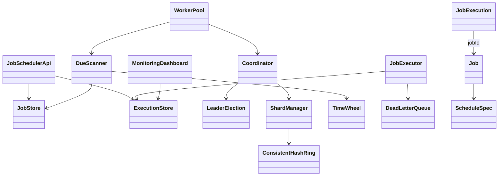

# Distributed Job Scheduler — Classes, Relationships & Data Model

Companions: [`README.md`](./README.md) · [`API_REFERENCE.md`](./API_REFERENCE.md)

---

## 1. Class catalog

| Package | Class | Persist? |
|---------|-------|----------|
| job | `Job` | **Yes** → `jobs` |
| job | `JobExecution` | **Yes** → `job_executions` |
| job | `ScheduleSpec`, policies, `RetryPolicy` | Embedded / columns |
| store | `JobStore`, `ExecutionStore`, `DeadLetterQueue` | Services over tables |
| schedule | `TimeWheel`, `DueScanner`, `CronExpression` | In-memory / computed |
| coordinate | `Coordinator`, `LeaderElection`, `ShardManager`, `ConsistentHashRing` | etcd/ZK + cache |
| worker | `JobExecutor`, `WorkerPool` | No |
| api | `JobSchedulerApi` | No |
| monitor | `MonitoringDashboard` | Metrics store / TSDB |
| clock | `HybridClock` | No |

---

## 2. Relationships



| Relation | Type |
|----------|------|
| Job → JobExecution | 1:N by jobId |
| JobExecution unique | idempotency_key |
| Shard → Worker | N:1 via ShardManager |
| Coordinator → cluster | 1 leader at a time |

---

## 3. Architecture layers

```
┌─────────────────────────────────────────────┐
│  JobSchedulerApi (schedule/cancel/status)   │
├─────────────────────────────────────────────┤
│  Coordinator (leader + fencing token)        │
│       └─ ShardManager (hash ring + HB)       │
├─────────────────────────────────────────────┤
│  WorkerPool                                  │
│    └─ DueScanner + TimeWheel  (WHEN)         │
│    └─ JobExecutor + Lease     (WHAT)         │
├─────────────────────────────────────────────┤
│  JobStore | ExecutionStore | DLQ | Metrics   │
└─────────────────────────────────────────────┘
```

---

## 4. Tables (production mapping)

### `jobs`
| Column | Notes |
|--------|-------|
| `job_id` PK | Client-supplied or UUID |
| `tenant_id` | Multi-tenant fairness |
| `payload` / `payload_ref` | Inline small; S3/blob for large |
| `job_type` | ONE_OFF / RECURRING |
| `cron_expr`, `timezone`, `run_at` | Schedule |
| `next_run_at` | **Indexed**; due scans |
| `shard_key` | Partition ownership |
| `status` | ACTIVE / PAUSED / CANCELLED / COMPLETED |
| `overlap_policy`, `catch_up_policy` | Cadence-style |
| `max_attempts`, `backoff_*` | Retry |
| `priority` | Tie-break within due window |

**Index:** `(shard_id, status, next_run_at)` or DynamoDB `pk=random_partition, sk=next_run_at` (Dynein-style).

### `job_executions`
| Column | Notes |
|--------|-------|
| `execution_id` PK | UUID |
| `idempotency_key` UNIQUE | `jobId@fireEpoch` |
| `job_id`, `scheduled_fire_at` | Fire identity |
| `status` | LEASED / RUNNING / SUCCEEDED / FAILED / DEAD_LETTERED / SKIPPED |
| `worker_id`, `lease_expires_at` | Crash recovery |
| `attempt`, `fencing_token` | Retry + stale leader reject |
| `started_at`, `finished_at`, `error` | Audit / drift |

### `dead_letters`
Poison executions for ops replay / alert.

### `shard_leases` (coordination store)
| Column | Notes |
|--------|-------|
| `shard_id` | 0..N-1 |
| `owner_worker_id` | Current assignee |
| `fencing_token` | Monotonic |
| `lease_expires_at` | Heartbeat TTL |

---

## 5. Key invariants

1. Only the **leader** mutates shard ownership.
2. A fire is claimed at most once under a given **fencing token** + **idempotency key**.
3. Near-term due set lives in the **time-wheel**; DB is source of truth.
4. Worker crash ⇒ lease expiry ⇒ retry or DLQ — job is never silently lost.
