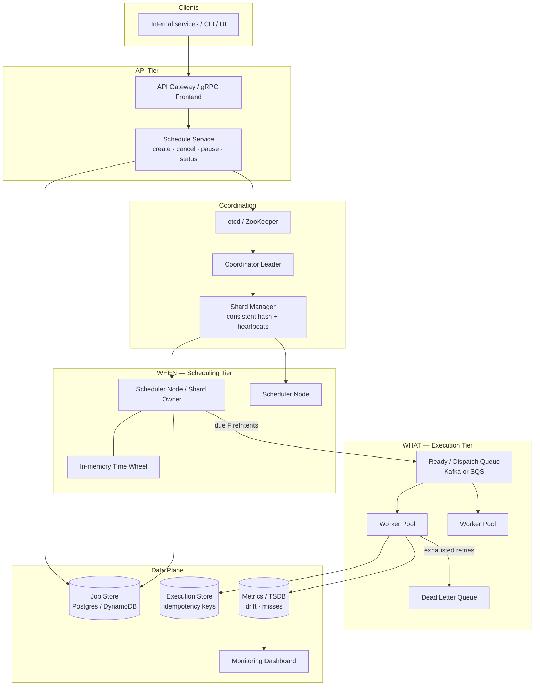

# Distributed Job Scheduler — HLD

High-level design for interview whiteboard + tech tradeoff discussion.  
Companions: [`README.md`](./README.md) (LLD) · [`API_REFERENCE.md`](./API_REFERENCE.md)

---

## 1. Final architecture diagram



**End-to-end path:** Client registers a job → durable `next_run_at` write → shard owner loads near-term work into a time-wheel → on due, claim + enqueue → worker leases, runs under idempotency key → success / retry / DLQ → dashboard records drift.

---

## 2. Why these technologies (and why not the alternatives)

| Concern | Choose | Why | Not / when to reconsider |
|---------|--------|-----|---------------------------|
| Job metadata + due index | **Postgres** *or* **DynamoDB** | Strong durability; range on `next_run_at`; Postgres `SKIP LOCKED` for claims; DynamoDB random PK + time SK spreads `:00` hot keys (Dynein) | Redis alone — risk of durability loss; fine as *cache* of near-term wheel only |
| Coordination / leader | **etcd** or **ZooKeeper** | Battle-tested leases, watches, fencing-friendly epoch | DB advisory locks only — OK at small scale; weaker ops story under partitions |
| Near-term timers | **Time wheel** (in process) | O(1) tick; no full-table poll every second | Pure DB poll — dies at tens of millions of schedules; pure heap OK for smaller fleets |
| Dispatch buffer | **Kafka** or **SQS** | Decouples *when* from *what*; absorbs cron bursts; visibility timeout ≈ lease | Direct RPC to workers — crashes lose in-flight work; harder backpressure |
| Idempotency / run log | **Execution store** (same DB or separate) | Unique `jobId@fireTime`; audit + dedupe | App memory only — lost on restart → double side effects |
| Workflows beyond cron | Stay with **this timer service**; grow to **Cadence/Temporal** later | Cron ≠ full workflow engine | Building Cadence on day 1 — overkill if you only need distributed cron |
| Metrics | **Prometheus + Grafana** (or Uber-style M3) | Drift p99, miss rate, DLQ depth | Logs only — too late for SLA paging |

**Rule of thumb in interview:** *At-least-once dispatch + idempotent handlers* beats chasing distributed exactly-once.

---

## 3. Components (what each owns)

| Component | Responsibility | Scale / failure note |
|-----------|----------------|----------------------|
| **Schedule API** | Validate cron/`runAt`, persist job, pause/cancel/status | Stateless; buffer writes with a queue if registration spikes |
| **Job Store** | Source of truth: schedule, `next_run_at`, shard key, policies | Partition by shard or time; never lose an accepted schedule |
| **Coordinator + Leader Election** | Exactly one assigner of shards; renew lease; bump fencing token | On partition, old leader must be fenced out of claims |
| **Shard Manager** | Consistent hash worker↔shard; rebalance on join/leave/silent HB | Ownership change ⇒ reload time-wheels |
| **Due Scanner + Time Wheel** | Decide *when* a fire is due; apply overlap/catch-up/jitter | Must stay light — no heavy payload work here |
| **Dispatch Queue** | Hold claimed fires; redeliver on worker timeout | Burst shock absorber at hourly cron boundaries |
| **Worker / Job Executor** | Lease pull, run handler, retry backoff, DLQ | Scale horizontally independent of schedulers |
| **Execution Store** | Idempotency + history | Dedupes failover duplicates |
| **Dead Letter Queue** | Quarantine poison jobs | Alert on depth; manual replay |
| **Hybrid Clock + Dashboard** | Skew-tolerant due checks; miss/drift SLIs | Don’t page on ±skew noise; page on sustained p99 drift |

---

## 4. Data & control planes (interview sketch)

```
Control:  etcd lease → leader → shard map → scheduler heartbeats
Data:     jobs / executions / DLQ
Hot path: time-wheel tick → claim → queue → worker → idempotency check
```

**Invariants to say out loud**
1. One shard owner at a time (lease + fencing).
2. One logical fire → one idempotency key.
3. Worker death ⇒ lease expiry ⇒ retry, not silent drop.
4. Catch-up is bounded (no unbounded stampede).

---

## 5. Capacity & SLOs (discussion numbers)

| Metric | Order of magnitude |
|--------|--------------------|
| Schedules | 10M–20M+ |
| Steady fires | ~5K/s |
| `:00` burst | 100K–300K+/s (jitter + queue absorb) |
| Lateness SLO | p99 within ~1s under normal load |
| Semantics | At-least-once dispatch; effectively-once with idempotent sink |

---

## 6. Other important interview discussion points

**Clarify first:** volume, one-off vs cron, exactly-once needs, timezone/DST, overlap, multi-tenant fairness.

**Hot topics interviewers probe**
- Time wheel vs DB poll vs delay queue only  
- Fencing tokens after false failover  
- Skip vs double-run (Google SRE cron prefers skip when forced)  
- Catch-up policies after outage  
- Separating scheduling tier from execution tier  
- Multi-tenant isolation / priority  
- Observability: drift, misses, DLQ, leader flaps  

**Common follow-ups**
- “How do you backfill a month of missed reports?” → bounded catch-up + explicit backfill API with distinct keys  
- “What if handler is not idempotent?” → outbox / unique business constraint still required  
- “Multi-region?” → active-passive timers or carefully partitioned ownership; avoid dual leaders per shard  

**Link to LLD in this repo:** packages under `com.jobscheduler.lld.*` simulate etcd, DB, and queue in-memory for demos.
