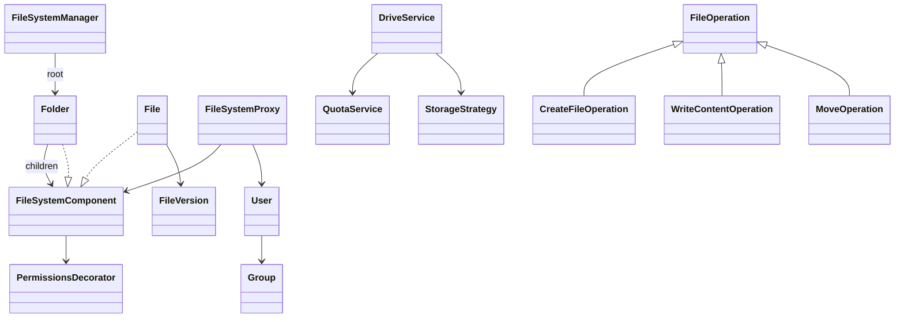

# Google Drive LLD — Classes, Relationships & Data Model

Companions: [`README.md`](./README.md) · [`API_REFERENCE.md`](./API_REFERENCE.md)

---

## 1. Class catalog

| Package | Class | Persist? |
|---------|-------|----------|
| account | `User`, `Group` | **Yes** → `users`, `groups` |
| access | `PermissionsDecorator` | **Yes** → `acl_entries` |
| fs | `Folder`, `File`, `FileVersion` | **Yes** → `nodes`, `file_versions` |
| fs | `FileSystemManager` | No (process) |
| storage | `StorageStrategy*` | Blobs → object store |
| quota | `QuotaService` | **Yes** → `quotas` |
| operation | `FileOperation*` | Audit log optional |
| proxy | `FileSystemProxy` | No |

---

## 2. Relationships



---

## 3. Tables (prod sketch)

```sql
users(id, username, password_hash, salt, role)
groups(id, name)
group_members(group_id, user_id)
nodes(id, type, name, parent_id, owner_id)
acl_entries(node_id, principal_type, principal_id, access_level)
file_versions(file_id, version_id, object_key, size, created_at)
quotas(user_id, used_bytes, limit_bytes)
```

Content lives in object storage keyed by `object_key`, not in `nodes`.
