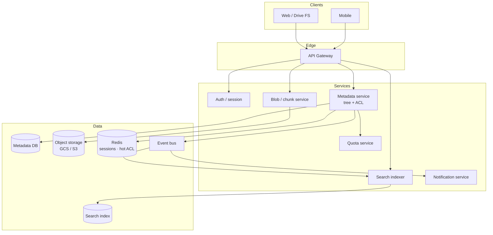

# Google Drive — HLD

High-level design for a consumer file-sync / share platform (interview whiteboard).  
Companions: [`README.md`](./README.md) · [`API_REFERENCE.md`](./API_REFERENCE.md)

---

## 1. Final architecture diagram

## 2. Tech choices vs alternatives

| Concern | This design | Alternative | Why this |
|---------|-------------|-------------|----------|
| Metadata | Relational / Spanner-style | Store tree only in object store | ACL + versions need transactional nodes |
| Bytes | Object storage | Block SAN | Cheap, immutable versions = new objects |
| ACL | Per-node + inherit | POSIX mode bits | Sharing is the product |
| Search | Async index | Live DFS in prod | DFS is LLD-demo only; prod is inverted index |
| Locks | Per-file RW lock | Global FS mutex | Independent docs must not queue |

## 3. Components

- **Metadata** — folders, files, parents, ACL maps, version pointers.
- **Blob** — content keyed by version id; `StorageStrategy` in LLD.
- **Quota** — owner bytes; reject before write.
- **Notify** — observers on share and content change.

## 4. Interview talking points

- Metadata vs blob split.
- Inheritance + explicit `NONE`.
- Lock order for move/rename.
- `tryLock` timeouts vs deadlock.
- Why Holder singleton beats a lazy unsynchronized `instance`.
