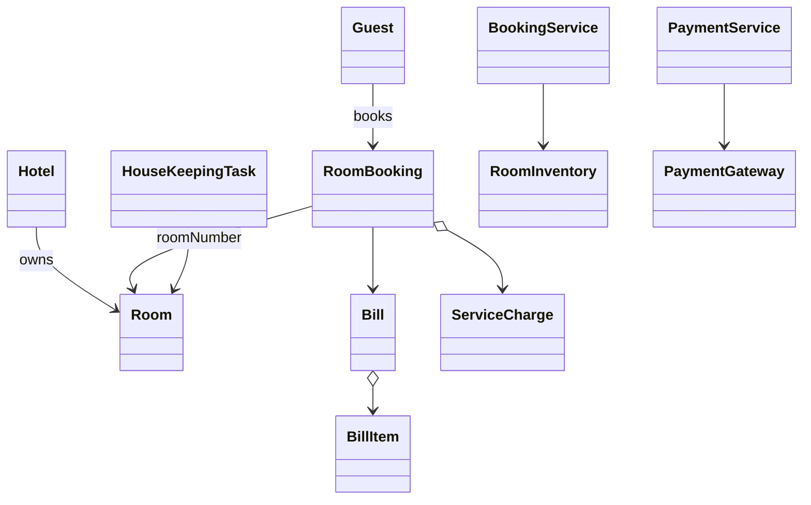

# Hotel Management — Classes, Relationships & Data Model

Companions: [`README.md`](./README.md) · [`API_REFERENCE.md`](./API_REFERENCE.md)

---

## 1. Class catalog

| Package | Class | Persist? |
|---------|-------|----------|
| account | `Guest` | **Yes** → `guests` |
| hotel | `Hotel` | **Yes** → `hotels` |
| room | `Room` | **Yes** → `rooms` |
| room | `RoomInventory` | No (service) |
| booking | `RoomBooking` | **Yes** → `bookings` |
| booking | `BookingService` | No |
| booking | `CancellationPolicy` | No (strategy) |
| service | `HouseKeepingTask` | **Yes** → `housekeeping_tasks` |
| service | `ServiceCharge` | **Yes** → `service_charges` |
| billing | `Bill`, `BillItem` | **Yes** → `bills`, `bill_items` |
| payment | `PaymentGateway*`, `PaymentService` | `payments` |
| events | `AsyncEventBus` | Kafka in prod |

---

## 2. Relationships



| Relation | Type |
|----------|------|
| Booking → Room | N:1 by room number |
| Booking → ServiceCharge | 1:N |
| Room → calendar dates | 1:N logical (`availability` table or JSON) |
| HouseKeepingTask → Room | N:1 |

---

## 3. Tables

```sql
hotels (
  hotel_id VARCHAR PK,
  name VARCHAR,
  city VARCHAR,
  address VARCHAR
);

guests (
  guest_id VARCHAR PK,
  name VARCHAR,
  email VARCHAR UNIQUE,
  phone VARCHAR,
  status VARCHAR
);

rooms (
  room_number VARCHAR PK,
  hotel_id VARCHAR FK → hotels,
  style VARCHAR,           -- STANDARD|DELUXE|FAMILY_SUITE|BUSINESS_SUITE
  booking_price NUMERIC(10,2),
  smoking BOOLEAN,
  status VARCHAR,          -- AVAILABLE|RESERVED|OCCUPIED|BEING_SERVICED|...
  version INT DEFAULT 0    -- optimistic lock
);

room_availability (
  room_number VARCHAR FK → rooms,
  stay_date DATE,
  is_available BOOLEAN,
  PRIMARY KEY (room_number, stay_date)
);

bookings (
  reservation_number VARCHAR PK,
  guest_id VARCHAR FK → guests,
  room_number VARCHAR FK → rooms,
  check_in DATE,
  duration_days INT,
  status VARCHAR,
  actual_check_in TIMESTAMP NULL,
  actual_check_out TIMESTAMP NULL
);

housekeeping_tasks (
  task_id VARCHAR PK,
  room_number VARCHAR FK → rooms,
  status VARCHAR,          -- PENDING|IN_PROGRESS|COMPLETED
  assigned_at TIMESTAMP,
  staff_id VARCHAR,
  completed_at TIMESTAMP NULL
);

bills (
  bill_id SERIAL PK,
  reservation_number VARCHAR FK → bookings,
  paid BOOLEAN
);

bill_items (
  bill_item_id SERIAL PK,
  bill_id INT FK → bills,
  type VARCHAR,
  description VARCHAR,
  amount NUMERIC(10,2)
);

service_charges (
  charge_id VARCHAR PK,
  reservation_number VARCHAR FK → bookings,
  type VARCHAR,
  description VARCHAR,
  amount NUMERIC(10,2),
  created_at TIMESTAMP
);

payments (
  payment_id VARCHAR PK,
  reservation_number VARCHAR FK → bookings,
  method VARCHAR,          -- CREDIT_CARD|CHECK|CASH
  amount NUMERIC(10,2),
  status VARCHAR
);
```

---

## 4. Concurrency notes

- **Optimistic:** `rooms.version` — update fails on mismatch → retry.
- **Pessimistic (in-process):** `synchronized(room)` / `ReentrantLock` per room.
- **Distributed:** Redis lock keyed by `roomId` with TTL — multi-server safe.
