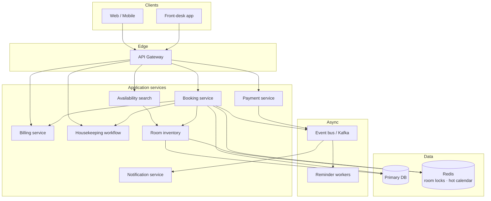

# Hotel Management System — HLD

High-level design for a multi-property hotel booking platform (interview whiteboard).  
Companions: [`README.md`](./README.md) (LLD) · [`API_REFERENCE.md`](./API_REFERENCE.md)

---

## 1. Final architecture diagram

---

## 2. Why this tech / alternatives

| Concern | Choice | Why | Alternative |
|---------|--------|-----|-------------|
| Availability | Date calendar per room | Future bookings + no overbooking | Status-only flag (too weak) |
| Concurrency | Per-room lock / Redis lock | Avoid double-booking | Global DB lock (hotspot) |
| Notifications | Async event bus | Loose coupling, non-blocking | Sync Observer list |
| Refunds | Policy strategy | Business rules outside controllers | Hardcoded in API layer |
| Housekeeping | Task workflow | Operational visibility | `cleanRoom()` method |

---

## 3. Components

| Component | Owns | Interview note |
|-----------|------|----------------|
| Room inventory | Rooms + calendars | Availability is **date-based**, not status-based |
| Booking service | Reserve / cancel / check-in / out | Lock → validate → create → mark reserved |
| Cancellation policy | Refund amount | Full if ≥24h before check-in |
| Event bus | Fan-out | Email / SMS / Push independently |
| Housekeeping | Task log + room state | CHECKOUT → BEING_SERVICED → AVAILABLE |
| Payment | Card / check / cash | Async + retry |

---

## 4. Interview discussion points

- **Clarify:** multi-hotel? partial refunds? overbooking strategy? inventory holds with TTL?
- **Hot topics:** optimistic vs pessimistic vs Redis distributed lock; calendar vs reservation-interval overlap queries.
- **Scale:** shard by hotelId; Redis lock `RoomID + TTL`; Kafka for reminders.
- **Takeaway:** *Booking systems fail not when traffic spikes — but when locks are missing.*
