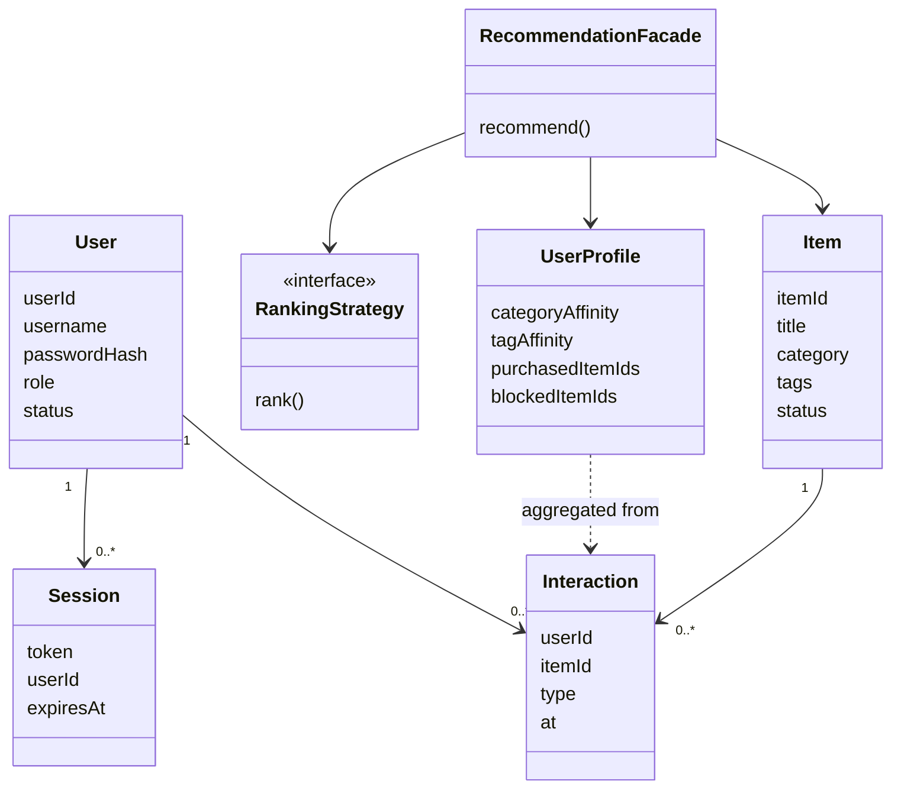

# Recommendation Service — Class and data model

## Class relationships

## Tables (logical)

### users
| Column | Notes |
|--------|--------|
| user_id | PK |
| username | unique |
| password_hash | salted hash, never plaintext |
| salt | per-user |
| role | GUEST / MEMBER / ADMIN |
| status | ACTIVE / BLOCKED |
| email | **not** selected into rec responses |

### sessions
| Column | Notes |
|--------|--------|
| token | PK, opaque |
| user_id | FK |
| expires_at | TTL |

### items
| Column | Notes |
|--------|--------|
| item_id | PK |
| title, category, tags, price | content features |
| status | ACTIVE / OUT_OF_STOCK / BANNED |

### interactions
| Column | Notes |
|--------|--------|
| user_id, item_id, type, at | append-only event log |
| type | VIEW, CLICK, LIKE, PURCHASE, DISLIKE, HIDE |

### recommendation_cache (Redis)
| Key | Value |
|-----|--------|
| `{userId}|{placement}|{seed}|{limit}` | JSON slate + strategy + bucket, TTL ~60s |

Do **not** persist neighbor user ids on the slate. Store item_id, score, reason_code only.
