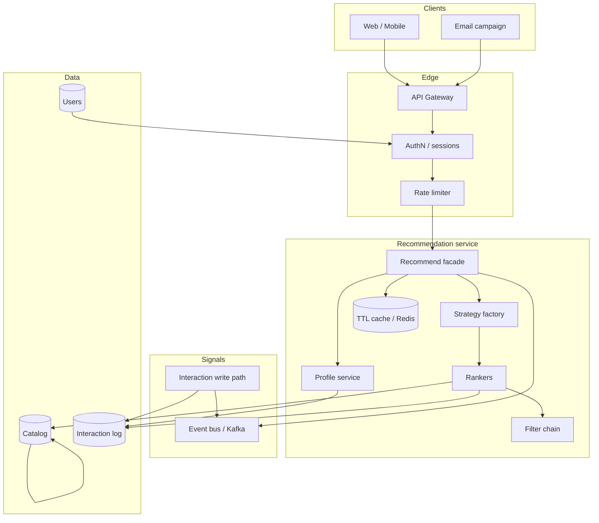

# Recommendation Service — HLD

High-level design for a product recommendation platform (interview whiteboard).  
Companions: [`README.md`](./README.md) (LLD) · [`API_REFERENCE.md`](./API_REFERENCE.md)

---

## 1. Final architecture diagram

---

## 2. Why this tech / alternatives

| Concern | Choice | Why | Alternative |
|---------|--------|-----|-------------|
| Identity | Opaque session + server-side user | Stops IDOR (`userId` in query is not auth) | Trust client userId (unsafe) |
| Ranking | Strategy per placement | HOME ≠ PDP ≠ EMAIL | One global top-N list |
| Neighbors | Item–item co-occurrence | No user graph in the response | User–user list of neighbor ids (privacy fail) |
| Cold start | Popularity fallback | Empty slate is a product failure | Wait for history |
| Failure | Decorator fallback | Personalization can die independently | 500 the homepage |
| Filters | Chain after score | Ban/OOS is policy, not a weight | Hope the model learned bans |
| Fan-out | Async bus | Scoring must not wait on email | Sync Observer list |
| Abuse | Token bucket / user | Ranking is CPU-heavy + scrape surface | Unlimited GET |

---

## 3. Components

| Component | Owns | Interview note |
|-----------|------|----------------|
| Auth / session | Tokens, password hash | Personalized recs are **PII-adjacent** |
| Profile service | Affinities, blocks, purchases | Rankers never see email / neighbor names |
| Strategy factory | Placement + experiment + cold-start | Open for new rankers |
| Collaborative ranker | Co-purchase matrix | Scores only — no “people like you” identities |
| Filter chain | Eligibility, hide, already-bought | Hard constraints after ML |
| Cache | Slate TTL | Invalidate on hide/purchase |
| Interaction service | Event log | Write path is authenticated separately |
| Experiment assigner | Sticky CONTROL / TREATMENT | Hash(userId), not random per request |

---

## 4. Interview discussion points

- **Online vs offline:** this LLD scores online on a small catalog. At scale, candidate generation is offline (ANN / two-tower) and the service only **ranks a few hundred** candidates.
- **Feature store:** affinities here are computed on the fly; production snapshots them on a schedule.
- **Exploration:** ε-greedy or bandits on HOME; EMAIL should be conservative.
- **GDPR / CCPA:** hide + delete interactions; recs are profiling — document lawful basis.
- **Feedback loops:** popularity can snowball; diversity + exploration dampen it.
- **Evaluation:** offline NDCG on held-out purchases; online CTR / CVR with the experiment bucket.
