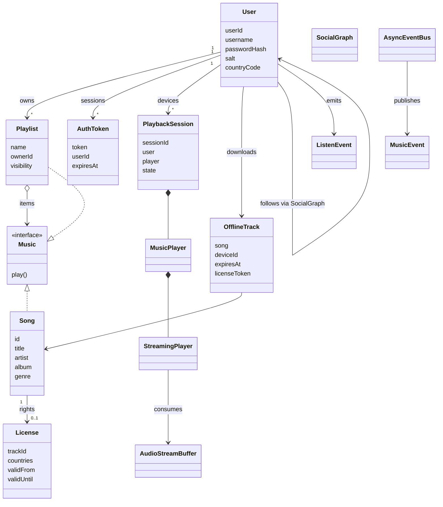
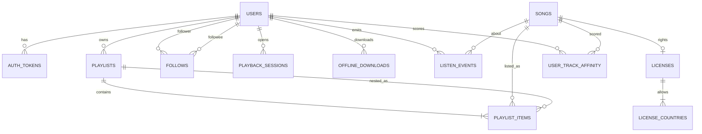

# Spotify LLD — Classes, Relationships & Data Model

Maps **OOP classes** in this codebase to **relationships** and a production-style **relational schema**.  
LLD code is in-memory; tables show how the same domain would persist.

Companions: [`README.md`](./README.md) · [`INTERVIEW_PREP_GUIDE.md`](./INTERVIEW_PREP_GUIDE.md)

---

## Why learn this?

**Yes — this is high-value interview and on-the-job knowledge.**

| Skill | Why it matters |
|-------|----------------|
| Class diagram | Whiteboard LLD: ownership, composition vs association |
| Class → table mapping | Bridge LLD ↔ HLD / DB design questions |
| What is *not* a table | Runtime objects (buffers, players, Trie nodes) vs durable entities |
| Cardinality | 1:N, N:M (follows, playlist tracks) — classic schema probes |

Interviewers often ask: *“How would you store this?”* after your class design. Knowing both sides shows you think beyond a single JVM.

---

## 1. Class Catalog (by package)

| Package | Class | Role | Persist? |
|---------|-------|------|----------|
| auth | `User` | Account identity, salt+hash, country | **Yes** → `users` |
| auth | `AuthToken` | Session bearer + expiry | **Yes** → `auth_tokens` (or Redis) |
| auth | `AuthService` | Register/login/validate | No (service) |
| auth | `PasswordUtils` | Hash helpers | No (util) |
| catalog | `Music` | Composite interface | No (interface) |
| catalog | `Song` | Track metadata + bytes | **Yes** → `songs` (bytes in object store) |
| catalog | `MusicCatalog` | Song store + search facade | No (service; data in tables/index) |
| catalog | `CatalogSearchIndex` / `TrieNode` | In-memory Trie | **No** → use Elasticsearch in prod |
| playlist | `Playlist` | Nested playlist composite | **Yes** → `playlists` + `playlist_items` |
| playlist | `PlaylistVisibility` | PUBLIC / FOLLOWERS_ONLY / PRIVATE | Enum column |
| playback | `SessionManager` | Session registry | No / Redis |
| playback | `PlaybackSession` | Per-device player context | **Yes** → `playback_sessions` (ephemeral OK) |
| playback | `MusicPlayer` / `PlayerState` | Playback control | No (runtime) |
| streaming | `StreamingPlayer`, `AudioStreamBuffer`, … | Chunk pipeline | No (runtime) |
| license | `License` | Geo + time window | **Yes** → `licenses` + `license_countries` |
| license | `LicenseService` | Gate before play | No (service) |
| offline | `OfflineTrack` | Device-bound download meta | **Yes** → `offline_downloads` |
| offline | `DownloadManager` | Download/encrypt facade | No (service) |
| social | `SocialGraph` | Directed follows | **Yes** → `follows` |
| social | `PlaylistAccessControl` | ACL policy | No (policy) |
| events | `AsyncEventBus`, `MusicEvent`, … | Pub/sub | Events → Kafka in prod |
| recommendation | `ListenEvent` | Interaction signal | **Yes** → `listen_events` |
| recommendation | `RecommendationEngine` | Affinity scores | **Yes** → `user_track_affinity` |
| limits | `StreamLimiter`, `RateLimiter` | Abuse caps | Redis counters in prod |

---

## 2. Class Relationships



### Relationship notes (interview speak)

| Relation | Type | Meaning |
|----------|------|---------|
| `Playlist` → `Music` | Composition / Composite | Playlist contains songs or nested playlists |
| `User` → `Playlist` | 1:N association | Owner id FK |
| `User` ↔ `User` | N:M | `follows` edge table |
| `PlaybackSession` → `MusicPlayer` | Composition | Session owns its player (not global singleton) |
| `Song` → `License` | 1:1 / 1:N | Rights for a track |
| `ListenEvent` → User/Song | association | Append-only analytics |

---

## 3. How Tables Look (Relational Sketch)

### Core identity & auth

```sql
users (
  user_id        UUID PK,
  username       VARCHAR UNIQUE NOT NULL,
  password_hash  VARCHAR NOT NULL,
  salt           VARCHAR NOT NULL,
  country_code   CHAR(2) NOT NULL,
  created_at     TIMESTAMPTZ
);

auth_tokens (
  token          UUID PK,
  user_id        UUID FK → users,
  expires_at     TIMESTAMPTZ NOT NULL,
  created_at     TIMESTAMPTZ
);
-- Often stored in Redis with TTL instead of SQL
```

### Catalog & licensing

```sql
songs (
  song_id     UUID PK,
  title       VARCHAR NOT NULL,
  artist      VARCHAR NOT NULL,
  album       VARCHAR,
  genre       VARCHAR,
  audio_uri   VARCHAR,          -- S3/CDN path (not raw bytes in DB)
  created_at  TIMESTAMPTZ
);

licenses (
  license_id  UUID PK,
  song_id     UUID FK → songs UNIQUE,
  valid_from  TIMESTAMPTZ NOT NULL,
  valid_until TIMESTAMPTZ NOT NULL
);

license_countries (
  license_id    UUID FK → licenses,
  country_code  CHAR(2),
  PRIMARY KEY (license_id, country_code)
);
```

### Playlists (handles nesting)

```sql
playlists (
  playlist_id  UUID PK,
  owner_id     UUID FK → users,
  name         VARCHAR NOT NULL,
  visibility   VARCHAR NOT NULL  -- PUBLIC | FOLLOWERS_ONLY | PRIVATE
);

-- Polymorphic items: song OR nested playlist
playlist_items (
  playlist_id   UUID FK → playlists,
  position      INT NOT NULL,
  item_type     VARCHAR NOT NULL,  -- SONG | PLAYLIST
  song_id       UUID NULL FK → songs,
  child_playlist_id UUID NULL FK → playlists,
  PRIMARY KEY (playlist_id, position),
  CHECK (
    (item_type = 'SONG' AND song_id IS NOT NULL AND child_playlist_id IS NULL)
    OR
    (item_type = 'PLAYLIST' AND child_playlist_id IS NOT NULL AND song_id IS NULL)
  )
);
-- App enforces: no cycles, max depth
```

### Social

```sql
follows (
  follower_id  UUID FK → users,
  followee_id  UUID FK → users,
  created_at   TIMESTAMPTZ,
  PRIMARY KEY (follower_id, followee_id),
  CHECK (follower_id <> followee_id)
);
```

### Playback / offline / limits / recs

```sql
playback_sessions (
  session_id   UUID PK,
  user_id      UUID FK → users,
  device_id    VARCHAR,
  state        VARCHAR,          -- PLAYING | PAUSED | STOPPED
  current_song_id UUID NULL,
  updated_at   TIMESTAMPTZ
);

offline_downloads (
  download_id     UUID PK,
  user_id         UUID FK → users,
  song_id         UUID FK → songs,
  device_id       VARCHAR NOT NULL,
  encrypted_path  VARCHAR NOT NULL,
  license_token   VARCHAR NOT NULL,
  expires_at      TIMESTAMPTZ NOT NULL
);

listen_events (
  event_id            BIGSERIAL PK,
  user_id             UUID FK → users,
  song_id             UUID FK → songs,
  event_type          VARCHAR,   -- PLAY | SKIP | LIKE | …
  listen_duration_ms  BIGINT,
  created_at          TIMESTAMPTZ
);
-- High volume → Kafka → warehouse; SQL is fine for LLD explanation

user_track_affinity (
  user_id   UUID FK → users,
  song_id   UUID FK → songs,
  score     DOUBLE PRECISION,
  PRIMARY KEY (user_id, song_id)
);

-- Stream / rate limits → Redis keys, e.g. stream:user:{id}, rate:user:{id}
```

### ER overview



---

## 4. Class → Table Cheatsheet

| Java class | Table(s) |
|------------|----------|
| `User` | `users` |
| `AuthToken` | `auth_tokens` or Redis |
| `Song` | `songs` (+ blob store) |
| `License` | `licenses`, `license_countries` |
| `Playlist` | `playlists`, `playlist_items` |
| `SocialGraph` | `follows` |
| `OfflineTrack` | `offline_downloads` |
| `ListenEvent` | `listen_events` |
| `RecommendationEngine` scores | `user_track_affinity` |
| `PlaybackSession` | `playback_sessions` (optional) |
| `CatalogSearchIndex` | **Elasticsearch** index, not SQL |
| `StreamingPlayer` / buffers | **Not stored** |
| `AsyncEventBus` | **Kafka topics** |
| `StreamLimiter` / `RateLimiter` | **Redis** |

---

## 5. Whiteboard tip

When asked for LLD *and* storage:

1. Draw **session → player** (runtime).  
2. Draw **users / songs / playlists / follows** (tables).  
3. Say: *“Trie and stream buffer stay in memory; search and events move to ES/Kafka at scale.”*
