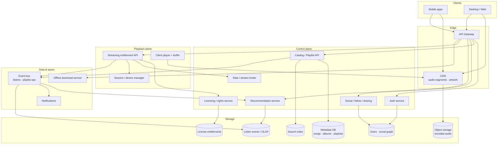

# Spotify — HLD

High-level design for a music streaming service (interview whiteboard).  
Companions: [`README.md`](./README.md) (LLD)

---

## 1. Final architecture diagram



**Play path:** Auth → entitlement/license check → stream limiter → session binds device → client fetches CDN audio segments into buffer → listen events async → recommendations update offline.

---

## 2. Why these technologies (and why not the alternatives)

| Concern | Choose | Why | Not / when to reconsider |
|---------|--------|-----|---------------------------|
| Audio delivery | **Object storage + CDN** (HLS/DASH-like segments) | Cheap egress, edge cache, seekable | Origin servers streaming raw files — won’t scale globally |
| Metadata (tracks, playlists) | **Postgres / distributed SQL** | Relational playlists, ACLs, catalog integrity | Putting audio bytes in DB — wrong medium |
| Search | **Elasticsearch / custom inverted index** | Title/artist/album relevance | In-memory list scan — interview fail |
| Auth sessions | **Token auth** (JWT/opaque + Redis revoke) | Stateless API + secure password hashing | Plaintext passwords; process-wide mutable singleton “current user” without care |
| Playback state | **Per-session player state** on client + soft server session | Multi-device: transfer playback via Session Manager | JVM singleton `MusicPlayer` shared by all users — classic LLD pitfall |
| Licensing | **Dedicated License service** | Region/label rights before bytes | Skip license check — legal + interview miss |
| Recommendations | **Offline/nearline jobs + online features** on listen stream | Collaborative / popularity hybrid | Sync ML in request path — latency |
| Offline downloads | **Encrypted blobs on device** + license expiry | DRM-ish offline mode | Unbounded plaintext downloads |
| Listen fan-out | **Kafka / event bus** | Feeds reco, notifications, analytics | Sync Observer only — blocks playback APIs |
| Abuse / free tier | **Token bucket / stream limiter** | Fair use, bot protection | Unlimited anonymous streaming |

---

## 3. Components

| Component | Responsibility | Interview note |
|-----------|----------------|----------------|
| **Auth Service** | Register/login, hashed passwords, tokens | Secure storage; session invalidation |
| **Music Catalog + Search** | Songs/albums/artists; indexed lookup | Trie/ES for prefix/search |
| **Playlist Service** | CRUD, visibility (public/private) | ACL with social graph |
| **Social Graph** | Follow, share, view public playlists | Graph queries at friend scale |
| **License Service** | Can this user stream this track here/now? | Fail closed |
| **Session Manager** | Active playback sessions per user/device | Hand-off / one active premium policy |
| **Streaming / Buffer / Decoder** | Real buffered playback model | Not `Thread.sleep` fake play |
| **Recommendation Engine** | History + interactions → next tracks | Event-driven updates |
| **Offline / Download Manager** | Download, expiry, device limits | License-aware |
| **Stream Limiter** | Rate limits concurrent streams | Token bucket |
| **Notification / Event Bus** | Async side effects | Decouple from play loop |

---

## 4. Playback & entitlement flow

```
play(trackId, deviceId):
  authenticate
  assert license(trackId, region, userPlan)
  assert within concurrent stream limit
  bind/transfer Session(deviceId)
  return CDN URLs / encryption keys for segments
  client buffers & decodes
  emit ListenEvent (async)
```

---

## 5. Other important interview discussion points

**Clarify:** DAU, catalog size, free vs premium, offline, multi-device policies, region licensing, podcasts?

**Hot topics**
- Why CDN + segmented audio, not one TCP stream from monolith  
- Singleton player anti-pattern in LLD interviews  
- Licensing before CDN URL minting (signed URLs / short TTL)  
- Concurrent stream limits (account sharing)  
- Playlist collaboration / visibility races  
- Personalization freshness vs cost  
- Offline DRM expiry when license ends  

**Scale sketch**
- Catalog ~100M tracks metadata (small) vs audio petabytes (object store)  
- Control plane QPS ≪ CDN bandwidth  
- Listen events: high write throughput → log/OLAP, not primary OLTP  

**Follow-ups**
- “Gapless playback / crossfade?” → client player responsibility  
- “Artist upload?” → separate ingestion + encoding pipeline (transcode to multiple bitrates)  

**Link to LLD:** `com.spotify.lld.*` — auth hashing, session manager, buffer/decoder streaming, license checks, async reco events, rate limiter.
