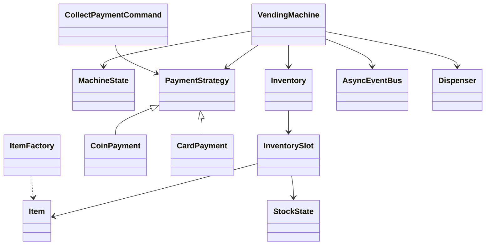

# Vending Machine LLD — Classes, Relationships & Data Model

---

## 1. Class catalog

| Package | Class | Persist? |
|---------|-------|----------|
| catalog | `Item` | Planogram |
| inventory | `InventorySlot` | **Yes** qty / expiry |
| payment | `PaymentStrategy*` | Session only |
| command | `PaymentCommand`, `TransactionLog` | Audit |
| machine | `VendingMachine`, `*State` | Device |
| events | `AsyncEventBus` | — |
| hardware | Acceptors / `Dispenser` | Device firmware |

---

## 2. Relationships



---

## 3. Tables (fleet backend)

```sql
machines(id, location, state)
slots(machine_id, code, qty, low_threshold, expires_at, price_cents)
tx_log(id, machine_id, type, cents, created_at)
```
