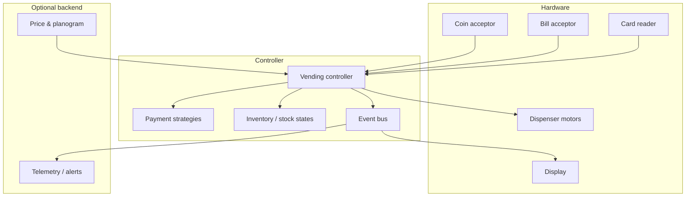

# Vending Machine — HLD

Companions: [`README.md`](./README.md) · [`API_REFERENCE.md`](./API_REFERENCE.md)

---

## 1. Final architecture diagram

## 2. Tech choices vs alternatives

| Concern | This design | Alternative | Why this |
|---------|-------------|-------------|----------|
| Money | Integer cents | `float` / `double` | Exact CAS; no rounding |
| UI | Event bus | `System.out` in machine | Display, audit, pager subscribe independently |
| Stock | State objects | `if (qty==0)` | Reload, low-stock, expiry |
| Payments | Command + log | `balance -= price` | Refund / rollback after failed motor |
| Admin | State + PIN | Unlocked restock API | Physical cabinet vs customer keypad |

## 3. Components

- **Controller** — one session lock; states Idle / Collecting / Maintenance.
- **Inventory** — per-code slot with CAS quantity.
- **Payment** — strategy + commands.
- **Hardware adapters** — denomination checks only.

## 4. Interview talking points

- Why not `AtomicFloat` (it does not exist; use cents).
- Failed dispense after debit → command `undo`.
- Planogram / telemetry as async consumers of the same bus.
